# PrismRender

PrismRender 是一个基于 **C++20、Direct3D 12、Vulkan 与 Slang** 的现代实时渲染器，聚焦显式图形 API、跨后端 RHI、Render Graph、多线程渲染、异步资源上传与 GPU Driven Rendering。

## 技术概览

- 借鉴 Unreal Engine 的 RHI 分层思想，统一抽象 Buffer、Texture、Descriptor、Pipeline、Command Context 与 Queue Sync，并映射到 D3D12/Vulkan 原生对象和命令。
- 构建 Main Thread、独立 Render Thread 与 Worker Thread Pool 协作的渲染流水，通过不可变 <code>RenderFramePacket</code> 隔离场景更新与 GPU 提交。
- 基于 D3D12 Copy Queue、Vulkan Transfer Queue 和持久映射分页 Upload Ring 实现异步资源上传，通过 Frames-in-Flight、Fence/Timeline 管理复用与延迟销毁。
- 实现声明式 Render Graph：RAW/WAR/WAW 依赖 DAG、反向 Pass Culling、子资源 Barrier、Transient Alias、Graphics/Compute Queue Batch 与跨队列同步。
- 使用 Slang Reflection 生成资源绑定布局并编译 DXIL/SPIR-V，实现 Forward+ / Deferred PBR、IBL、CSM、Clustered Lighting、GTAO、SSR、TAA、Bloom 以及 GPU Frustum/Hi-Z Occlusion Culling。

## 架构总览

~~~mermaid
flowchart TD
    Main[Main Thread Window / Input / ECS / Editor]
    Session[SceneSession World / Camera / Light]
    Extract[RenderScene Extraction]
    Packet[Immutable RenderFramePacket]
    Envelope[FrameEnvelope Frame Identity / UI / Capture]
    Queue[Bounded FIFO]
    Render[Render Thread RenderRuntimeExecutionTarget]
    Upload[Asset Upload / Streaming]
    Coordinator[RenderFrameCoordinator]
    Renderer[SceneRenderer]
    Features[RenderFeatureRegistry]
    Graph[Render Graph]
    Workers[Worker Thread Pool Independent Command Contexts]
    RHI[RHI]
    D3D12[D3D12 Backend]
    Vulkan[Vulkan Backend]
    GPU[Submit / Present]

    Main --> Session
    Session --> Extract
    Extract --> Packet
    Packet --> Envelope
    Envelope --> Queue
    Queue --> Render
    Upload --> Render
    Render --> Coordinator
    Coordinator --> Renderer
    Renderer --> Features
    Features --> Graph
    Graph --> Workers
    Graph --> RHI
    Workers --> RHI
    RHI --> D3D12
    RHI --> Vulkan
    D3D12 --> GPU
    Vulkan --> GPU
~~~

### 分层职责

| 层级 | 主要模块 | 职责 |
|---|---|---|
| Application | <code>ApplicationHost</code>、<code>ApplicationLauncher</code> | 程序装配、主循环、窗口事件与运行模式 |
| Engine / Scene | ECS、<code>SceneSession</code>、<code>RenderScene</code> | 场景更新、组件数据、相机与灯光、只读渲染数据发布 |
| Asset | Import、Streaming、Upload Request | glTF/纹理导入、后台加载、上传调度与驻留管理 |
| Renderer | <code>SceneRenderer</code>、<code>RenderFeatureRegistry</code> | 渲染路径、Feature 生命周期与帧级渲染组织 |
| Render Graph | Graph Compiler、Lifetime Planner、Queue Scheduler | Pass 依赖、裁剪、Barrier、别名与队列计划 |
| RHI | Device、Resource、Descriptor、Pipeline、Command Context | 与图形 API 无关的资源和命令接口 |
| Backend | D3D12、Vulkan | 原生资源、命令列表、队列同步、Swapchain 与 Present |
| UI / Automation | ImGui Editor、Profiler、Capture Harness | 编辑器交互、诊断、截图与确定性验证 |

模块依赖由 CMake 边界检查约束。RHI 与 Renderer 不反向依赖 Editor/Application，Core 不依赖 Renderer，避免跨层所有权和实现细节泄漏。

## 与 Unreal Engine 的分层对应

PrismRender 参考 UE 的 Renderer / RDG / RHI / Backend 分层方式，并将其收敛为适合独立渲染器的实现规模。

~~~text
Unreal Engine:
Scene / Renderer → RDG → FRHICommandList → Dynamic RHI → D3D12RHI / VulkanRHI

PrismRender:
SceneSession → SceneRenderer / Features → Render Graph
             → ICommandContext → RenderBackend → D3D12 / Vulkan
~~~

| Unreal Engine | PrismRender |
|---|---|
| Renderer / Mesh Pass | <code>SceneRenderer</code> / <code>RenderFeature</code> |
| Render Dependency Graph | Render Graph |
| <code>FRHIResource</code> | RHI Buffer / Texture / View |
| <code>FRHICommandList</code> | <code>ICommandContext</code> / <code>DeferredCommandContext</code> |
| <code>FDynamicRHI</code> | <code>IRenderBackend</code> |
| D3D12RHI / VulkanRHI | D3D12 / Vulkan Backend |

## 多线程渲染流水

~~~mermaid
sequenceDiagram
    participant Main as Main Thread
    participant Queue as Frame Queue
    participant Render as Render Thread
    participant Worker as Worker Pool
    participant GPU as GPU

    Main->>Main: Update Window / Input / ECS / Editor
    Main->>Main: Build immutable RenderFramePacket
    Main->>Queue: Submit FrameEnvelope N+1
    Queue->>Render: Consume FrameEnvelope N
    Render->>Render: BeginFrame + Upload Safe Point
    Render->>Render: Build / Compile Render Graph
    Render->>Worker: Record safe independent passes
    Worker-->>Render: Recorded command contexts
    Render->>GPU: Submit queue batches
    Render->>GPU: Present
~~~

### Main Thread

- 处理 GLFW 窗口、输入、ECS、SceneSession 和编辑器。
- 从场景数据构建不可变 <code>RenderFramePacket</code>。
- 将 Packet、帧身份、UI Draw Packet、截图与 profiling 请求冻结到 <code>FrameEnvelope</code>。
- 通过有界 FIFO 向 Render Thread 提交，队列满时施加背压而不是丢帧。

### Render Thread

- 独占 Render Backend、Frame Context 和提交阶段。
- 在安全点处理资源上传和延迟回收。
- 构建并编译 Render Graph。
- 汇总 Worker 录制结果，提交 Graphics/Compute/Copy 队列并 Present。

### Worker Thread Pool

- 使用独立 Command Context 并行录制满足安全条件的 Pass。
- 不修改共享 Feature 状态，不负责 Descriptor/PSO 的非线程安全创建。
- 不直接执行 Queue Submit、Present 或帧槽回收。

## RHI 与双后端

RHI 使用稳定接口表达资源、绑定、Pipeline、命令与同步语义：

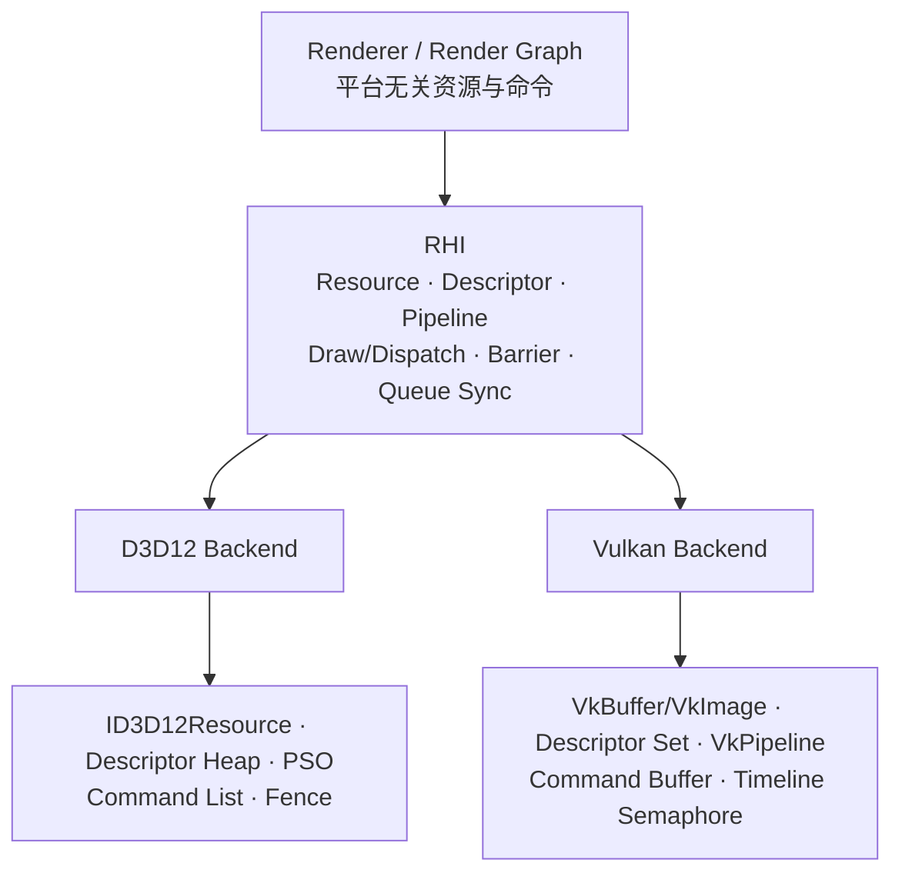

| 抽象 | 主要内容 |
|---|---|
| <code>IRenderBackend</code> | 后端初始化、Device/Frame/Command Context 入口与帧准入 |
| <code>IFrameContext</code> | Begin/End Frame、Swapchain、Back Buffer、Depth、Frames-in-Flight |
| <code>IGraphicsDevice</code> | Buffer、Texture、View、Sampler、Descriptor、Pipeline 与 AS 创建 |
| <code>ICommandContext</code> | Render Scope、Draw、Dispatch、Copy、Indirect、Barrier 与 Queue Batch |
| <code>DeferredCommandContext</code> | 平台无关命令记录与目标 Context 回放 |
| Capabilities / Statistics | Queue、Timeline、Descriptor、Upload、Transient Resource 能力和统计 |

### 原生映射

| RHI 概念 | Direct3D 12 | Vulkan |
|---|---|---|
| Buffer / Texture | <code>ID3D12Resource</code> | <code>VkBuffer</code> / <code>VkImage</code> |
| Pipeline | PSO + Root Signature | <code>VkPipeline</code> + Pipeline Layout |
| Descriptor | Descriptor Heap / Table | Descriptor Pool / Set |
| Command Context | Command List / Allocator | Command Buffer / Pool |
| Resource State | Resource Barrier | Pipeline Barrier + Image Layout |
| Queue Sync | Fence | Timeline Semaphore / Fence |
| Present | DXGI Swapchain | Vulkan Swapchain |

上层 Feature 只提交 RHI 资源与命令。后端负责转换资源描述、绑定布局、Barrier、Indirect 参数和 Queue Sync，并最终写入 D3D12 Command List 或 Vulkan Command Buffer。

完整的接口职责、逐函数原生映射、调用链和代码入口见 [RHI 与 D3D12/Vulkan 双后端设计](docs/RHI_DUAL_BACKEND_ARCHITECTURE_CN.md)。

## 异步资源上传与生命周期

~~~mermaid
flowchart LR
    IO[Cooked Asset / Background IO]
    Ring[Persistent Mapped Paged Upload Ring]
    Copy[Copy / Transfer Batch]
    Ticket[Upload Ticket]
    Wait[First GPU Consumer Wait]
    Resident[Resident Resource]
    Retire[Deferred Destruction]

    IO --> Ring
    Ring --> Copy
    Copy --> Ticket
    Ticket --> Wait
    Wait --> Resident
    Resident --> Retire
~~~

- D3D12 使用 Copy Queue，Vulkan 使用 Transfer Queue。
- Buffer 与 Texture 数据从持久映射的分页 Upload Ring 子分配，减少重复创建 staging resource。
- 上传批次返回稳定的 Upload Ticket；资源只有在 Fence/Timeline 到达后才进入 Resident 状态。
- Graphics/Compute 首次消费资源时等待对应上传完成值。
- 每个 Frame Slot 独立管理动态资源和 allocator，只有 GPU 完成值到达后才允许复用。
- 被替换的 GPU 资源进入延迟销毁队列，避免 CPU 生命周期早于 GPU 使用生命周期结束。

## Render Graph

Render Graph 通过 Pass 的资源访问声明构建执行计划：

~~~mermaid
flowchart LR
    Passes[Pass / Resource Declaration]
    DAG[RAW / WAR / WAW DAG]
    Cull[Reverse Pass Culling]
    Lifetime[First / Last Use]
    Alias[Transient Memory Alias]
    State[Subresource State Tracking]
    Batch[Graphics / Compute Batches]
    Execute[Record / Submit]

    Passes --> DAG
    DAG --> Cull
    Cull --> Lifetime
    Lifetime --> Alias
    Alias --> State
    State --> Batch
    Batch --> Execute
~~~

### 编译阶段

- 根据 Read/Write 声明建立 RAW、WAR、WAW 依赖。
- 从外部输出和有副作用 Pass 反向标记，裁剪无用 Pass。
- 计算 Texture/Buffer 的 First Use 与 Last Use。
- 为生命周期不重叠的 transient resource 规划显存别名。
- 跟踪 texture mip/layer 与 buffer range 的子资源状态。
- 生成 transition、UAV、alias barrier 和跨队列同步。
- 将 Pass 编排为 Graphics/Compute Queue Batch，并标记可并行录制区间。

### 执行阶段

编译后的 Graph 由统一 Graph Executor 执行。D3D12 与 Vulkan 共享同一图描述和调度结果，仅在资源与命令落地阶段进入各自后端。

## Slang Shader Pipeline

~~~mermaid
flowchart LR
    Source[Slang / HLSL Source]
    Compiler[Slang Compiler]
    Reflect[Shader Reflection]
    Layout[Descriptor Set Layout Description]
    DXIL[DXIL]
    SPIRV[SPIR-V]
    D3D12[D3D12 Root Signature / PSO]
    Vulkan[Vulkan Descriptor Set / Pipeline]

    Source --> Compiler
    Compiler --> Reflect
    Reflect --> Layout
    Compiler --> DXIL
    Compiler --> SPIRV
    Layout --> D3D12
    Layout --> Vulkan
    DXIL --> D3D12
    SPIRV --> Vulkan
~~~

Slang Reflection 提取 Constant Buffer、Shader Resource、UAV、Sampler、Binding Index 与 Space/Set 等信息。多个 Shader Stage 的 Reflection 被合并为统一 Descriptor Set Layout Description，再分别转换为 D3D12 与 Vulkan 的原生绑定布局。

## 渲染功能

### Rendering Paths

- Forward+ PBR
- Deferred PBR
- Forward baseline（用于多光源路径对照）
- Clustered/Tile Light Culling
- GPU Indirect Rendering

### Lighting and Materials

- Metallic-Roughness PBR
- Image-Based Lighting
- Directional / Point / Spot Light
- Cascaded Shadow Maps
- Hard Shadow、PCF、VSM、EVSM
- glTF Mesh、Material 与 Texture

### Screen-space and Post Process

- GTAO
- Screen Space Reflection
- Planar Reflection
- Temporal Anti-Aliasing
- HDR、Bloom 与 Tonemapping
- Hi-Z Depth Pyramid

### GPU Driven

- CPU Frustum Culling
- GPU Frustum Culling
- Hi-Z Occlusion Culling
- GPU Indirect / D3D12 ExecuteIndirect
- Instance Compaction 与可见性统计

## Renderer Labs

下列截图由 D3D12 后端以 1600×900 直接捕获 Game Render Target，不包含 Editor UI 或 Stats Overlay。

| Scene | 需要展示的内容 | README 呈现 |
|---|---|---|
| **Editor Preview** | glTF 导入、Hierarchy、Inspector、材质编辑、Scene/Game 双视图与编辑器交互闭环 | 核心信息位于 Editor UI，单独的 Game 输出只是基础预览，因此不加入下方画廊 |
| **Renderer Showcase** | PBR、IBL、阴影、HDR、Bloom、Tonemapping、反射与实例化场景的综合结果 | 使用完整 Game Hero Shot |
| **Forward+ Lab** | 大量局部光源、Clustered Light List，以及 Forward baseline、Forward+、Deferred 对同一场景的渲染路径 | 展示多光源最终画面；路径输出应保持视觉一致，性能与 Cluster 数据由专项报告验证 |
| **GPU Driven Stress Lab** | 重复实例、遮挡墙、Indirect Draw、GPU Frustum 和 Hi-Z Occlusion 的压力输入 | 展示稳定 60 帧后的压力场景和遮挡结构；可见数与间接绘制数据保留在诊断报告 |
| **Postprocess Lab** | HDR 场景颜色、Bloom 提取以及 Tonemapping 后的最终输出 | 使用 Final、HDR、Bloom-only 三阶段对比 |
| **RenderGraph Lab** | Pass DAG、Pass Culling、Barrier、Transient Alias、Graphics/Compute Queue Batch 与跨队列同步 | 最终画面不能证明图编译和调度；隐藏 Stats 后不放静态截图 |
| **Asset Streaming Lab** | Requested、Queued、Uploading、Resident、Released/Evicted 的时间过程，以及 Upload Ticket、预算和驻留变化 | 单帧 Game 输出不能证明流送过程；隐藏 Stats 后不放静态截图 |

### Renderer Showcase

综合场景同时覆盖材质、灯光、阴影、反射和 HDR 后处理链。

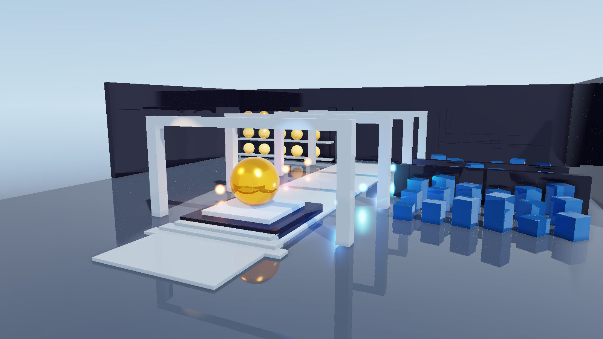

### Forward+ Lab

多光源场景用于验证 Clustered Lighting 对大量局部光源的组织与着色。

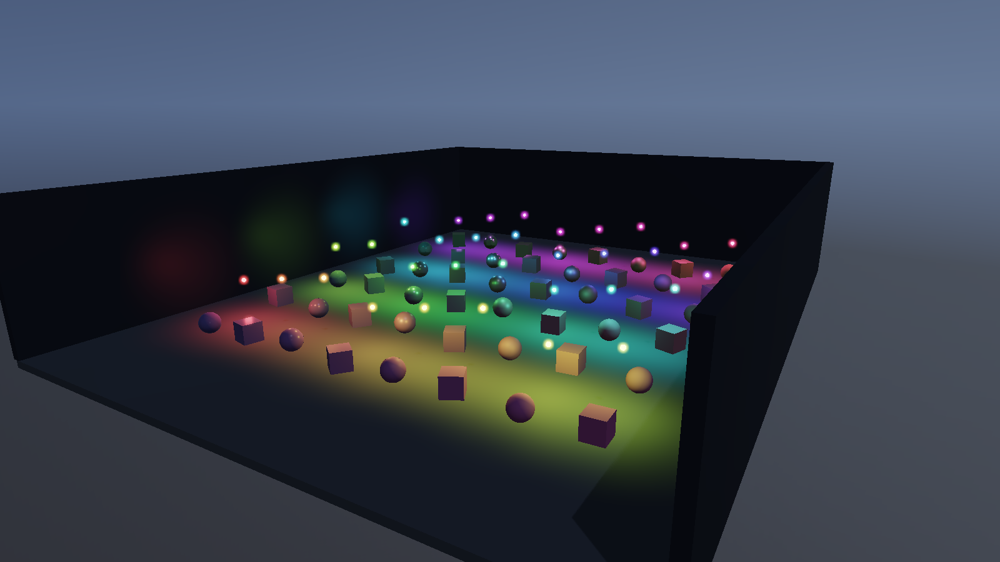

### GPU Driven Stress Lab

重复实例与两面遮挡墙构成 GPU Frustum、Hi-Z Occlusion 和 Indirect Draw 的压力输入。下图在 GPU Driven 路径稳定运行 60 帧后捕获。

### Postprocess Lab

同一 Game View 的不同处理阶段：

| Final Output | HDR Scene Color | Bloom-only |
|---|---|---|
| 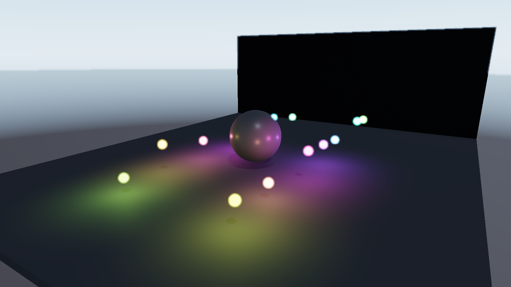 | 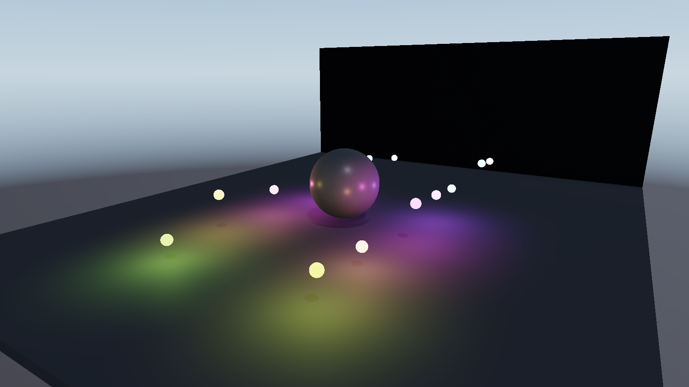 | 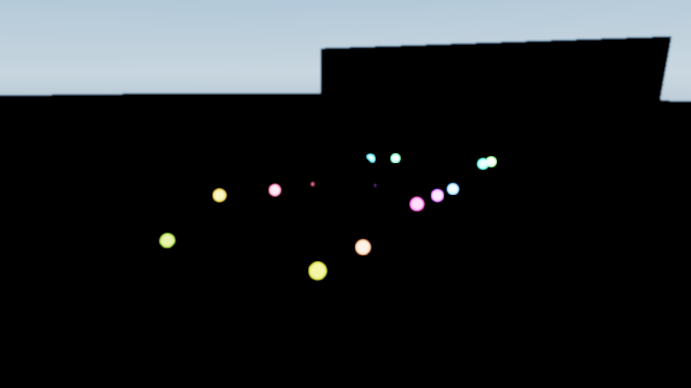 |

## 渲染效果

### Reflection

| Screen Space Reflection | Planar Reflection |
|---|---|
| 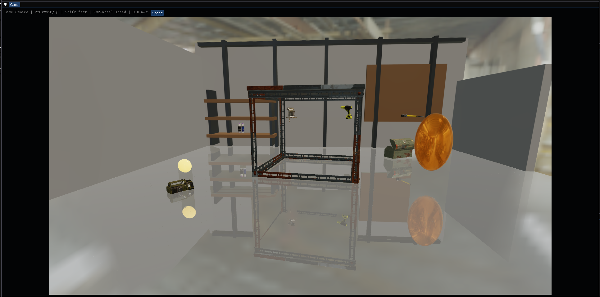 | 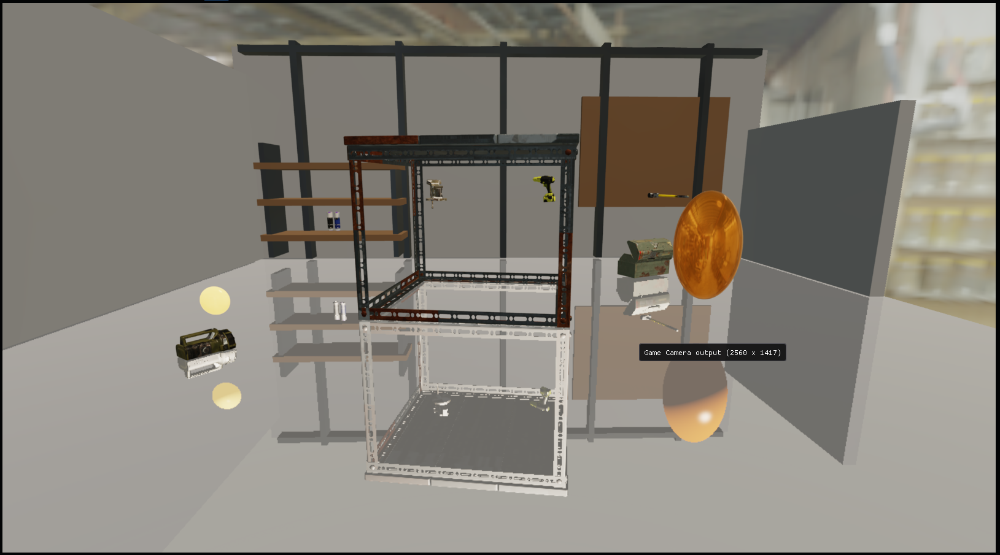 |

### Shadow Filtering

| Hard Shadow | PCF | VSM | EVSM |
|---|---|---|---|
| 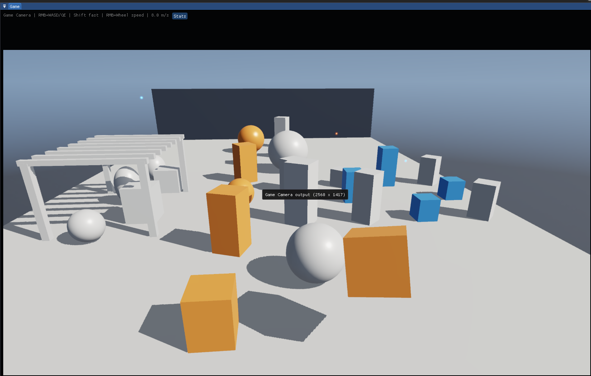 | 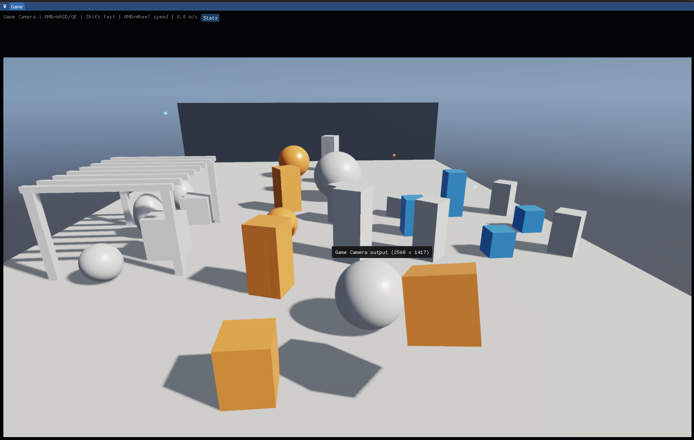 | 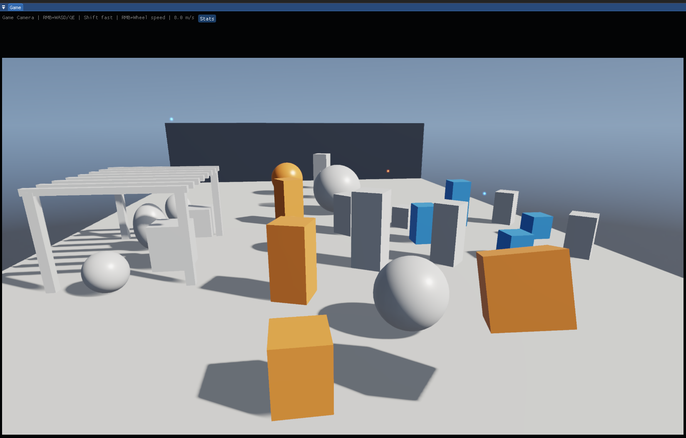 | 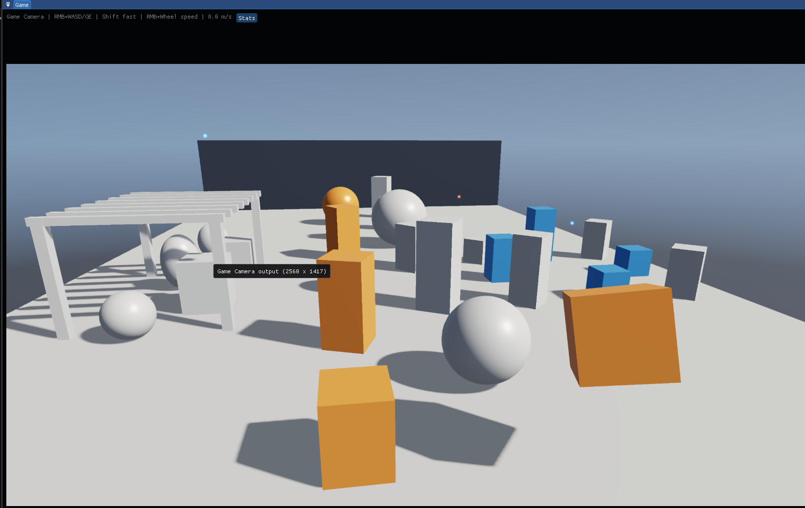 |

## 资源生命周期

项目区分不同层级的生命周期，避免把逻辑帧、帧槽与 GPU 完成状态混为一体：

| 生命周期 | 示例 |
|---|---|
| Device | Pipeline Cache、Descriptor Allocator、长期纹理 |
| Logical Frame | RenderFramePacket、FrameEnvelope、帧级请求 |
| Frame Slot | Command Allocator、动态上传、延迟释放 |
| View | Camera、View Constants、Visibility Result |
| Scene Data | 不可变 RenderSceneData publication |
| Render Graph | Transient Texture/Buffer 与 Alias Plan |

## 构建

### 依赖

- Windows 10/11
- Visual Studio 2022（Desktop development with C++）
- CMake 3.24+
- Windows SDK
- Vulkan SDK（启用 Vulkan 后端时）
- Slang SDK <code>v2026.8.1</code>

Slang SDK 可以放置在 <code>third_party/slang</code>，或通过 <code>PRISM_SLANG_ROOT</code> 指定。

### Windows

~~~powershell
cmake --preset windows-ci
cmake --build --preset windows-ci
~~~

其他 Preset：

- <code>windows-vulkan-only-ci</code>
- <code>windows-d3d12-standalone-ci</code>
- <code>linux-vulkan-debug</code>

## 验证

- CMake 模块边界与公共头文件检查
- D3D12/Vulkan Shader 编译与 Reflection 契约测试
- Render Graph Compiler、资源状态和 Feature Graph 测试
- GPU Shader、Indirect、Culling 与后处理数值回归
- 固定场景、固定帧截图和跨运行稳定性验证
- CPU/GPU Timeline、Queue Batch、Draw/Dispatch 与资源统计

## 目录结构

~~~text
PrismRender/
├─ assets/                  # Shader、模型、纹理与场景资源
├─ cmake/                   # 模块边界与构建检查
├─ docs/                    # 架构、实现和验证文档
├─ src/
│  ├─ Asset/                # 导入、Streaming 与上传请求
│  ├─ Automation/           # Capture 与自动化验证
│  ├─ Core/                 # ApplicationHost 与执行协议
│  ├─ Engine/               # ECS、Reflection 与运行时服务
│  ├─ Platform/             # Window / Input
│  ├─ Renderer/             # SceneRenderer、Features、Render Graph
│  ├─ RHI/                  # 公共接口与 D3D12/Vulkan 后端
│  ├─ Scene/                # World、RenderScene、Camera、Light
│  ├─ Tools/                # 开发与离线工具
│  └─ UI/                   # ImGui / Editor
├─ tests/                   # 单元、架构与 GPU 验证
├─ CMakeLists.txt
└─ CMakePresets.json
~~~
