# PrismRender

**C++20 · Direct3D 12 · Vulkan · Slang · GLFW · ImGui**

PrismRender 是一个自主开发的实时渲染器，围绕跨 API RHI、渲染依赖图与多线程执行组织现代渲染功能，并提供场景编辑、资源导入和可交互的渲染实验场景。

### Renderer Showcase

PBR 材质、IBL、级联阴影与 HDR 后处理在同一场景中组合呈现。

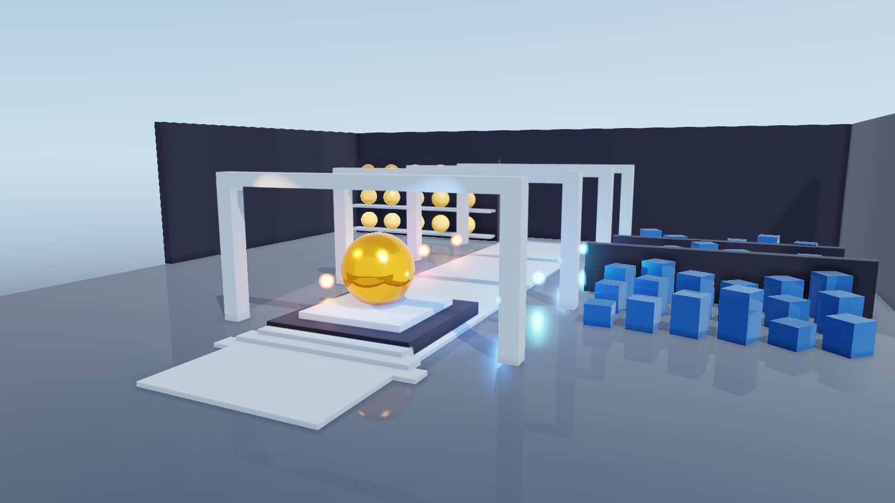

本文新增截图与性能数据来自当前本地开发构建；SSR、海洋参考路径及执行架构的部分改动尚未同步到公开源码。具体测量构建标识见[性能专题](RENDERING_PATH_BENCHMARK_CN.md)。

[渲染展示](#渲染展示) · [编辑器与渲染诊断](#编辑器与渲染诊断) · [核心技术](#核心技术) · [架构](#架构) · [构建与运行](#构建与运行) · [文档与源码](#文档与源码)

## 渲染展示

### WaveWorks-like Ocean Lab

四级联频谱风浪、波峰白沫、水体散射与环境反射，呈现从大尺度涌动到细波高光的海面细节。

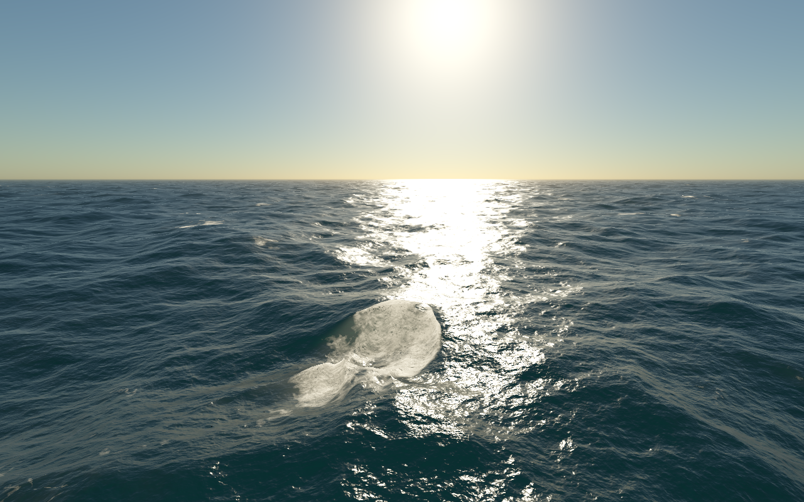

当前画面使用项目自主生成的 **JONSWAP 初始谱**，结合从 NVIDIA WaveWorks 示例截帧恢复的 FFT、表面数据与着色路径，由 PrismRender 的 C++、D3D12 RHI 和 Shader 实时执行。展示参数为风速 **12 m/s**、Fetch **100 km**；环境、局部初始状态与固定 Patch 来自参考数据。项目原生海洋路径另有相机相关的四叉树 LOD，完整实现与素材来源见专题。

[观看实时演示](Img/WaveWorksLikeOcean/Hybrid/show-web.gif) · [海洋实现专题](WAVEWORKS_LIKE_OCEAN_CN.md)

### PBR Materials · D3D12 / Vulkan

同一组 **5×5 材质球**分别运行于两个后端，使用相同相机、灯光和材质参数。按行改变金属度（0–1）、按列改变粗糙度（0.08–0.96），观察高光宽度、环境反射与漫反射的变化。

| Direct3D 12 | Vulkan |
|---|---|
| 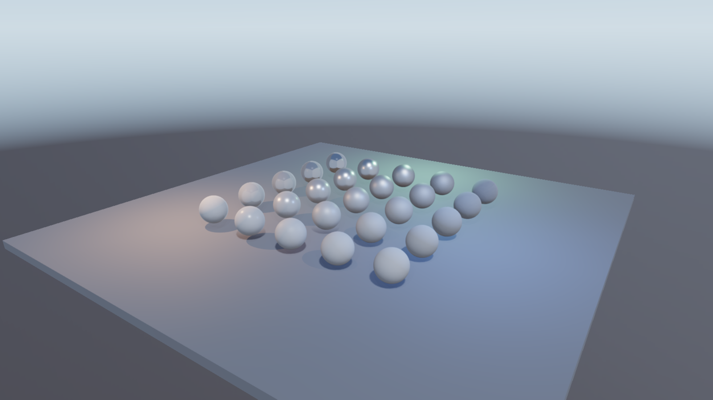 |  |

场景：`materials`。两张图均由对应后端实际运行捕获。

### Deferred Rendering · GBuffer

综合场景先将基础色、法线及材质参数写入 GBuffer，再执行延迟光照、反射与后处理，得到首页的最终画面。以下为同一视角的两个中间输出。

| Base Color · 基础色 | World Normal · 世界空间法线 |
|---|---|
| 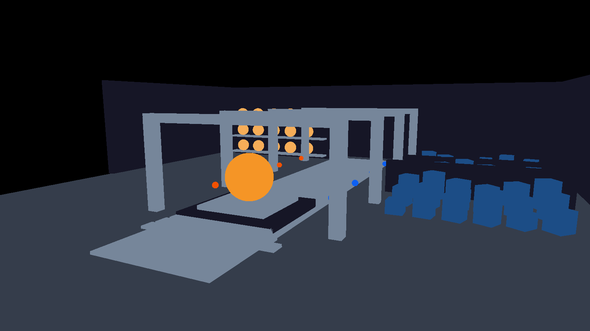 | 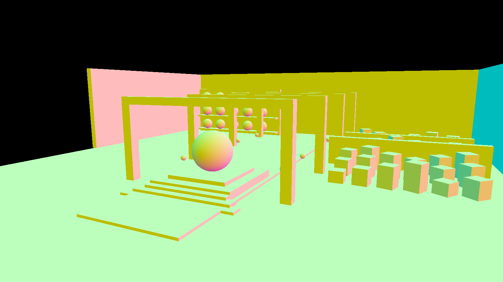 |

### Lighting · Forward / Forward+ / Deferred

Lighting Lab 使用 48 个材质物体和 32 盏点光源展示局部光照。Forward+ 与 Deferred 共用 Clustered Lighting 灯光列表，Forward 基线提供前 4 盏点光源的兼容路径。

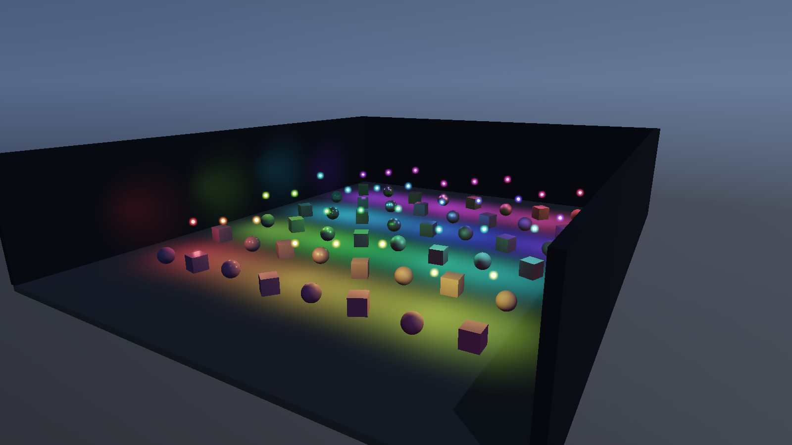

**三管线性能实测**：在同一 Lighting Lab、相机与材质配置下，先以 4 盏点光源比较三条路径，再以 32 盏点光源比较 Forward+ 与 Deferred。

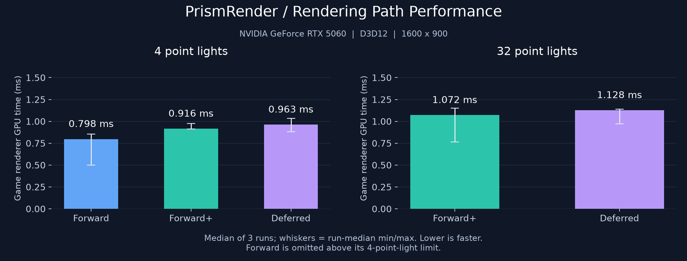

| 点光源数量 | 渲染路径 | GPU 耗时中位数 ↓ | GPU P95 ↓ | 应用帧间隔中位数 ↓ |
|---|---|---:|---:|---:|
| 4 | Forward | 0.798 ms | 2.230 ms | 3.881 ms |
| 4 | Forward+ | 0.916 ms | 2.657 ms | 4.178 ms |
| 4 | Deferred | 0.963 ms | 2.828 ms | 4.495 ms |
| 32 | Forward+ | 1.072 ms | 2.828 ms | 4.090 ms |
| 32 | Deferred | 1.128 ms | 2.860 ms | 4.588 ms |

测试环境：**RTX 5060 / i5-13600KF · D3D12 · 1600×900 · RelWithDebInfo**。关闭编辑器、VSync、GTAO、TAA、SSR 与局部灯阴影；保留 PBR、IBL、CSM、Bloom 和 Tonemapping。每组预热 120 帧、采样 600 帧，运行 3 轮；表中取各轮统计量的中位数，图中误差线表示各轮中位数范围。

Forward 基线最多计算 4 盏点光源，因此不参加 32 灯完整负载对比。当前 32 灯场景中 Forward+ 与 Deferred 的 GPU 结果接近，轮间范围有重叠；这些数据用于展示当前实现的开销，不代表所有场景的性能排名。应用帧间隔包含等待，GPU 耗时也不直接等于实际帧率。

[测试方法、逐轮结果与复现命令](RENDERING_PATH_BENCHMARK_CN.md) · [逐帧数据](Img/Labs/rendering-path-samples.csv)

### GPU Driven · 视锥与遮挡剔除

重复实例与遮挡墙用于演示 GPU 视锥剔除、Hi-Z 遮挡剔除和间接绘制。


### Reflection

SSR 提供屏幕内物体的反射细节，Planar Reflection 通过镜像相机生成平面反射，IBL 提供环境反射。

| Screen Space Reflection | Planar Reflection |
|---|---|
| 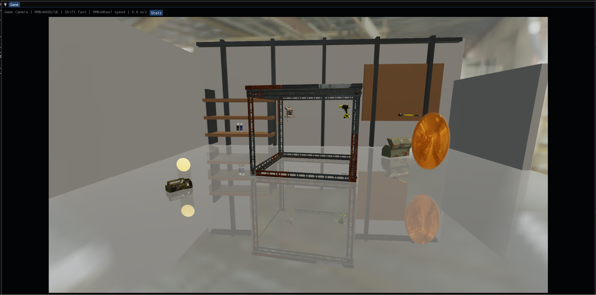 | 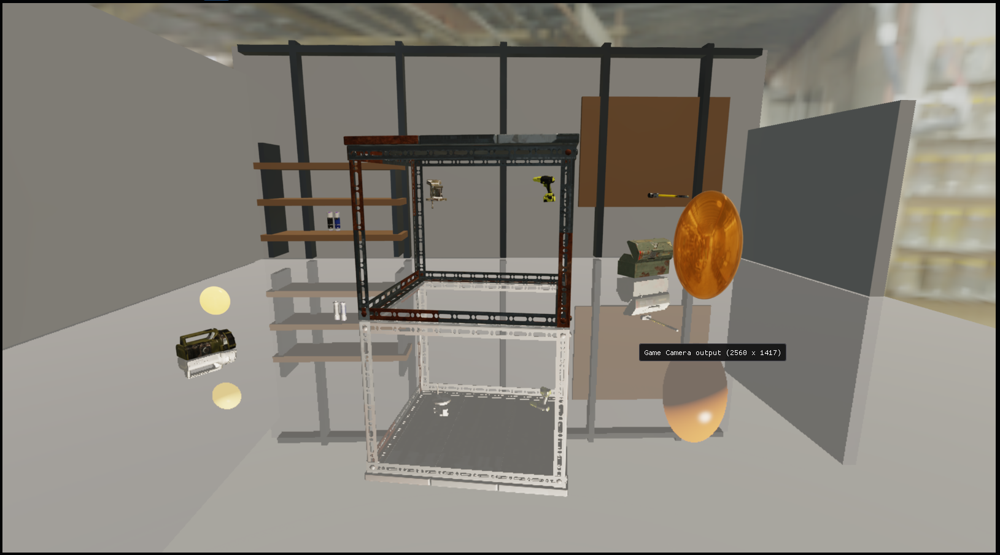 |

### Shadow Filtering

同一场景对比不同阴影过滤方式。

| Hard Shadow | PCF |
|---|---|
| 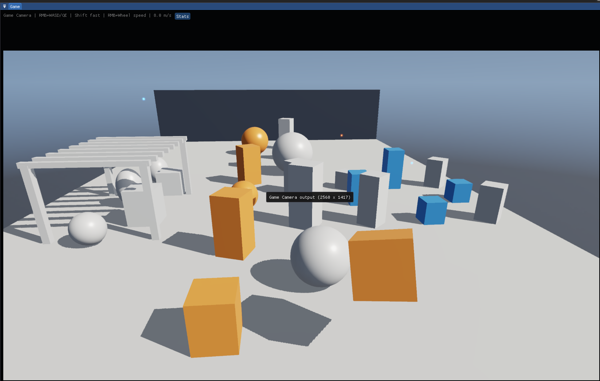 | 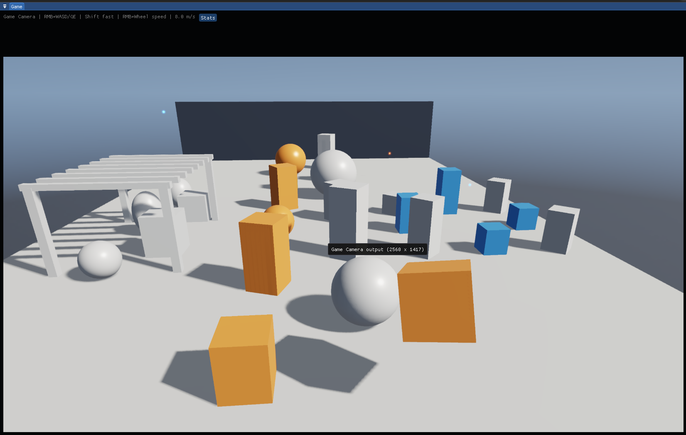 |
| **VSM** | **EVSM** |
| 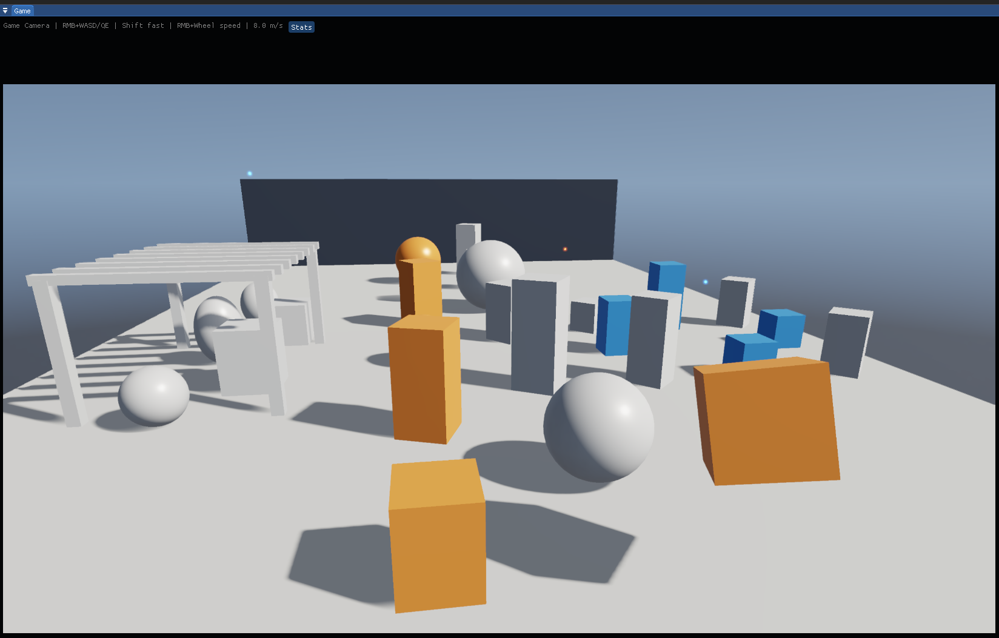 | 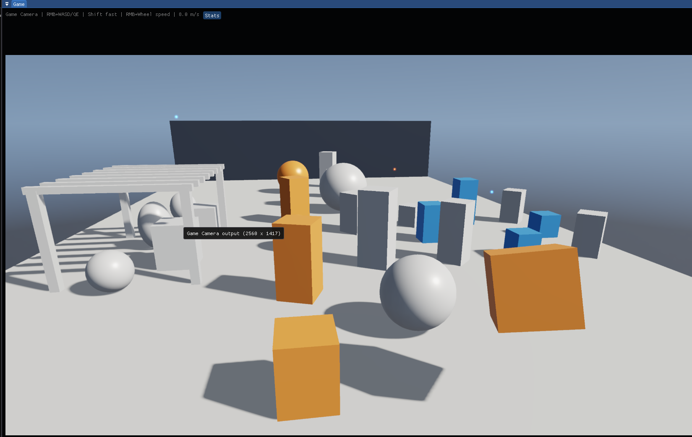 |

### Post Process

从 HDR 场景颜色提取 Bloom，再经曝光与 Tonemapping 得到最终画面。

| Final Output | HDR Scene Color | Bloom-only |
|---|---|---|
| 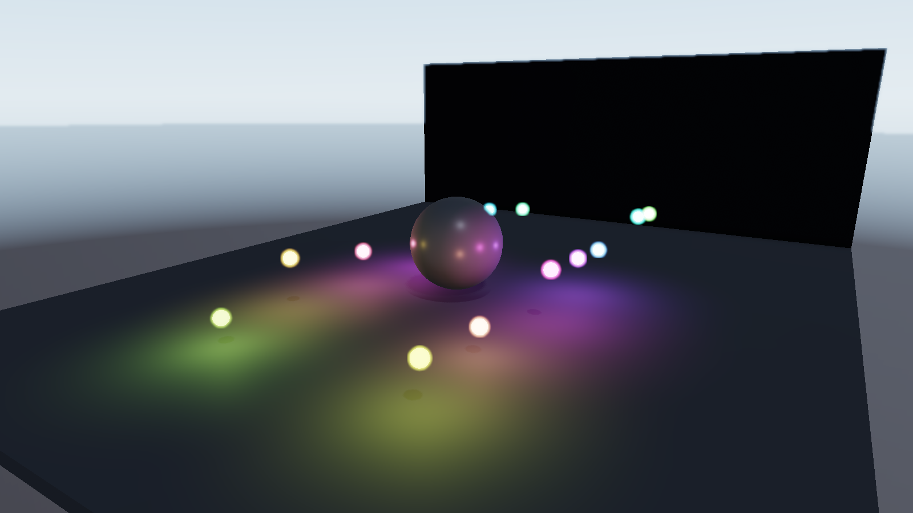 | 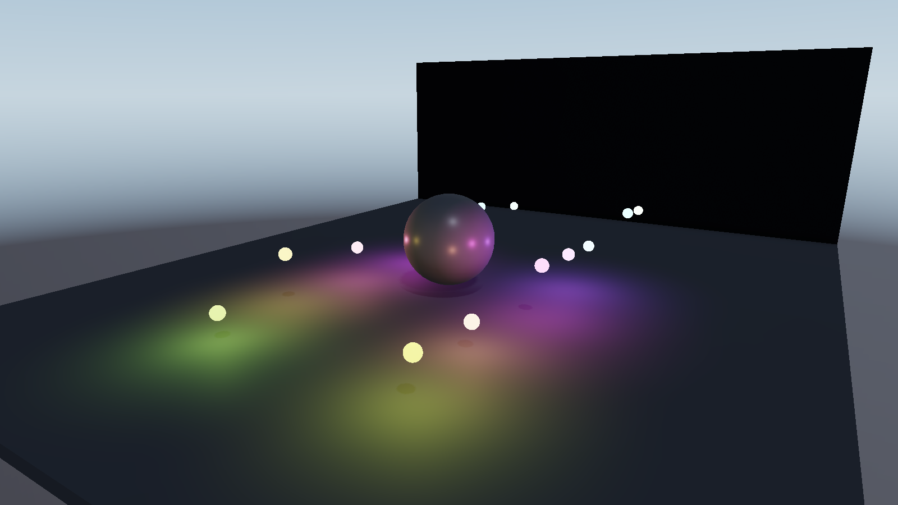 | 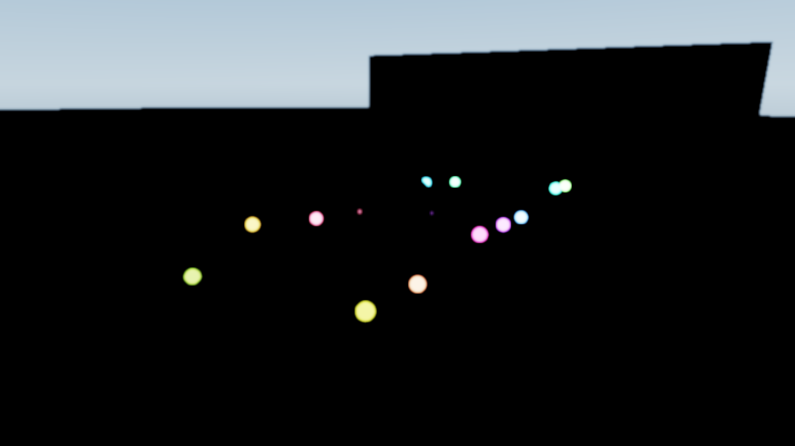 |

## 编辑器与渲染诊断

### Scene / Game 双视图

Scene View 提供相机操作、灯光标记和场景编辑；Game View 展示独立游戏相机的最终输出。Hierarchy、Inspector、Content Browser 与渲染调试面板在同一工作区中组织场景和资源。

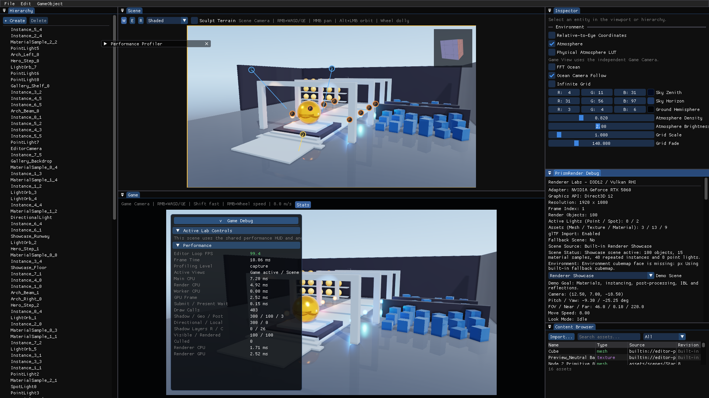

### Render Graph · 运行统计

在 RenderGraph Lab 中查看当前帧的 Pass 声明与执行数量、队列批次、跨队列同步和瞬态资源统计，并结合 CPU / GPU 时间与 Draw Call 计数定位帧内工作。

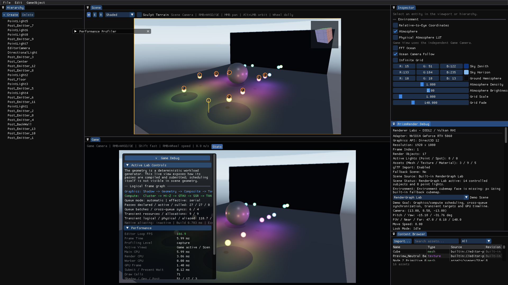

图中数值为该次运行的实时状态。场景：`render-graph`；完整界面截图可点击原图查看。

## 核心技术

- **跨 API RHI**：借鉴 UE 的 Renderer / RDG / RHI 分层，统一资源、描述符、Pipeline、命令与队列同步接口，由 D3D12 / Vulkan 后端映射到原生对象。Slang 编译 DXIL / SPIR-V，并通过 Reflection 构建资源绑定布局。
- **多线程渲染**：主线程更新场景与编辑器，通过不可变帧快照向渲染线程发布数据；工作线程池使用独立 Command Context 并行录制满足安全条件的 Pass。另提供可选的 `deferred-threaded` 独立 RHI 执行模式，默认使用 `native-direct`。
- **渲染依赖图（RDG）**：基于 Pass 资源读写声明建立 RAW / WAR / WAW 依赖，从最终输出反向裁剪无效 Pass，规划子资源 Barrier、瞬态资源显存别名、Graphics / Compute 队列批次与跨队列同步。
- **资源与提交管理**：Copy / Transfer Queue、分页 Upload Ring 与 Upload Ticket 支持异步上传；Frames-in-Flight、Fence / Timeline 和延迟销毁约束 GPU 资源复用。GPU 视锥剔除、Hi-Z 遮挡剔除与间接绘制组成 GPU Driven 路径。

| 方向 | 已实现能力 |
|---|---|
| 渲染路径 | Forward+、Deferred、用于对照的 Forward baseline |
| 材质与光照 | Metallic-Roughness PBR、IBL、方向光 / 点光源 / 聚光灯、Clustered Lighting |
| 阴影 | CSM、局部光源阴影、Hard / PCF / PCSS / VSM / EVSM |
| 反射与后处理 | SSR、Planar Reflection、GTAO、TAA、HDR、Bloom、Tonemapping |
| 可见性与提交 | CPU / GPU 视锥剔除、Hi-Z、GPU Instancing、Indirect Draw、PSO Cache |
| 海洋渲染 | 四级联频谱风浪、持久白沫、海面四叉树 LOD |
| 编辑与资源 | glTF 导入、场景层级、Transform / 材质编辑、Scene / Game 双视图、异步资源流送 |
| 调试与分析 | CPU / GPU Profiling、Pass 时间线、资源统计、固定场景截图与回归测试 |

## 架构

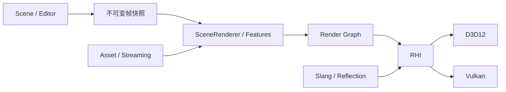
```mermaid
flowchart LR
    Scene[Scene / Editor] --> Packet[不可变帧快照]
    Packet --> Renderer[SceneRenderer / Features]
    Renderer --> RDG[Render Graph]
    RDG --> RHI[RHI]
    RHI --> D3D12[D3D12]
    RHI --> Vulkan[Vulkan]
    Asset[Asset / Streaming] --> Renderer
    Slang[Slang / Reflection] --> RHI
```

`Scene` 负责场景数据与渲染数据提取；`Renderer` 按 Feature 组织帧内工作；Render Graph 编译资源依赖和执行计划；`RHI` 将公共资源与命令语义落到两个后端。模块边界由 CMake 检查，入口 `main.cpp` 只负责启动应用。

```text
src/
├─ Core/         # 应用装配、任务调度与帧执行协议
├─ Platform/     # 窗口与输入
├─ Engine/       # ECS、反射与运行时服务
├─ Scene/        # 场景、相机、灯光与渲染快照
├─ Asset/        # 资源导入、加载、流送与上传请求
├─ Renderer/     # 渲染路径、Features 与 Render Graph
├─ RHI/          # 公共接口、执行服务、D3D12 / Vulkan 后端
├─ UI/           # ImGui 编辑器与性能面板
└─ Automation/   # 自动化运行、捕获与报告
```

## 构建与运行

Windows 开发环境：Visual Studio 2022 的 **Desktop development with C++** 工作负载、Windows SDK、CMake **3.25+**（现有 Preset 使用 schema v6）与 Ninja。准备 **Slang SDK v2026.8.1**，放置到 `third_party/slang`，或配置 `-DPRISM_SLANG_ROOT=<SDK 路径>`。运行 Vulkan 后端需要支持 Vulkan 的显卡驱动。

在仓库根目录的 VS 2022 Developer PowerShell 中执行：

```powershell
cmake --preset windows-ci
cmake --build --preset windows-ci --target PrismRender

.\build-windows-ci\RelWithDebInfo\PrismRender.exe --api d3d12 --scene showcase
```

切换后端或进入专题场景：

```powershell
.\build-windows-ci\RelWithDebInfo\PrismRender.exe --api vulkan --scene showcase
.\build-windows-ci\RelWithDebInfo\PrismRender.exe --api d3d12 --scene waveworks-ocean
```

| 场景参数 | 内容 |
|---|---|
| `showcase` / `preview` | 综合展示 / 编辑器与 glTF 预览 |
| `materials` / `lights` | Metallic-Roughness 材质矩阵 / 多光源 |
| `reflections` / `shadows` | 反射 / 阴影过滤 |
| `gpu-driven` / `post-process` | 剔除与间接绘制 / 后处理 |
| `render-graph` / `streaming` | 图调度与瞬态资源 / 资源流送 |
| `waveworks-ocean` | 频谱海洋 |

完整场景列表可通过 `PrismRender.exe --help` 查看，运行后也可在编辑器的 `Demo Scene` 中切换。[CMake Presets](CMakePresets.json) 另提供 Windows Vulkan-only、D3D12 standalone 和 Linux Vulkan 配置；Linux 配置关闭 Windows 编辑器与 Harness。

## 文档与源码

- [RHI 与 D3D12 / Vulkan 双后端设计](docs/RHI_DUAL_BACKEND_ARCHITECTURE_CN.md)
- [WaveWorks-like 海洋实现专题](WAVEWORKS_LIKE_OCEAN_CN.md)
- 源码入口：[Render Graph](src/Renderer/RenderGraph.cpp) · [Slang 编译与反射](src/Asset/SlangShaderCompiler.cpp) · [渲染执行服务](src/Core/Application/RenderExecutionService.h)
- 渲染与资源：[GPU 可见性](src/Renderer/Features/GpuDrivenVisibility.cpp) · [资源流送](src/Asset/AssetStreamingManager.cpp) · [实验场景目录](src/Scene/DemoSceneCatalog.cpp)
