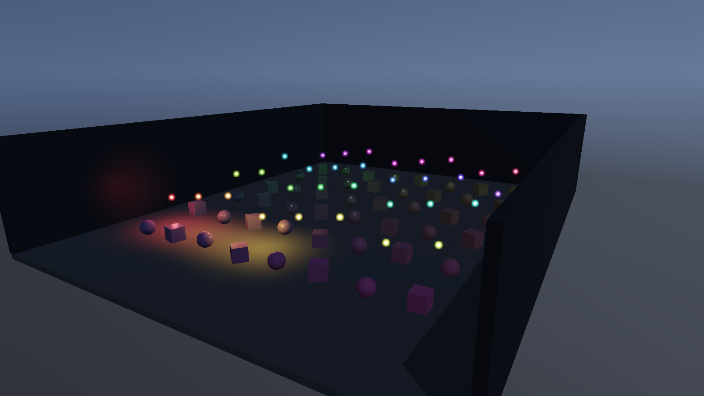
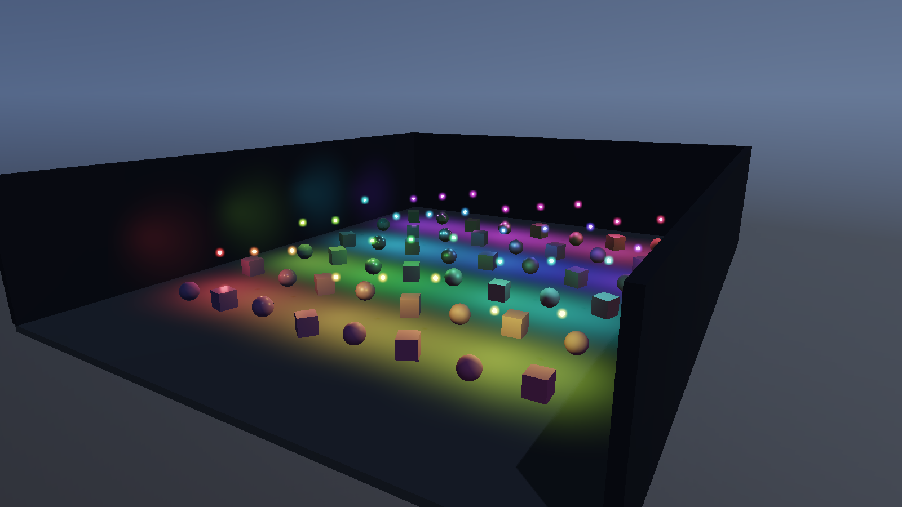

# Forward / Forward+ / Deferred 性能对比

本次测量展示 PrismRender 当前三条渲染路径在同一 Lighting Lab 中的开销。默认 Forward 基线只处理前 4 盏点光源；三路径主对比使用相同的 4 盏灯，多光源扩展只比较能够完整处理 32 盏灯的 Forward+ 与 Deferred。

这些结果来自本地开发构建，包含尚未发布的 Shader 绑定与渲染执行改动，并非本次公开提交的二进制测量结果。原始构建的可执行文件 SHA-256 与 Shader 修订标识保存在汇总 JSON 中。公开脚本与 Lighting Lab 参数可用于重新测量公开源码，但不同源码版本得到的画面和数值应单独记录。


## 测试条件

| 条件 | 配置 |
|---|---|
| 测试日期 | 2026-10-08，UTC+8 |
| GPU | NVIDIA GeForce RTX 5060，约 8 GB 独立显存 |
| CPU | Intel Core i5-13600KF |
| 驱动 | Windows 驱动版本 32.0.15.9186 |
| 构建 | x64 / MSVC 195136257 / RelWithDebInfo |
| API / 分辨率 | Direct3D 12 / 1600×900 |
| 场景 | `lights`；固定相机、几何、材质和方向光 |
| 几何 | 48 个材质主体、32 个发光标记、4 个环境物体，共 84 个物体 |
| 公共效果 | PBR、IBL、CSM、HDR、Bloom、Tonemapping |
| 关闭效果 | GTAO、TAA、SSR、Planar Reflection、局部灯阴影 |
| 应用模式 | Standalone；仅 Game View；隐藏窗口；无编辑器 |
| 执行 | threaded 渲染线程 / native-direct RHI / native RDG 队列 |
| 呈现 | `benchmark`；实际 Immediate，D3D12 `syncInterval=0`；无 FPS 上限 |
| 采样 | basic profiler；性能采样关闭 GPU validation |
| 每轮 | 120 帧预热 + 600 帧采样 + 8 帧排空，共 728 帧 |
| 重复 | 每组 3 轮，共 15 次独立进程、9,000 个有效测量帧 |

每轮在相同灯数内轮换路径顺序。运行时仅修改有效点光源数量，32 个发光标记和其余几何保持不变。GTAO/TAA 在当前实现中依赖 Deferred，统一关闭可以避免只给 Deferred 额外增加效果开销。分辨率、视图、实际呈现模式、采样帧数和 GPU 源帧完整性均由汇总脚本验证；运行日志还确认实际启用的渲染路径和灯数，以拒绝未包含自动化选项的旧二进制。

未锁定 GPU 频率，未清空系统或驱动 Shader 缓存；进程内状态每次重新创建。这是单台桌面机器上的重复测量，保留全部轮次，展示轮间变化。

## 结果与口径

| 点光源 | 管线 | GPU 中位数 | GPU P95 | 应用帧间隔中位数 | 各轮 GPU 中位数范围 |
|---|---|---:|---:|---:|---:|
| 4 | Forward | 0.798 ms | 2.230 ms | 3.881 ms | 0.499–0.855 ms |
| 4 | Forward+ | 0.916 ms | 2.657 ms | 4.178 ms | 0.912–0.976 ms |
| 4 | Deferred | 0.963 ms | 2.828 ms | 4.495 ms | 0.881–1.033 ms |
| 32 | Forward+ | 1.072 ms | 2.828 ms | 4.090 ms | 0.764–1.151 ms |
| 32 | Deferred | 1.128 ms | 2.860 ms | 4.588 ms | 0.972–1.138 ms |

表中每一项均先按轮计算，再取 3 轮的中位数；P95 使用 nearest-rank，偶数样本的中位数取中间两项平均。图中柱高是三轮 GPU 中位数的中位数，误差线是三轮中位数的最小值至最大值。

逐轮 GPU 中位数如下，单位为 ms：

| 点光源 / 管线 | 第 1 轮 | 第 2 轮 | 第 3 轮 |
|---|---:|---:|---:|
| 4 / Forward | 0.499 | 0.798 | 0.855 |
| 4 / Forward+ | 0.916 | 0.912 | 0.976 |
| 4 / Deferred | 1.033 | 0.881 | 0.963 |
| 32 / Forward+ | 1.151 | 0.764 | 1.072 |
| 32 / Deferred | 1.138 | 1.128 | 0.972 |

- **GPU 耗时**：Game Renderer 的 Graphics 队列起止 timestamp 区间，覆盖该视图的 RDG 渲染及其依赖等待，包含公共阴影与后处理；不包含 CPU 场景准备、编辑器或 Present。异步查询按 `gpuResolvedFrameId` 对齐源帧，排空阶段用于收回采样末尾的结果。
- **应用帧间隔**：Profiler 的 `editorLoopMs` 字段；Standalone 模式仍沿用该字段名。它测量应用完成循环的间隔，包含等待，不是纯 CPU 活跃执行时间，也不是显示器扫描输出时间。
- **原始数据**：CSV 每行对应一个测量源帧，另保留相邻帧实际 Present 返回时间戳的差值 `presentIntervalMs`。较早版本的公开分析器没有该时间戳，重新测量时此项留空；GPU 与应用间隔仍独立统计。不会使用 `1000 / GPU ms` 冒充实际 FPS。

4 灯负载下，Forward 基线的 GPU 中位数较低；Forward+ 包含灯光分簇构建，Deferred 另有 GBuffer 与延迟光照工作。32 灯下 Forward+ 与 Deferred 的 GPU 中位数接近，轮间范围重叠，不能据此得出稳定的通用胜负。该场景几何规模较小，灯数、覆盖率、过绘制、材质复杂度或硬件改变后，需要重新测量。

## 同条件画面对照

以下画面来自 D3D12 实际运行，固定第 60 帧与 1600×900 Game 输出。捕获开启 D3D12 debug layer，独立于关闭验证层的性能运行；这组截图用于核对场景与功能配置。采集未报告验证错误，日志包含现有的优化清屏值不匹配警告（D3D12 820）；本次未修改该渲染行为。

| 4 灯 · Forward | 4 灯 · Forward+ | 4 灯 · Deferred |
|---|---|---|
|  |  |  |

| 32 灯 · Forward+ | 32 灯 · Deferred |
|---|---|
|  |  |

## 复现

在 Windows 的 VS Developer PowerShell 中构建。测量脚本需要 PowerShell 7，汇总 CSV/JSON 使用 Python 标准库；可选的 `--plot` 需要 Matplotlib。

```powershell
cmake --build --preset windows-ci --target PrismRender

# 输出目录必须尚不存在；默认执行 D3D12 的全部 15 次测量。
pwsh -NoProfile -File tools/MeasureRenderingPaths.ps1 `
    -OutputDirectory artifacts/rendering-paths-new

python tools/SummarizeRenderingPaths.py `
    --input artifacts/rendering-paths-new --output artifacts/rendering-paths-new-summary

# 安装有 Matplotlib 时，加 --plot 同时生成图表。
```

脚本支持 `-Backend vulkan`、分辨率、预热帧数、采样帧数和重复轮数参数。本页仅发布已经实测的 D3D12 数据，不能将其当作 Vulkan 结果。

Lighting Lab 的自动化参数为 `PRISM_RENDER_LIGHTING_PATH=forward|forward-plus|deferred` 与 `PRISM_RENDER_LIGHTING_COUNT=1..32`。前者同时关闭 GTAO/TAA，形成共同功能配置；未设置时保留原有场景默认行为。测量驱动自动跳过大于 4 灯的 Forward，避免用截断光源数的画面作完整负载对比。

## 数据与实现

- [汇总 JSON：硬件标识、逐轮指标、呈现状态与哈希](Img/Labs/rendering-path-performance.json)
- [逐帧 CSV：9,000 个源帧的 GPU / 应用间隔 / Present 间隔](Img/Labs/rendering-path-samples.csv)
- [测量脚本](tools/MeasureRenderingPaths.ps1) · [汇总与绘图脚本](tools/SummarizeRenderingPaths.py)
- [Lighting Lab 配置](src/Renderer/DemoSceneSettings.cpp) · [灯光场景构建](src/Scene/LightingShowcaseSceneFactory.cpp)
- [异步 GPU 对齐与统计检查](tests/RenderingPathSummaryTests.py)

本地完整 JSONL、进程日志、配置与文件哈希保存在每次运行的 `artifacts/` 目录；仓库提供精简逐帧 CSV 和逐轮汇总，便于检查图表与表格。应用二进制 SHA-256 和 Shader 修订标识记录在汇总 JSON 中。
