# PrismRender WaveWorks-like 实时海洋

[返回项目主页](README.md)

PrismRender 包含一套自研的大范围实时海洋渲染方案。该方案参考 NVIDIA WaveWorks 的公开技术思路与示例表现，但不依赖或分发 WaveWorks SDK、运行库及专有 Shader。

系统以 **Base Wind + Swell 双 JONSWAP 频谱**描述风浪和涌浪，通过 Compute Shader 完成四级联频谱演化与二维 IFFT，生成高度、水平位移、坡度、波面折叠和坡度矩；海面几何由相机相关的自适应四叉树 Patch LOD 构建，并支持动态风力、持久白沫和局部船尾流。

<!-- GIF 槽位：当前文件是由实机截图生成的单帧占位 GIF。录制完成后直接用同名文件覆盖。 -->

<p align="center">
  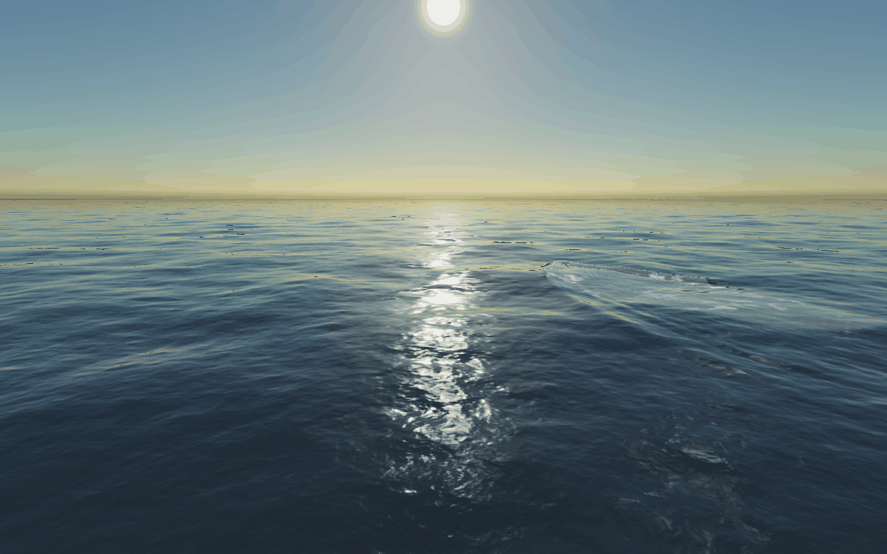
</p>

<p align="center"><sub>Four-cascade spectral ocean · persistent foam · adaptive quadtree geometry · atmospheric reflection</sub></p>

<p align="center"><sub>D3D12 · 1280×800 · Extreme · deterministic Game View capture</sub></p>

## 核心功能

| 功能 | 实现方式 |
|---|---|
| 大范围风浪 | Base Wind 与 Swell 双 JONSWAP 频谱 |
| 四级联 FFT | 15.625、62.5、250、1000 m 四个周期频带 |
| 海浪运动 | GPU 频谱相位演化与二维 IFFT |
| 尖锐浪峰 | 高度位移与水平 Choppy 位移共同改变几何 |
| 海面几何 | 相机相关的 CPU 四叉树 Patch LOD 与实例化绘制 |
| 风浪白沫 | Jacobian/Folding 破碎判据、历史累积、平流与耗散 |
| 局部交互 | 有限区域局部波方程、船尾流和扰动发射器 |
| 水面材质 | Fresnel、GGX 高光、环境/大气反射及散射近似 |
| 远景稳定性 | 坡度矩方差过滤、导数 Mip 选择和细级联距离淡出 |
| 实时调试 | 风速、风向、Fetch、Swell、泡沫、局部波与几何 LOD 控制 |

## 海浪模拟

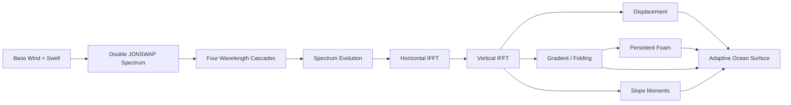
```mermaid
flowchart LR
    A[Base Wind + Swell] --> B[Double JONSWAP Spectrum]
    B --> C[Four Wavelength Cascades]
    C --> D[Spectrum Evolution]
    D --> E[Horizontal IFFT]
    E --> F[Vertical IFFT]
    F --> G[Displacement]
    F --> H[Gradient / Folding]
    F --> I[Slope Moments]
    H --> J[Persistent Foam]
    G --> K[Adaptive Ocean Surface]
    H --> K
    I --> K
    J --> K
```

### GPU 中间纹理可视化

以下图片不是概念图，而是从同一份 D3D12 RenderDoc 捕获
`FFT水面渲染.rdc` 的实际 GPU 资源导出。每张图均按 `Slice 0～3`
排成 2×2，对应 C0、C1、C2、C3 四个波长级联。

浮点纹理不能直接当普通 0～1 颜色查看，因此展示图做了**仅用于可视化的归一化**：

- 频域复数显示模长，并使用对数尺度，让低能量频率也能被看见。
- 位移、坡度等有正负的数据以 0.5 灰为零点；低于 0 偏暗，高于 0 偏亮。
- 法线从 `[-1, 1]` 编码到 `[0, 1]`。
- 四个 Slice 共用同一阶段的显示尺度，因此仍可比较级联间的相对能量。
- PNG 只用于讲解，Shader 使用的仍是原始 `RGBA32F/RGBA16F` 数值。

#### RenderDoc 定位

| 阶段 | EID | 查看资源 | 说明 |
|---|---:|---|---|
| 初始双 JONSWAP | 166 的输入 | `OceanInitialSpectrum` | 本帧复用缓存；只有风浪参数变化时才重新生成 |
| 频谱相位演化 | 166 | `OceanSpectrumA0/B0` | 将 `H0(k)` 推进到当前时间 `H(k,t)` |
| 横向 IFFT | 181 | `OceanSpectrumA1/B1` | X 方向已回到空间域，Z 方向仍在频域 |
| 纵向 IFFT | 197 | `OceanSpectrumA0/B0` | X、Z 都回到空间域 |
| 派生水面 Map | 214 | `OceanDisplacement`、`OceanNormalFoam`、`OceanSlopeMoments` | 从空间位移求导，生成渲染直接使用的 Map |
| 持久泡沫 | 228 | `OceanFoamHistory1` | 本捕获帧的写入历史；0/1 两张纹理交替读写 |
| 生成 Mip 1～9 | 243～275 | 上述四张最终 Map | 每次 Dispatch 从上一层 2×2 过滤到下一层 |
| 自适应海面绘制 | 350 | 最终 Map 作为 SRV | 四叉树 Patch 实例采样并合成四级联 |

#### 纹理数组与通道布局

这些资源均为 `Texture2DArray`。`Width × Height` 都是 512×512，
`Array Size = 4` 才表示四个级联；它不是四张空间上相邻的海域贴图。

| 资源 | 格式 | Mip | RGBA 通道 |
|---|---|---:|---|
| `OceanInitialSpectrum` | `RGBA32F` | 1 | `RG = Base Wind H0` 的复数实部/虚部；`BA = Swell H0` 的复数实部/虚部 |
| `OceanSpectrumA0/A1` | `RGBA32F` | 1 | `RG = Height` 复数；`BA = Dx` 复数 |
| `OceanSpectrumB0/B1` | `RGBA32F` | 1 | `RG = Dz` 复数；`BA = 0` |
| `OceanDisplacement` | `RGBA16F` | 10 | `R = Dx`，`G = Height`，`B = Dz`，`A = Jacobian` |
| `OceanNormalFoam` | `RGBA16F` | 10 | `RGB = Normal.xyz`，`A = Folding/Breaking`；名称中的 Foam 是历史命名 |
| `OceanSlopeMoments` | `RGBA16F` | 10 | `R = dH/dx`，`G = dH/dz`，`B = (dH/dx)²`，`A = (dH/dz)²` |
| `OceanFoamHistory0/1` | `RGBA16F` | 10 | Mip 0：`R = Foam Energy`，`G = Dx`，`B = Dz`，`A = Height`；GBA 为下一帧表面运动估计保留 |

泡沫 History 的上述 GBA 语义只适用于 Mip 0；Mip 1～9 只保留经过覆盖率过滤的
R 通道泡沫能量，GBA 写为 0。

四个 Slice 使用相同分辨率但覆盖不同世界周期，所以每 texel 的物理尺寸不同：

| Slice | 世界周期 | 每 texel 约覆盖 | 主要内容 |
|---:|---:|---:|---|
| C0 | 15.625 m | 3.05 cm | 细浪与小浪尖 |
| C1 | 62.5 m | 12.2 cm | 中短风浪 |
| C2 | 250 m | 48.8 cm | 中长波组 |
| C3 | 1000 m | 1.95 m | 大尺度涌浪 |

#### 1. 初始双 JONSWAP 频谱

`OceanInitialSpectrum` 的每个 texel 不是海面位置，而是一个波向量
`k=(kx,kz)`。Shader 分别计算 Base Wind 和 Swell 的 JONSWAP 能量，
乘上方向分布、级联频带权重与确定性高斯随机数，保存两组复数 `H0(k)`。
图中橙色表示 Base Wind 模长，青色表示 Swell 模长。

<p align="center">
  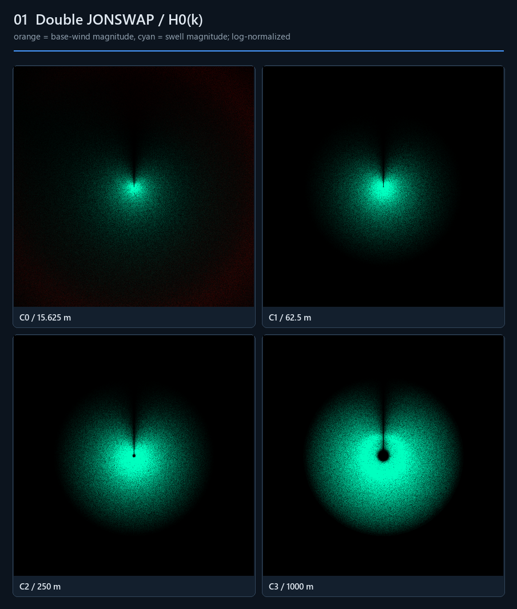
</p>

#### 2. 当前时刻的高度与水平位移频谱

EID 166 根据深水色散关系 `ω(k)=sqrt(g|k|)` 推进复数相位，先得到
`H(k,t)`，再用波向量方向构造 `Dx/Dz` 频谱。图中 RGB 分别表示
`|Dx| / |Height| / |Dz|`。这里仍是频域数据，不是可直接加到顶点上的米制位移。

<p align="center">
  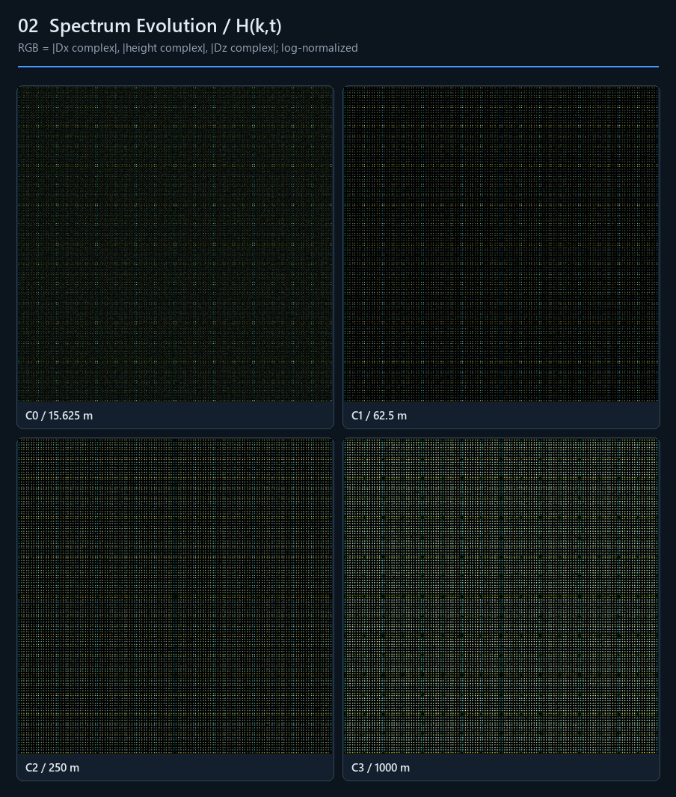
</p>

#### 3. 横向 IFFT

EID 181 让一个 Workgroup 负责一整行，在共享内存中完成该行全部
Radix-2 蝶形阶段。输出的 `A1/B1` 保持同样的 RGBA 语义，但此时
X 已是空间坐标，Z 仍是频率坐标，所以图案呈现明显的单方向结构。

<p align="center">
  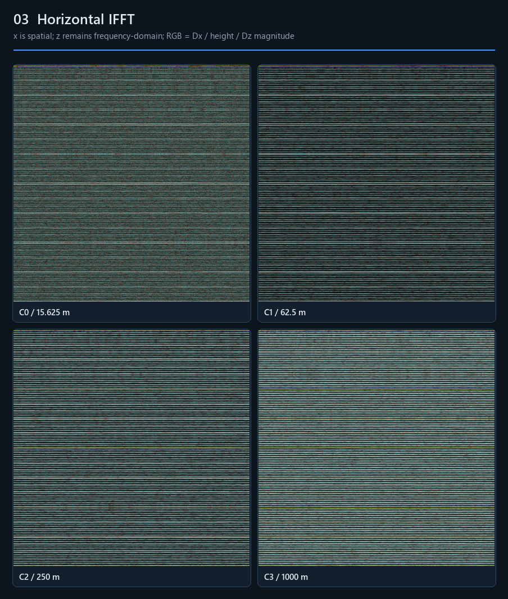
</p>

#### 4. 纵向 IFFT

EID 197 对列执行同样的过程，得到完整二维空间场。随后应用棋盘符号修正
与 `1/(512²)` 归一化：`A0.R → Height`、`A0.B → Dx`、
`B0.R → Dz`；对应复数的虚部只应剩数值误差。图中 RGB 是带符号的
`Dx / Height / Dz`。

<p align="center">
  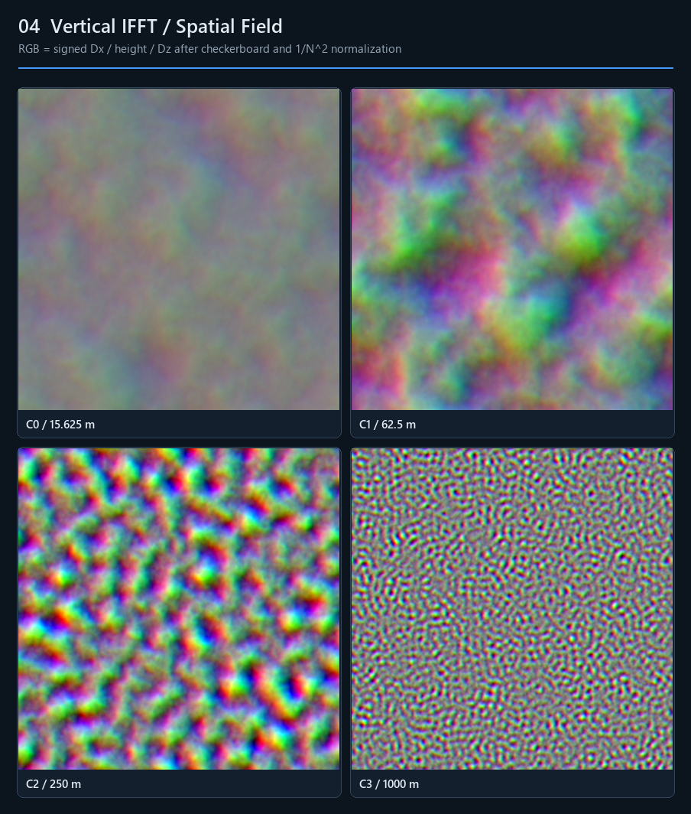
</p>

#### 5. 位移与水平压缩

EID 214 将 IFFT 空间场转换为半精度渲染 Map。`Displacement.rgb`
直接表示三维位移，顶点阶段会将四个级联的采样结果加到基础世界位置；
`Displacement.a` 是水平变形矩阵的 Jacobian，用于判断局部面积压缩或翻折。

<p align="center">
  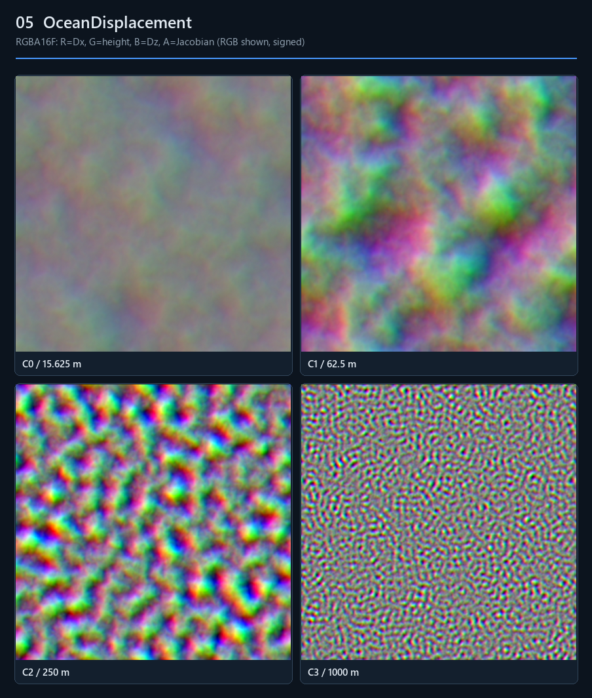
</p>

<p align="center">
  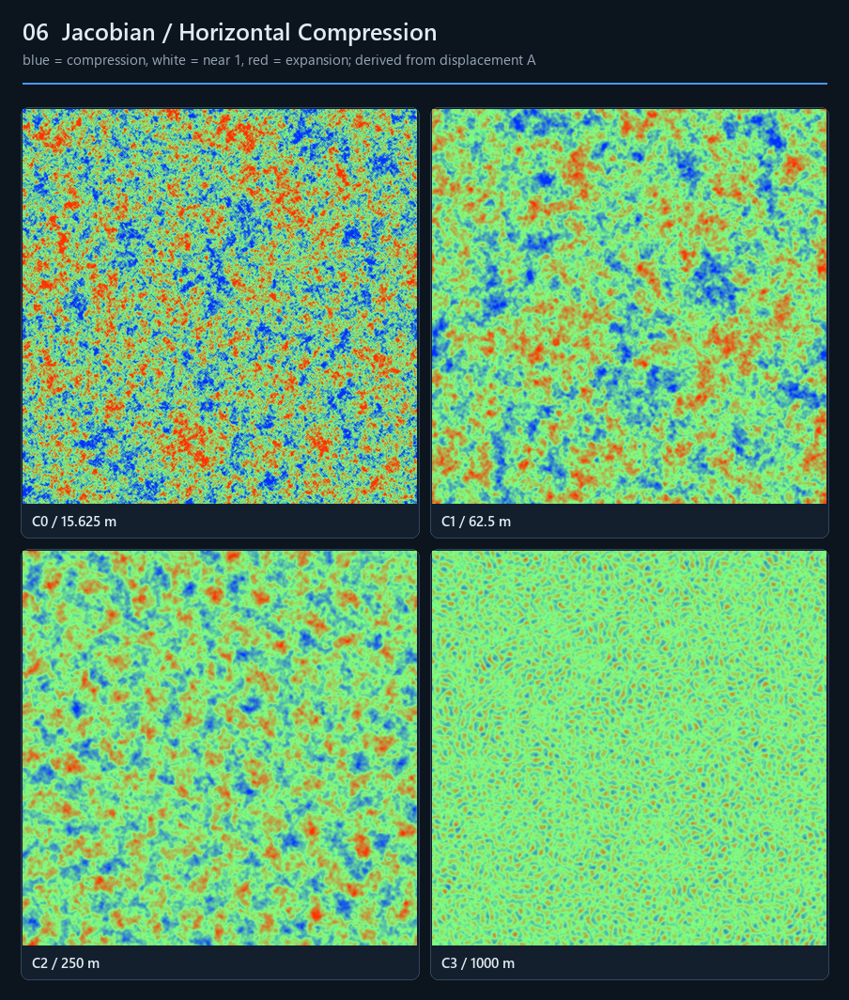
</p>

#### 6. 法线、Folding 与坡度矩

Compute Shader 对空间位移做周期中心差分，构造切线并叉乘得到世界空间法线；
同时计算水平形变矩阵最小主伸长量，将压缩程度写入 Folding。坡度的一阶矩
用于法线，二阶矩用于估计像素内未解析细浪的坡度方差。

<p align="center">
  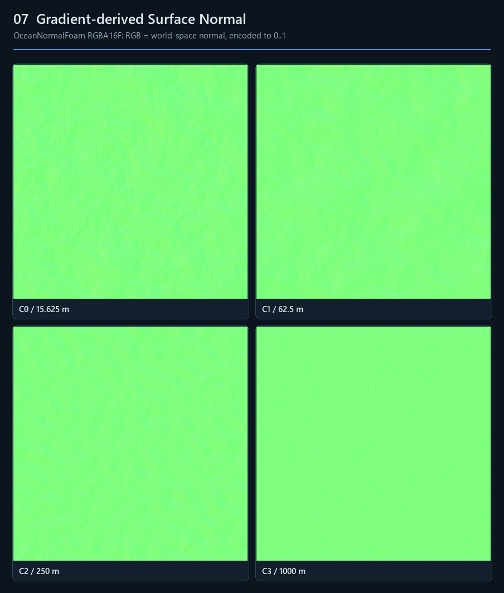
</p>

<p align="center">
  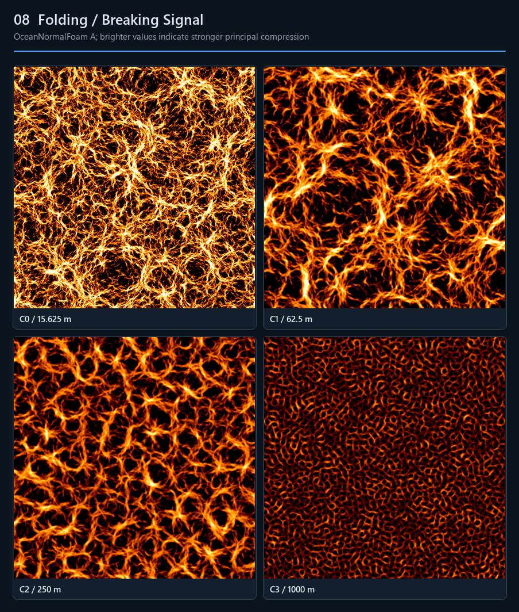
</p>

<p align="center">
  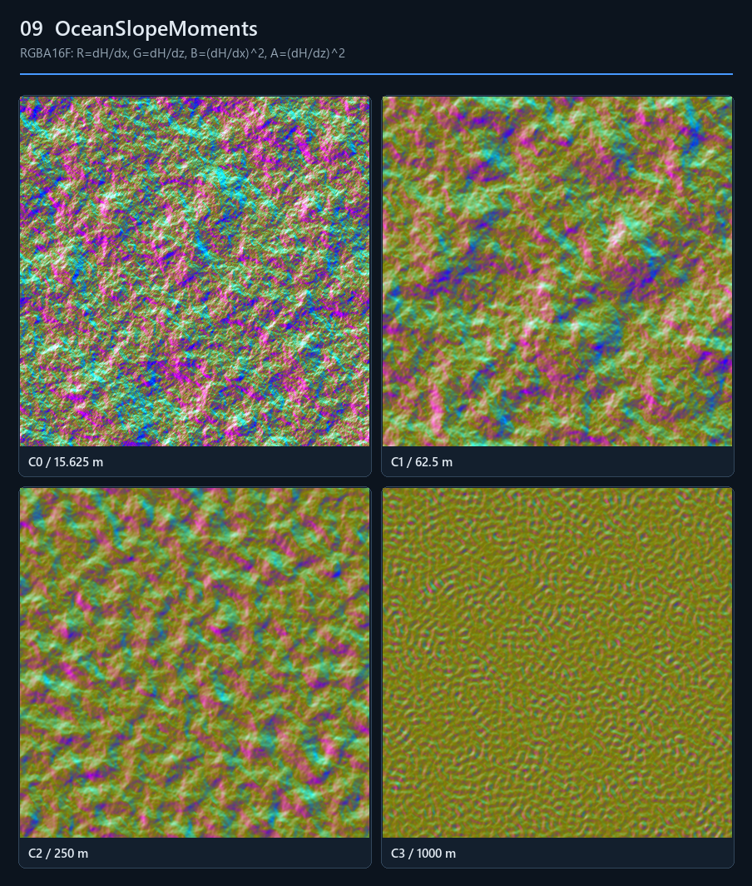
</p>

#### 7. 持久泡沫历史

EID 228 读取上一张 History，并根据水平位移差反向追踪泡沫；Folding、
浪峰突出度和上升速度共同形成破碎源，再经过空间耗散与时间衰减写入另一张
History。本捕获帧写入 `OceanFoamHistory1`。下图只显示 R 通道泡沫能量；
GBA 保存本帧 `Dx/Dz/Height`，供下一帧估计表面运动。
这帧只有 C0 出现非零泡沫能量（最大值约 0.0147），C1～C3 为 0；空白 Slice
是当前风浪/破碎阈值的真实结果，不是导出失败。

<p align="center">
  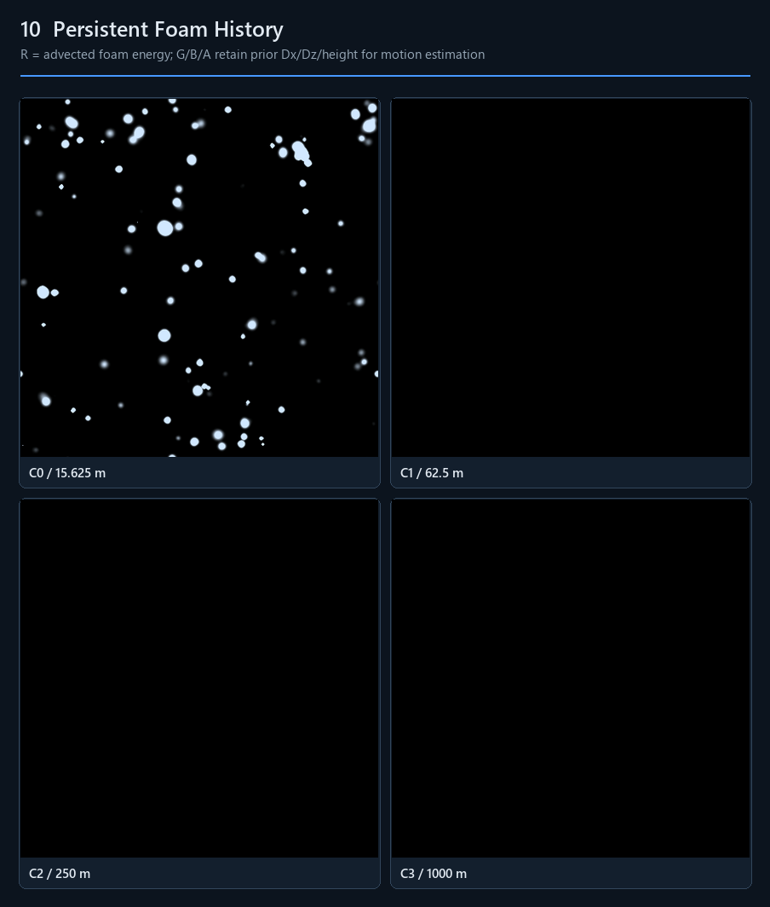
</p>

#### 8. 这些纹理怎样变成最终大海

四级联纹理是**可周期平铺的波场**，并不只覆盖一块 512×512 顶点的 Mesh。
四叉树先选择当前相机周围需要绘制的世界 Patch；每个 Patch 实例把共享单位
网格转换为连续世界坐标。随后同一个顶点用世界 XZ 分别除以四个世界周期，
得到四组 UV：

```text
worldXZ
  ├─ / 15.625 → sample Slice 0 displacement
  ├─ / 62.5   → sample Slice 1 displacement
  ├─ / 250    → sample Slice 2 displacement
  └─ / 1000   → sample Slice 3 displacement

Pworld' = Pworld + Σ DistanceWeight(c, cameraDistance) × Dc(worldXZ)
```

因此同一个近处顶点会同时获得细浪、中短波、中长波和大涌浪位移。距离权重
只让远处无法由屏幕解析的细级联逐渐淡出，不会把顶点“分配”给某一个级联。
像素阶段以同样的世界坐标采样 `NormalFoam`、`SlopeMoments` 和
`FoamHistory`：法线进入 Fresnel/GGX 光照，坡度方差调整远处粗糙度，
Folding 与历史能量控制白沫覆盖。最终 EID 350 的一次实例化绘制把这些
Patch 组合成视觉上连续的大范围海面。

对应实现可查看：

- [`OceanInitialSpectrum.slang`](assets/shaders/Ocean/OceanInitialSpectrum.slang)：双 JONSWAP、频带分配和 `H0(k)`。
- [`OceanSpectrumEvolution.slang`](assets/shaders/Ocean/OceanSpectrumEvolution.slang)：相位演化及 `Height/Dx/Dz` 复数打包。
- [`OceanFft.slang`](assets/shaders/Ocean/OceanFft.slang)：横向/纵向共享内存 IFFT。
- [`OceanBuildMaps.slang`](assets/shaders/Ocean/OceanBuildMaps.slang)：位移、法线、Jacobian、Folding 和 Moments。
- [`OceanFoam.slang`](assets/shaders/Ocean/OceanFoam.slang)：泡沫平流、生成、耗散和 History 写回。
- [`OceanSurface.hlsl`](assets/shaders/OceanSurface.hlsl)：四级联采样、顶点位移与最终水面材质。

> **面试可回答版本：** 我把海浪数据组织成四层 512×512 的纹理数组，
> 四层不是四块海域，而是 15.625～1000 米四个世界周期的波长频带。
> 初始纹理用 RG/BA 分别保存 Base Wind 和 Swell 的复数 JONSWAP 系数；
> 每帧频谱演化后，A 纹理保存高度与 X 位移复数，B 纹理保存 Z 位移复数。
> 横纵两次 IFFT 将它们变成空间位移，再生成位移、法线/Folding、坡度矩和
> 持久泡沫 Map。四叉树 Patch 顶点按连续世界坐标采样四个 Slice 并叠加，
> 像素阶段再用法线、坡度方差和泡沫完成 GGX/Fresnel 水面着色。RenderDoc
> 中可沿 EID 166、181、197、214、228、350 逐步验证整条数据流。

Base Wind 与 Swell 分别描述局部风浪和远距离涌浪。系统根据风速、风向、Fetch、谱峰、短波截止和振幅参数计算 JONSWAP 频谱能量。每个频率格点根据波向量推导物理波长，并通过 `BandWeight` 将重叠波段的能量平滑分配到四个级联：

```text
k = 2π / Lc × (frequencyCoordinate - resolution / 2)
λ = 2π / |k|
H0,c(k) = Gaussian(k) × sqrt(P(k) × BandWeight(c,k) / 2)
```

每帧根据深水色散关系推进频谱相位：

```text
ω(k) = sqrt(g × |k|)
H(k,t) = H0(k)e^(iωt) + conjugate(H0(-k))e^(-iωt)
```

高度频谱还用于构造 `Dx/Dz` 水平位移频谱。二维 IFFT 被拆成横向和纵向两个阶段，把频域复数数据转换为空间海面：

```text
OceanDisplacement = (Dx, Height, Dz, Jacobian)
OceanGradient     = (Normal/Gradient.xyz, Folding)
OceanSlopeMoments = (SlopeX, SlopeZ, SlopeX², SlopeZ²)
OceanFoamHistory  = Persistent Foam Energy
```

四级联不是四块不同海域，而是同一片海面的四个物理波长频带：

| 级联 | 周期 | 主要作用 |
|---:|---:|---|
| Slice 0 | 15.625 m | 近距离细浪与细小浪尖 |
| Slice 1 | 62.5 m | 中短尺度风浪 |
| Slice 2 | 250 m | 中长尺度波形 |
| Slice 3 | 1000 m | 大尺度涌浪与远景轮廓 |

为了说明每个频带实际给海面增加了什么，下面两组图片均通过与 Game Debug 中 `Cascade Master` 复选框相同的掩码生成，并保持相同相机、时间、风浪参数和曝光。

第一组将四个级联分别单独启用：

- C0：15.625 m 周期，主要提供近景细浪、细小浪尖和高频法线变化。
- C1：62.5 m 周期，补充中短尺度风浪，使水面不只剩均匀细纹。
- C2：250 m 周期，提供中长尺度起伏和较大的波组结构。
- C3：1000 m 周期，提供大尺度涌浪、低频高度变化和远景轮廓。

<p align="center">
  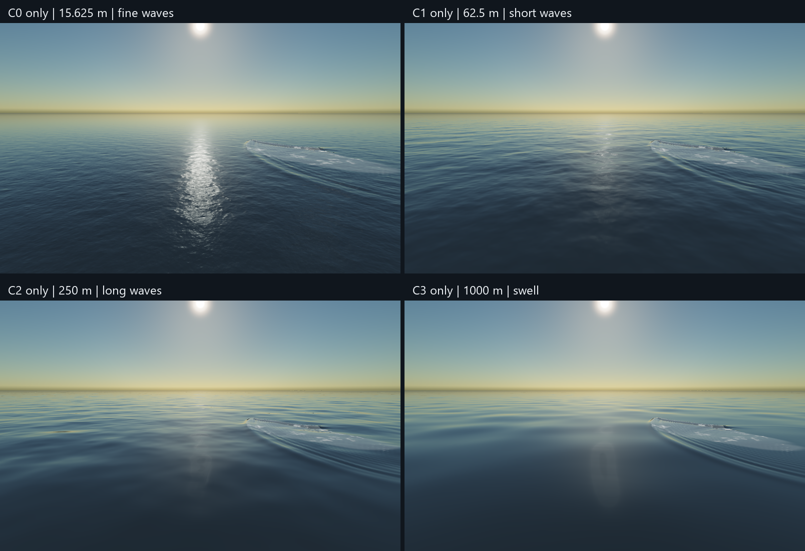
</p>

第二组按渲染时的叠加顺序逐步加入频带。它能直观看出：同一个海面顶点会依次采样这些级联的位移、坡度、折叠和坡度矩，然后把有效频带的结果叠加，而不是把顶点分配给某一个级联。

<p align="center">
  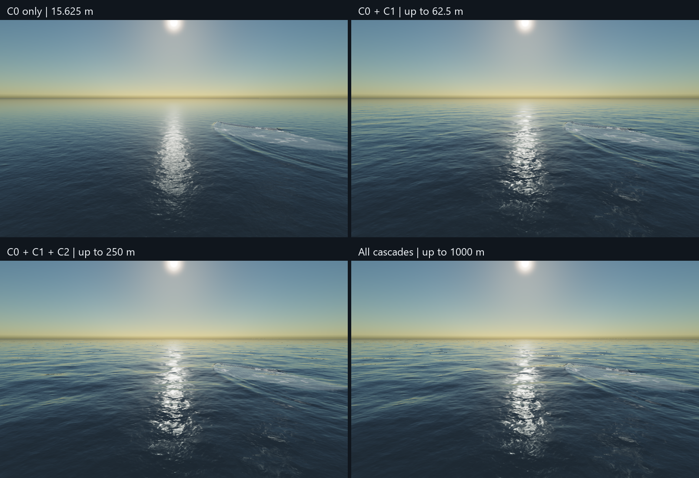
</p>

<p align="center">
  <a href="Img/WaveWorksLikeOcean/cascade-c0-only.png">C0</a> ·
  <a href="Img/WaveWorksLikeOcean/cascade-c1-only.png">C1</a> ·
  <a href="Img/WaveWorksLikeOcean/cascade-c2-only.png">C2</a> ·
  <a href="Img/WaveWorksLikeOcean/cascade-c3-only.png">C3</a> ·
  <a href="Img/WaveWorksLikeOcean/cascade-c0-c1.png">C0+C1</a> ·
  <a href="Img/WaveWorksLikeOcean/cascade-c0-c2.png">C0+C1+C2</a> ·
  <a href="Img/WaveWorksLikeOcean/cascade-all.png">全部级联</a>
</p>

可使用确定性截图脚本复现这些结果；`-CascadeMask` 支持 `c0`、`c1`、`c2`、`c3`、`c01`、`c012` 和 `all`：

```powershell
.\scripts\Capture-HpWater.ps1 `
    -Api d3d12 `
    -Scene waveworks-ocean `
    -Camera default `
    -Quality extreme `
    -SurfacePreset reference `
    -CascadeMask c0 `
    -Frames 240 `
    -BinaryPath .\build-windows-ci\Release\PrismRender.exe `
    -OutputName cascade-c0-only
```

项目内置的彩色覆盖调试图仍保留为 [`cascade-debug.png`](Img/WaveWorksLikeOcean/cascade-debug.png)，它主要用于检查距离淡出与级联过渡，不用于比较单个频带的波形。

## 自适应海面几何

海面不是一张预先生成的超大高密度 Mesh。系统只保存一份 64×64 单元、65×65 顶点的单位 Patch，再由 CPU 四叉树根据相机动态选择可见叶节点：

```text
相机附近  → 更小的 Patch → 更密的世界空间顶点
远处      → 更大的 Patch → 更疏的世界空间顶点
视锥之外  → 不生成 Patch
```

所有 Patch 复用同一份顶点和索引缓冲，只在实例数据中保存中心、尺寸、LOD、Morph 和接缝边缘掩码。默认允许 `LOD 0～15` 共 16 个逻辑层级，但每帧只保留满足屏幕投影误差、视锥、最小尺寸和 4096 节点预算的层级子集。

不同 LOD 的 Patch 顶点数量相同，区别是映射后的世界尺寸和顶点间距不同。相邻叶节点最多相差一级，并通过边缘顶点折叠与 Geomorph 减少 T 形裂缝和层级跳变。

每个 Patch 顶点根据实例中心和半尺寸转换为连续世界坐标，再采样并叠加四层位移：

```text
UVc = worldXZ / CascadePeriodc + Offsetc + Warpc
DistanceWeightc = 1 - smoothstep(FadeStartc, FadeEndc, CameraDistance)
Dtotal = Σ DistanceWeightc × Displacementc(WorldXZ)
```

细浪随相机距离逐渐淡出，最粗的大涌浪始终保留。相邻 Patch 使用相同的连续世界坐标，因此边界处会采样到相同海浪数据。

下图由同一相机位置的 Geometry LOD 与 Wireframe Game View 自动抓取并合成。左侧颜色区分空间 LOD，右侧线框展示共享基础网格映射到不同世界尺寸后的几何密度。

<p align="center">
  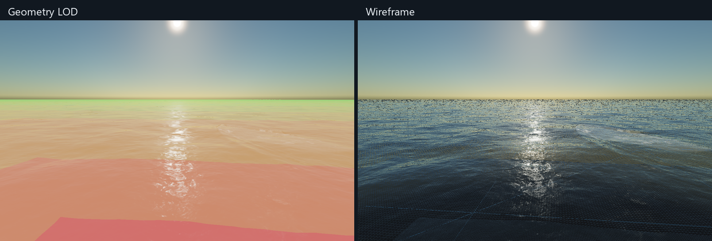
</p>

## 风浪白沫与局部交互

> **当前状态：白沫效果仍不够理想，视觉表现待继续完善。** 现阶段主要用于验证破碎判据、历史累积、平流、耗散以及局部尾流合成流程，不代表最终美术品质。

白沫不是直接根据高度阈值着色。频谱模拟从水平变形的 Jacobian、波面 Folding 和浪峰活动中提取破碎源，再更新持久泡沫历史：

```text
F(t+1) = Advect(F(t), velocity) + BreakingSource - Dissipation
```

泡沫只在海浪发生明显压缩和破碎时生成，并通过历史累积、平流、耗散和迟滞形成从新生白沫到逐渐消散泡沫的层次。

局部船尾流使用独立有限区域波场计算，不需要提高整片海洋的 FFT 空间密度。风浪泡沫与船尾流泡沫分别生成，最终在水面材质中合成。

下面的静态图使用高风浪白帽验证预设，展示由频谱折叠信号产生的非均匀泡沫覆盖。局部船尾流需要用时间序列才能说明平流与衰减，因此不使用单帧冒充动态结果。

<p align="center">
  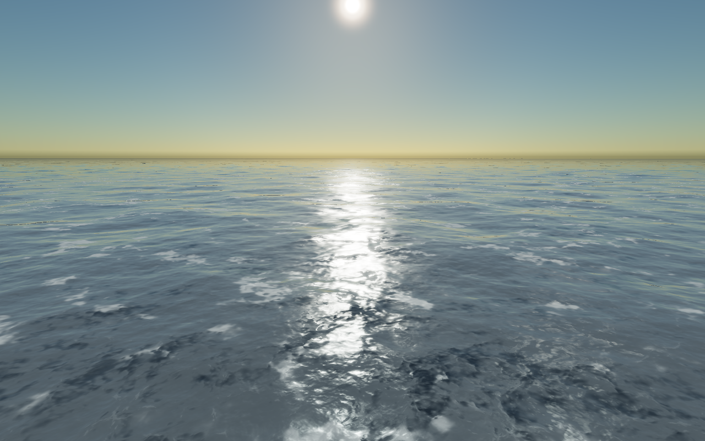
</p>

### GIF 槽位：船尾流与泡沫生命周期

当前是频谱白帽结果生成的单帧占位 GIF。录制后直接覆盖 `Img/WaveWorksLikeOcean/foam-and-wake.gif`，建议展示隐形船绕行、尾流生成、泡沫平流、扩散和衰减。

<p align="center">
  
</p>

## 实时参数控制

Ocean Lab 支持运行时修改：

- Base Wind：风向、风速、Fetch、Dependency、Spectrum Peaking、Cutoff 和 Amplitude。
- Swell：方向、速度、Fetch、谱峰、截止波长和振幅。
- Spectral Foam：白帽阈值、生成阈值、生成量、耗散和衰减。
- Local Waves：尾流、雨滴、手动扰动、局部域范围和分辨率。
- Geometry：Patch 分辨率、最小尺寸、屏幕误差和最大 LOD。
- Debug：单级联、泡沫能量、坡度矩、法线和四叉树 LOD 可视化。

改变风浪参数时，系统只重建受影响的初始频谱或历史资源；之后继续由 GPU 每帧推进频谱相位。

### GIF 槽位：实时风浪调参

<p align="center">
  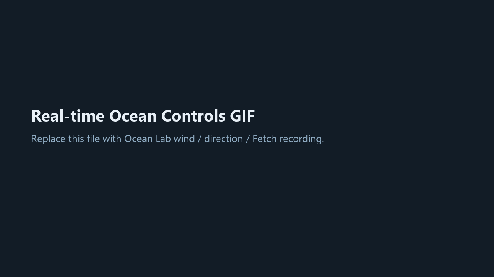
</p>

录制时保留 Ocean Lab UI，连续调整风速、风向与 Fetch，并让画面停留足够时间以展示频谱重建后的变化。直接覆盖同名文件即可，不需要再修改 Markdown。

## 水面着色

水面法线来自四级联坡度叠加。Slope Moments 保存坡度的一阶矩与二阶矩，用于估计当前像素无法解析的微小波浪方差，并据此调整 GGX 高光粗糙度，减少远距离太阳高光闪烁。

```text
四级联坡度 → 最终法线
Slope Moments → 坡度方差 → GGX粗糙度过滤
Folding + Foam History + Local Foam → 分层泡沫
最终法线 + 粗糙度 + 泡沫 → Fresnel + GGX高光 + 环境/大气反射 + 散射近似
```

## 性能优化

- 使用 Workgroup 共享内存完成行/列 IFFT，减少逐蝶形 Dispatch 和全局显存往返。
- 四个频谱级联按物理波长分工，并在远处淡出屏幕无法解析的细浪。
- 使用四叉树 Patch LOD、视锥剔除和实例化绘制控制几何量。
- 位移、梯度、坡度矩和泡沫使用 Texture2DArray 统一组织四个级联。
- 像素阶段根据纹理 footprint 选择 Mip，减少远处闪烁和过度采样。
- 将船尾流与扰动限制在有限局部区域，避免整片海域运行高密度波动方程。
- 使用专用 Ocean Shader，跳过普通 Mesh 不需要的材质纹理、局部灯光和通用分支。

> 四级联首先是频谱质量与尺度覆盖方案，并不是免费的性能优化。实际性能收益来自频带分工、距离淡出、Mip 过滤、局部求解和几何 LOD。

## 性能结果

| GPU | API | 分辨率 | 构建 | 质量 | Renderer GPU 中位数 | 完整帧循环中位数 | 理论吞吐率 |
|---|---|---:|---|---|---:|---:|---:|
| NVIDIA GeForce RTX 5060 | D3D12 | 1280×800 | Release | Extreme | 约 4.62 ms | 约 4.90 ms | 约 204 FPS |

```text
1000 / 4.90 ≈ 204 FPS
```

该结果表示固定本地基准条件下的中位吞吐率，不等同于开启 VSync、Editor 双视图、GPU Validation、RenderDoc 捕获或录屏时的显示 FPS。驱动版本、功耗状态、窗口模式、相机覆盖率和后台负载均可能影响结果。

<!-- 素材7（可选）：Img/WaveWorksLikeOcean/performance-rtx5060.png；展示稳定采样结果和完整测试条件。 -->

## 构建与运行

### WaveWorks-like Ocean Lab

```powershell
cmake --preset windows-ci
cmake --build --preset windows-ci --config Release

.\build-windows-ci\Release\PrismRender.exe `
    --api=d3d12 `
    --scene=waveworks-ocean
```

## 展示素材清单

当前已自动生成的静态结果和可直接覆盖的 GIF 槽位：

```text
Img/WaveWorksLikeOcean/
├─ ocean-overview.png          # 已生成：最终海面首图
├─ ocean-overview.gif          # 单帧占位：替换为最终效果动图
├─ cascade-debug.png           # 已生成：四级联覆盖调试
├─ cascade-c0-only.png         # 已生成：仅 C0
├─ cascade-c1-only.png         # 已生成：仅 C1
├─ cascade-c2-only.png         # 已生成：仅 C2
├─ cascade-c3-only.png         # 已生成：仅 C3
├─ cascade-c0-c1.png           # 已生成：C0 + C1
├─ cascade-c0-c2.png           # 已生成：C0 + C1 + C2
├─ cascade-all.png             # 已生成：全部级联
├─ cascade-isolated-comparison.png # 已生成：四个独立频带对比
├─ cascade-comparison.png      # 已生成：逐级累加对比
├─ geometry-lod.png            # 已生成：Geometry LOD 原始帧
├─ ocean-wireframe.png         # 已生成：Wireframe 原始帧
├─ quadtree-lod.png            # 已生成：LOD / Wireframe 对照图
├─ spectral-whitecaps.png      # 已生成：频谱白帽静态结果
├─ foam-and-wake.gif           # 单帧占位：替换为尾流泡沫动图
├─ realtime-controls.gif       # 占位画面：替换为实时调参动图
├─ performance-rtx5060.png     # 可选：性能采样证据
└─ pipeline/                   # 已生成：RenderDoc 实际 GPU 中间纹理
   ├─ 01-initial-double-jonswap.png
   ├─ 02-spectrum-evolution.png
   ├─ 03-horizontal-ifft.png
   ├─ 04-vertical-ifft.png
   ├─ 05-displacement.png
   ├─ 06-jacobian.png
   ├─ 07-gradient-normal.png
   ├─ 08-folding.png
   ├─ 09-slope-moments.png
   └─ 10-persistent-foam.png
```

建议规格：

- GIF 使用 1280×720 或 1280×800，时长 8～12 秒，20～24 FPS。
- 单个 GIF 尽量控制在 10 MB 左右。
- Hero GIF 隐藏大部分调试 UI，只保留最终效果。
- 调参 GIF 保留 Ocean Lab 面板，并避免无意义的鼠标移动。
- 对比图使用 PNG，保持相同相机、时间、曝光和风力参数。
- 性能结果使用静态 PNG 或表格，不从 GIF 中读取瞬时 FPS。

文档已经生成以下两种 2×2 布局：

```text
独立频带                          逐级累加
┌─────────┬─────────┐             ┌─────────┬─────────┐
│ C0 Only │ C1 Only │             │ C0 Only │ C0 + C1 │
├─────────┼─────────┤             ├─────────┼─────────┤
│ C2 Only │ C3 Only │             │ C0～C2  │ All     │
└─────────┴─────────┘             └─────────┴─────────┘
```

## 技术定位与边界

- 这是适用于大范围深水海洋的频谱模拟，不是完整三维 Navier-Stokes 流体求解。
- 四个频谱 Slice 保存的是可周期采样的波长频带，不是四块空间海域。
- 大范围频谱风浪与有限区域局部交互波采用不同求解方式，最后在同一水面合成。
- WaveWorks 用作技术思路和视觉行为参考；代码、Shader、资源管理和跨 API 接入均由 PrismRender 自行实现。

## 面试可回答版本

这套海洋是参考 WaveWorks 公开技术思路完成的自研实现，不依赖 NVIDIA WaveWorks 运行库。模拟端使用 Base Wind 与 Swell 双 JONSWAP 谱源，将能量分配到四个波长级联，通过 GPU 频谱演化和二维 IFFT 生成高度、水平位移、坡度、折叠与坡度矩；几何端使用相机相关的四叉树 Patch LOD；材质端通过坡度法线、Fresnel、GGX 环境反射和坡度方差过滤表现水面，并根据破碎信号和历史能量生成风浪白沫及局部尾流。RTX 5060、D3D12、1280×800、Release Extreme 固定基准中，Renderer GPU 中位数约 4.62 ms，完整帧循环约 4.90 ms，对应约 204 FPS 理论吞吐率。
