 # 在 PrismRender 中实现一片频谱海面：从 WaveWorks 截帧到实时渲染

[返回项目主页](README.md)

下面是实现效果：


这篇文章记录我在 PrismRender 中实现大范围海面的过程。起点是一份 NVIDIA WaveWorks 示例的 RenderDoc 截帧：我先沿着海面 Draw 的资源绑定拆解它的 GPU 数据流，再实现频谱演化、位移、着色和泡沫，再处理大范围几何与资源管理。

下面是目前的效果。风浪使用项目自己的 JONSWAP 初始谱，后续 FFT、表面数据和着色沿用从参考示例恢复的路径。展示参数为 12 m/s 风速、100 km Fetch；环境、局部初始状态以及这组相机的 Patch 来自参考数据。整个过程由项目自己的 C++、D3D12 RHI 和 Shader 执行，不依赖 WaveWorks SDK 运行库。


*图 1：当前项目的完整水面。大尺度起伏、细波高光和局部白沫分别来自不同部分的模拟与着色。*

## 先从海面 Draw 入手，弄清楚一帧在做什么

打开截帧后，我先查看最后几次绘制对颜色目标的影响。在这份 D3D12 捕获中，EID 325–335 是六次海面 Draw，358 绘制天空，之后才是 ImGui。观察 EID 335 和 358 的同一张颜色目标 R306，可以把海面与天空的绘制分开。

| EID 335：海面绘制结束 | EID 358：加入天空 |
|---|---|
| 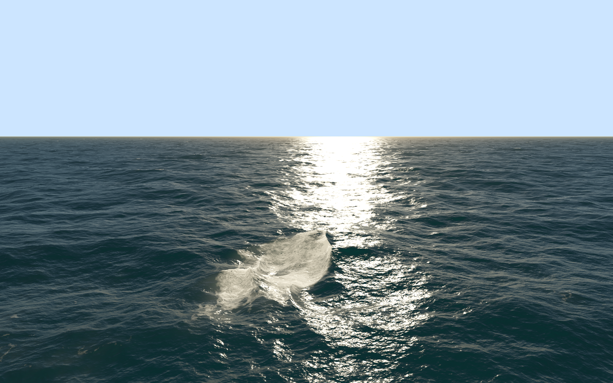 | 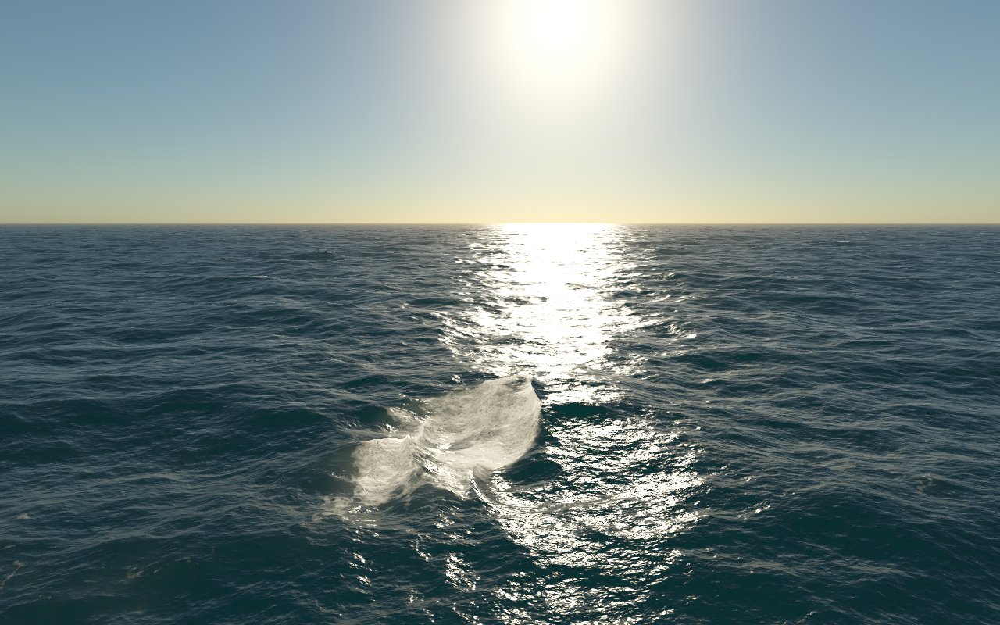 |

*图 2：RenderDoc 回放导出的两个事件输出。左图上方仍是背景色，右图才加入天空。两图均来自 NVIDIA 示例，后文的项目效果图会另行标明。*

这一步确定了分析范围：海面本身的颜色已经在六次 Draw 中完成，天空是另一次绘制。接着选中第一个海面事件 EID 325，查看 Pipeline State。它的拓扑是三控制点 Patch，VS、HS、DS、PS 都参与执行；这一批有 173 个实例，每个实例使用 24576 个索引。由此可以继续分别追踪几何与材质，而不是把水面的起伏都当成 PS 的法线效果。

### 顺着 DS 和 PS 的绑定往前找

DS 绑定了四层风浪位移数组 R517 和一张局部位移图 R561。PS 没有直接读取这两张位移图，而是读取另一组资源：

| 阶段与槽位 | 捕获资源 | Shader 中的名称 |
|---|---|---|
| DS t0 | R517 | `g_displacementTextureArrayWindWaves` |
| DS t1 | R561 | `g_displacementTextureLocalWaves` |
| PS t0 | R518 | `g_gradientsTextureArrayWindWaves` |
| PS t1 | R519 | `g_momentsTextureArrayWindWaves` |
| PS t3 | R587 | `g_gradientsTextureLocalWaves` |
| PS t4–t6 | R686、R693、R698 | 泡沫、气泡与阵风细节 |
| PS t7 | R624 | 二维天空环境 |

这组绑定给出了后续分析的主线：位移负责改变几何，梯度和矩负责着色，局部波另有自己的资源，最后在 DS/PS 中与风浪合并。局部波因此不是四级风浪的“第五个级联”。表中的槽位来自 Shader 反射寄存器；PS 的 t2 空缺，不能按资源列表中的顺序重新编号。

沿着 R517–R519 的写入事件向前找，会遇到 EID 253。这个 Dispatch 读取四组位移、梯度和矩，共 12 张输入纹理，写入三张 `512×512×4` 数组。再向前，四组位移分别来自 117/123、136/142、155/161、174/180；它们之间又夹着梯度、泡沫和 mip 的计算。

到这里，一帧的骨架就清楚了：

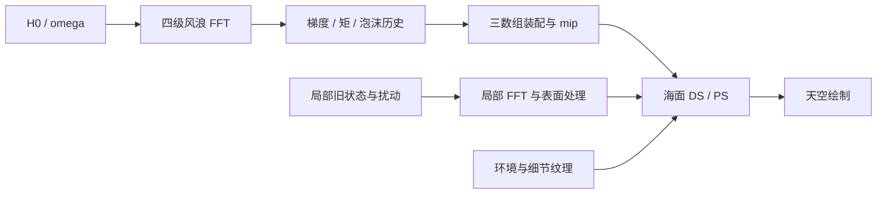
```mermaid
flowchart LR
    A[H0 / omega] --> B[四级风浪 FFT]
    B --> C[梯度 / 矩 / 泡沫历史]
    C --> D[三数组装配与 mip]
    E[局部旧状态与扰动] --> F[局部 FFT 与表面处理]
    D --> G[海面 DS / PS]
    F --> G
    H[环境与细节纹理] --> G
    G --> I[天空绘制]
```

这里的 EID 和 R 编号只用于说明这份 NVIDIA 截帧。接入项目时，我保留相同的数据关系，但由 RenderGraph 管理资源依赖，不沿用捕获里的资源编号。

### 两个 Dispatch 如何完成一次二维 IFFT

我先拆开最低频 C0 的 117 和 123。EID 117 读取 H0 缓冲 R332、omega 缓冲 R331，输出中间缓冲 R333/R334；EID 123 再读取这两个中间结果，写出位移纹理 R335。

仅凭名字还不能判断 117 做了多少事情。查看它使用的 S375 反汇编，开头读取正、反频率的 H0，读取 omega，并将时间相位转入 double 运算。下面摘取其中几条指令，省略了无关的寄存器操作：

```text
14: ftod r0.zw, r0.z
15: dmul r3.xy, r0.zwzw, m_time.xyxy
...
23: dmul r5.xyzw, r3.xyzw, d(0.159155l, 0.159155l)
24: dtof r1.zw, r5.xyzw
25: round_ni r1.zw, r1.zzzw
...
28: dadd r3.xyzw, r3.xyzw, -r5.xyzw
29: dtof r1.zw, r3.xyzw
30: sincos r3.xy, r5.xy, r1.zwzz
```

`ftod/dmul` 对应双精度相位计算，后面的乘常量、取整和相减是在约减 2π 周期，之后才转回 float 做正弦余弦。再往下就是蝶形运算、组共享内存交换与同步。也就是说，**117 已经把频谱演化和第一轴逆变换融合在一起**，这帧里没有一个单独的“谱演化 Dispatch”。123 完成第二轴，并处理频谱中心偏移、choppiness 和输出打包。

| C0：EID 123 / R335 | C3：EID 180 / R476 |
|---|---|
| 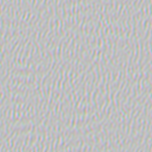 | 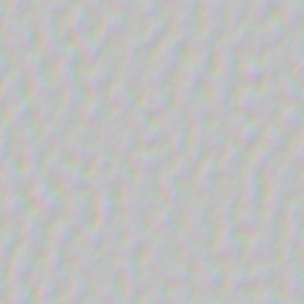 |

*图 3：捕获中的两级位移纹理。RGB 分别显示 Dx、Dy 和高度；左图显示范围为 −2～2，右图为 −0.1～0.1，因此应观察波形结构，而不是直接比较颜色亮度。*

位移最终写成 `(Dx, Dy, Height, 0)`。结合 VS 中世界位置和海平面的处理，可以确定这里使用 Z-up。这个细节直接影响项目接入：PrismRender 的原生场景是 Y-up，转换时必须让相机、网格、位移和采样方向保持一致。

### 一张看起来像法线的纹理，实际装了四种数据

追踪位移后面的表面处理时，最容易混淆的是 gradients。它的 RGB 预览很像普通法线贴图，但 S522 的实际写入并不是单位法线：XY 是坡度，Z 是水平形变的 Jacobian，A 是处理后的旧泡沫历史。紧接着的乘法把坡度组合为 `sx²、sy²、sx·sy`，写入独立 moments 纹理。

| EID 244 / R535：梯度 RGB | EID 287 / R519，slice 3：矩 RGB |
|---|---|
| 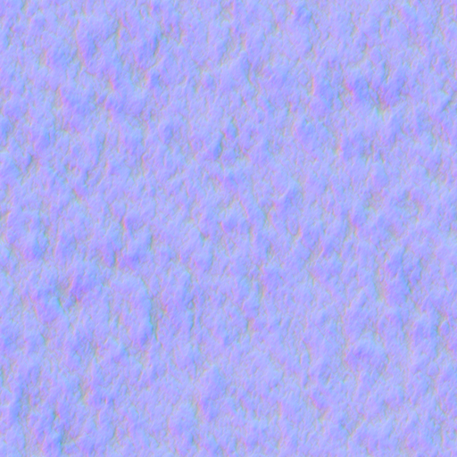 | 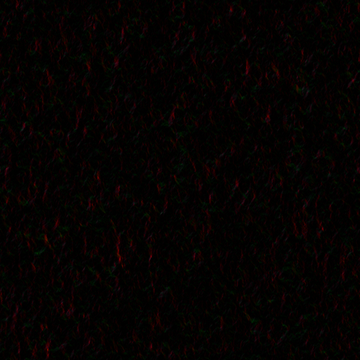 |

*图 4：从捕获导出的 C3 表面数据。左图不是 RGB 法线，右图保存坡度二阶矩；普通 RGB 预览不会显示左图 A 通道中的泡沫历史。*

为了弄清泡沫的时序，我继续观察 C3 的 237/244。237 读取旧 energy R537，将一个方向过滤、衰减后的结果放进 R535.A；244 再读取 R535，沿另一方向过滤并加入生成项，写回 R537。后面的数组装配复制的是 gradients，所以当前 PS 读到的是第一步处理后的历史。

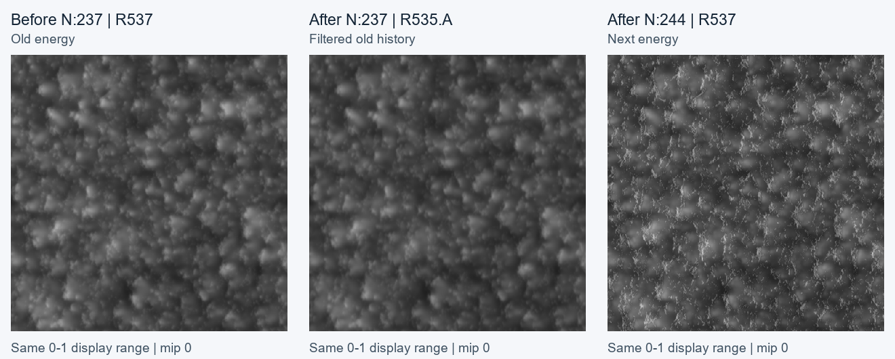

*图 5：同一捕获的三个资源状态，均以 0～1 灰度显示。左为 237 前的旧 energy，中为 237 后的 gradients.A，右为 244 后的新 energy。右侧包含进一步过滤和本步生成的细碎结构，会进入下一次模拟的历史。*

这决定了实现中的两个版本不能混用：当前着色所需的历史在 gradients.A，下一步模拟所需的能量在独立 energy 中。单纯在 Jacobian 低于阈值时涂白，或者把刚生成的 energy 直接交给当前 PS，都会改变这条更新链。

## 让频谱先生成能动的海面

弄清计算链后，我把风浪、局部波、表面处理和绘制拆成独立模块。风浪部分先接好 H0/omega 到位移的路径，再补充表面数据，最后将三张数组交给海面 Shader。这样每个模块的输入输出都比较明确。

### 补上项目自己的初始谱

截帧里 H0 和 omega 已经存在，看到的计算是它们之后的演化，不能从这一帧推断 NVIDIA 的初始化公式。因此，可调风速的路径使用项目自己的 JONSWAP 初始化，再按参考 FFT 的尺寸、布局和缩放接入。

JONSWAP 给出风浪能量随频率的分布，初始化结合风速、Fetch、风向和随机相位生成复数 H0。深水色散关系提供 omega，时间演化则可以用下面的结构理解：

```text
h(k,t) = h0(k) exp(iωt) + conjugate(h0(-k)) exp(-iωt)
```

四个周期分别约为 1000、191.205、36.559 和 6.990 m，计算尺寸为 256²、256²、256²、512²。大周期负责大尺度起伏，小周期逐渐补上细波。自主初始化还要适配参考变换的归一化：项目原生 IFFT 包含 N² 缩放，参考路径的处理不同，因此我在初始谱系数上完成转换，避免接入后浪高随 FFT 尺寸改变。

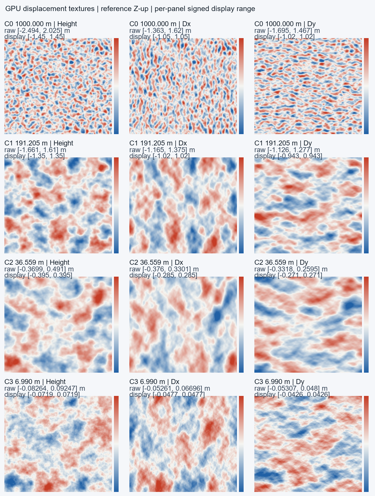

*图 6：项目生成的位移纹理，每行一个级联，每列为高度、Dx、Dy。各图采用独立伪彩色范围。*

有了这些纹理，VS 就可以对四级位移加权并移动网格。只改变高度会得到较圆滑的起伏；加入水平位移后，顶点向浪峰挤压，才能形成更尖锐的 choppy 波形。

### 从位移继续算出坡度和矩

表面处理读取相邻 texel 的位移差。计算坡度时，不仅要取高度差，还要考虑水平位移改变了采样点间距；随后输出 Jacobian 和二阶矩。四级原始结果再装配到统一的 512² 数组，前三个 256² 级在这个阶段重采样。

| 输出数组 | RGBA 通道 | 后续使用位置 |
|---|---|---|
| displacement | Dx、Dy、高度、0 | VS 位移 |
| gradients | 坡度 X、坡度 Y、Jacobian、旧泡沫历史 | PS 法线与泡沫 |
| moments | 坡度 X²、坡度 Y²、坡度 X×Y、1 | PS 微表面分布 |

三张数组均为四层 RGBA16Float，并生成 10 级 mip。模拟尺寸与最终数组尺寸是两个概念，这也是分析 EID 253 后需要单独处理的步骤。

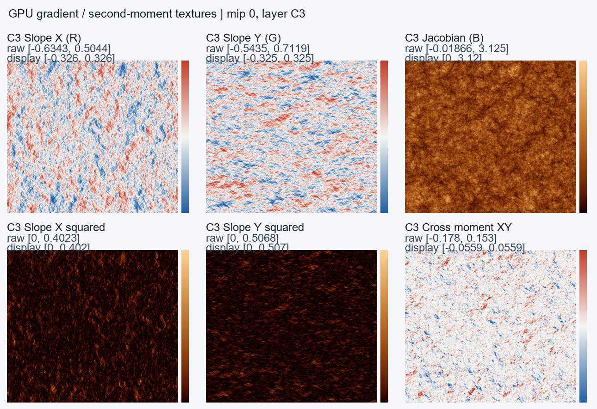

*图 7：项目 C3 的坡度、Jacobian 和二阶矩。后续着色使用这些数据，而不是再从颜色图中估算法线。*

局部波另外维护 512² 状态，经扰动注入、正向 FFT、重力—毛细频域传播和逆 FFT 输出位移。参考 EID 32 的传播指令中包含 `sqrt(9.81k + 0.000074k³)`：前一项来自重力，后一项来自毛细作用，因此这里实现的是频域传播，没有按浅水有限差分去替代它。

混合场景从参考局部初始状态继续传播，再在 VS 和 PS 中与风浪合并。风浪按实际经过时间推进，支持暂停和播放速度；Game 与 Scene 共享同一逻辑帧的模拟结果，避免双视图把时间推进两次。

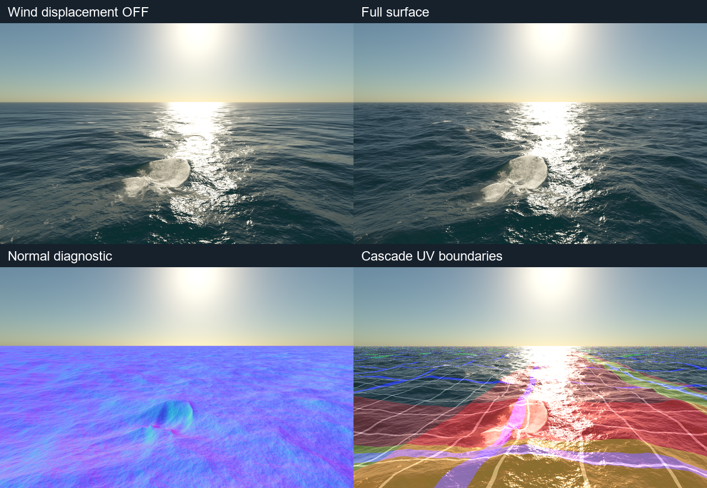

*图 8：左上关闭风浪几何位移，仍保留坡度着色与局部波；右上是完整结果。左下显示法线，右下显示级联 UV 边界，后者与几何 Patch 边界不同。*

<!-- 动态效果位置： -->

## 有了波形之后，处理高光和环境反射

位移解决了海面的形状，但材质还需要解释一个像素里有多少细波。参考 PS 读取的不只是坡度，还包括当前 mip 的矩和最粗 mip 的矩，这正是它与简单法线贴图材质的区别。

这里使用 Beckmann 微表面分布、粗糙 Fresnel 和 Smith 遮蔽项。Fresnel 控制反射随视角的变化，坡度协方差影响高光分布，环境反射则对二维天空纹理进行 25 点积分。

<p align="center">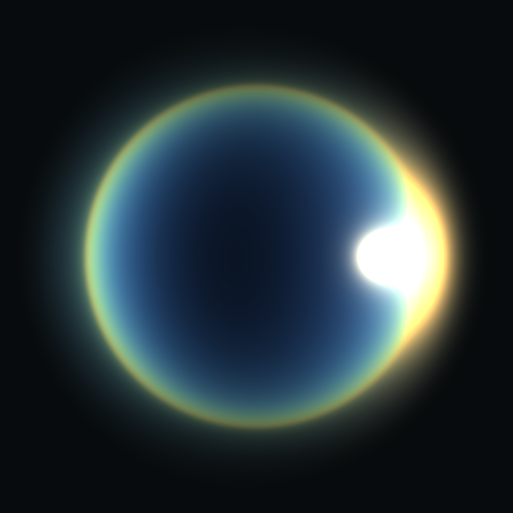</p>

*图 9：海面 PS 绑定的二维环境 R624。EID 358 也使用它绘制天空，因此反射与背景来自同一环境。它不是 cubemap，也不是当前场景的屏幕空间反射结果。*

### 加入水体散射近似，观察背光波面的变化

接入反射和高光后，我继续加入参考 PS 的水体散射颜色。它根据波面高度、法线以及太阳和视线方向计算强度，与基础水色和水下气泡颜色相加，再通过 Fresnel 与环境反射混合。

为了看清这一项的贡献，下面保持波形、时间、相机与光照不变，只切换波面散射颜色。关闭时，背光波面颜色更暗；开启后，这些区域增加了青绿色，波面之间的颜色层次更清楚。当前参数下变化较轻，局部放大图更容易观察。

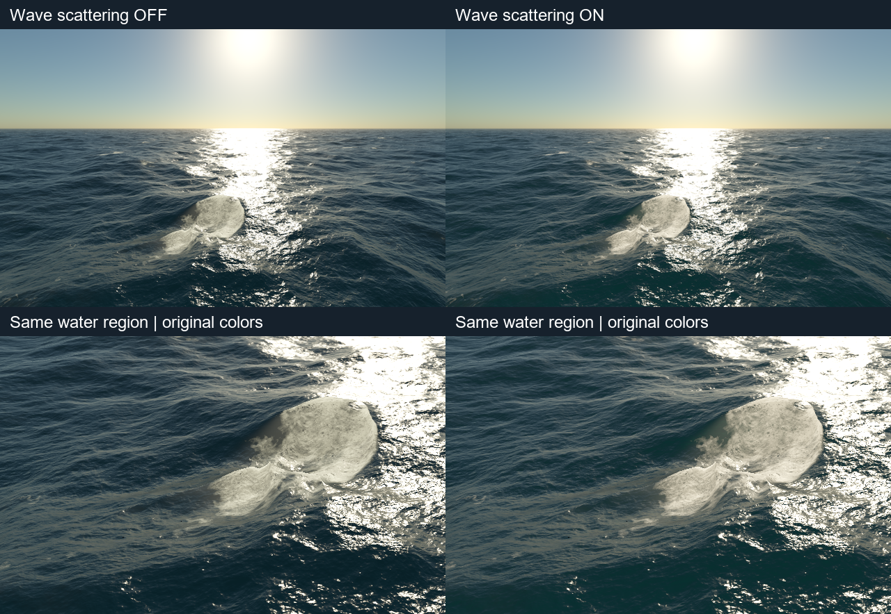

*图 10：左侧关闭水体散射近似，右侧开启；下排为同一区域的放大图。关闭时将 `waterScatterColor` 从 `(0, 0.7, 0.6)` 设为零，基础水色、水下气泡、反射、高光与泡沫保持一致。图片保留原始颜色。*

最终输出保留参考 PS 内的 filmic/gamma 处理，不在它之后再叠加一遍项目常规 tonemapping。

### 逐个替换材质分支，看清它们的贡献

参考 Shader 保留了经典与微表面两套分支。我利用这些开关，从经典分支开始，依次切换 Fresnel、高光和环境反射；波形、散射、泡沫与环境保持不变。

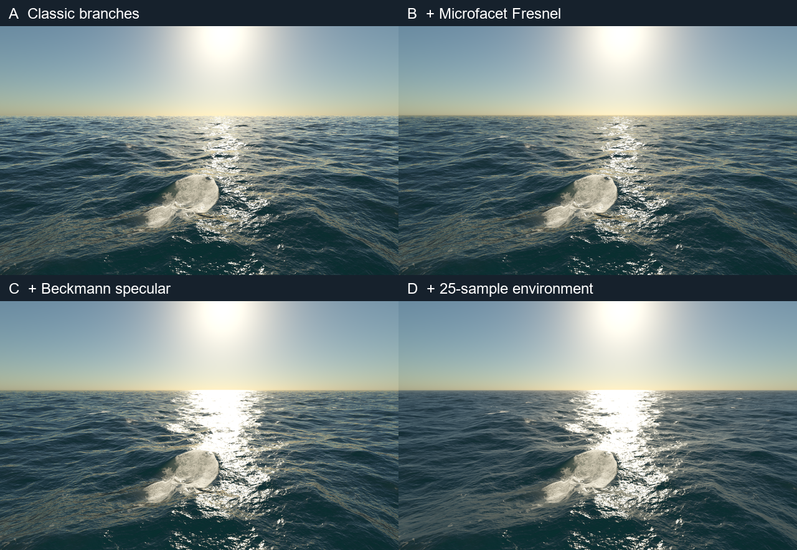

*图 11：A 为经典分支；B 切换微表面 Fresnel；C 再切换 Beckmann 高光；D 加入 25 点环境积分。A 本身仍有光照，D 对应本文的完整材质。*

### 远处细波退出几何后，仍要留下粗糙度

远处一个像素可能覆盖很多细波，单次法线采样不足以描述这片波面的高光。矩过滤用 `E[s²] − E[s]²` 和交叉项估计坡度协方差，让微表面模型考虑像素内的坡度分布。

还有一个与几何有关的处理：细级联位移随距离淡出时，最粗 mip 的全局矩补偿其粗糙度贡献。这样远处不必保留全部细波几何，也能保留相应的反射分布。

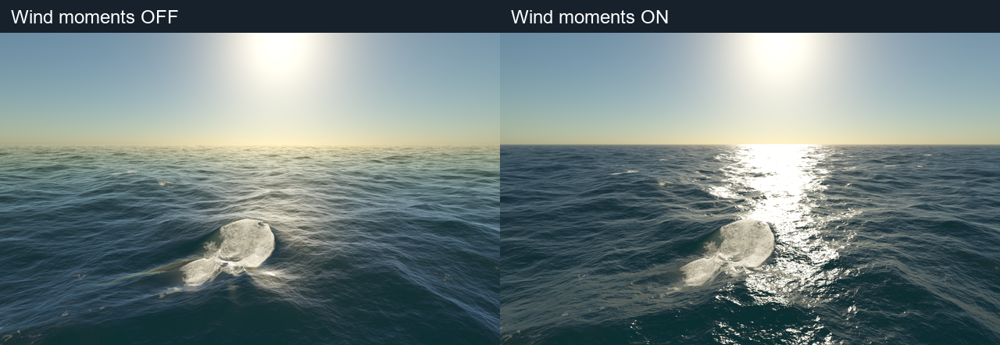

*图 12：左侧关闭风浪矩消费者，右侧启用，差异主要体现在高光分布。局部波仍按自身坡度参与矩组合。*

<!-- 动态效果位置： -->

## 让白沫从浪峰生成，再留在水面上

在前面的截帧分析中，泡沫已经被拆成当前着色历史和下一步 energy。接入时，我先把这个顺序落实，再处理最终的颗粒与覆盖细节。

水平形变的 Jacobian 可以写成 `(1+a)(1+d)−bc`，其中 a、b、c、d 来自水平位移导数。较小的 J 表示压缩，作为白沫的生成依据。仅用它控制颜色，白沫会紧跟当前压缩区域出现和消失；保留历史后，浪峰经过的位置还能继续留下泡沫。

第一步读取旧 energy，在 Y 方向取邻域样本并衰减，将结果写入 gradients.A。第二步沿 X 方向继续过滤，加入 J 产生的新能量，存入下一步的 energy。四级风浪与局部波分别维护 R16Float 能量；风浪能量有上限，局部累计能量则允许超过 1。

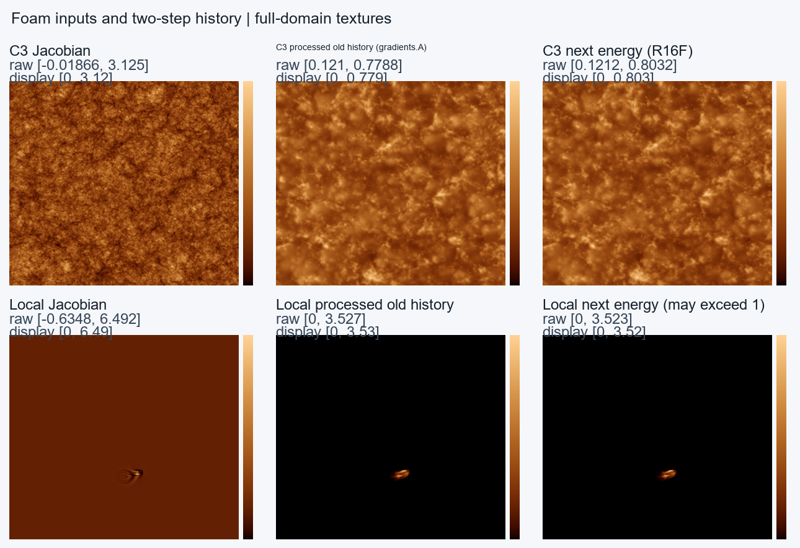

*图 13：上排为 C3 的 J、处理后旧历史与新 energy，下排为局部波对应资源。它们分别决定生成位置、当前着色历史和下一步保留的状态。*

### 能量纹理和细节纹理承担不同工作

泡沫最终仍由 PS 绘制。它组合当前折叠产生的即时白沫与 gradients.A 中的历史，再采样参考泡沫、气泡和阵风纹理。模拟数据回答“哪里有泡沫、能留下多久”，细节纹理回答“覆盖看起来是什么样”。

| 泡沫细节纹理 | 项目泡沫能量视图 |
|---|---|
| 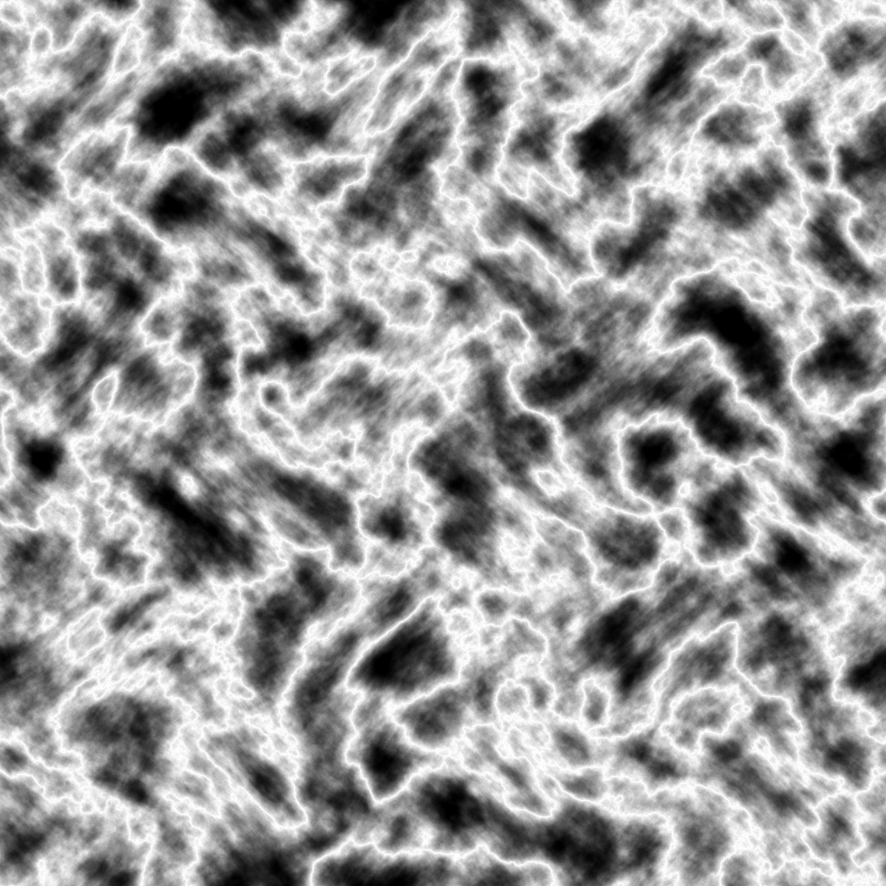 | 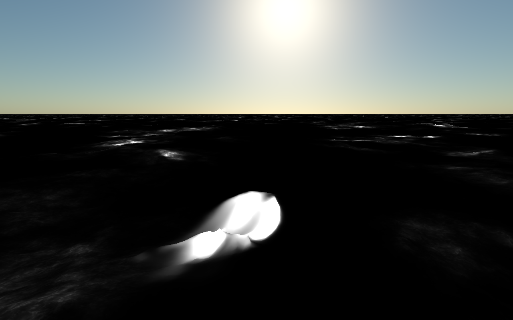 |

*图 14：左侧为参考 PS 的泡沫细节输入，右侧显示项目海面采样后的能量。右图显示时映射到 0～1，模拟中的局部能量可以大于 1。*

PS 用覆盖强度混合泡沫漫反射和原水面颜色，同时加入水下气泡的散射近似。它不是把一张白色纹理直接贴到浪峰上。

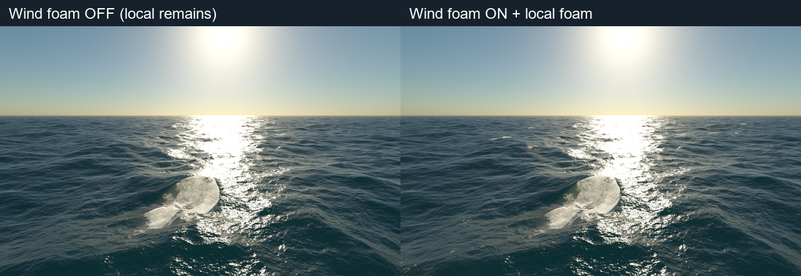

*图 15：左侧关闭风浪 Folding 和 Foam History，右侧启用。中央局部泡沫在两侧都保留，因此这组图展示的是风浪泡沫的贡献。*

<!-- 动态效果位置： -->

## 把海面铺向远处，而不是铺满同样密度的网格

模拟纹理的成本相对固定，几何却会随覆盖范围增长。项目原生路径使用 CPU 四叉树，根据相机距离、Patch 投影大小和视锥选择层级，近处保留细网格，远处使用粗网格。

每个 Patch 复用基础网格，实例数据提供位置、尺度、LOD 与 morph 参数。相邻层级差限制为一级，边缘索引衔接不同密度，morph 缓解层级切换。根区域随相机稳定对齐，同时用节点预算限制选择器和绘制开销。

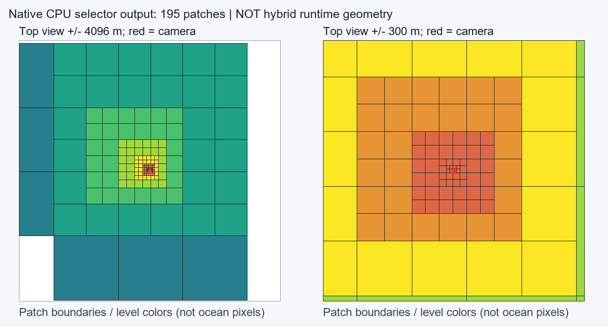

*图 16：自研 `OceanQuadtree::Select` 的节点俯视图。左侧是整体覆盖，右侧放大相机附近，颜色表示层级，红色标记相机。*

<!-- 动态效果位置（原生模式）： -->

### 参考几何给出了 GPU 端的另一半处理

截帧里的六次 Draw 共使用 303 个实例，基础网格有 4225 个顶点。同一次 Draw 中包含多个尺度的 Patch，所以六次 Draw 不能直接理解为六个 LOD 层。

VS 对网格坐标做 morph，HS 根据边长和到相机的距离计算细分因子，VS 再合并风浪与局部位移。HS 中的关系可以概括为：

```text
edgeTess = edgeLength × dynamicAmount / distance(eye, edgeMidpoint)
           + staticOffset
insideTess = average(three edgeTess factors)
```

本页混合场景使用这组固定参考实例和相机，恢复 GPU 几何阶段；自由相机下的自适应选择使用前面的原生路径。自研 CPU 选择器与参考 GPU 曲面细分分别实现，不能将固定实例批次当作正在运行的 CPU 四叉树。

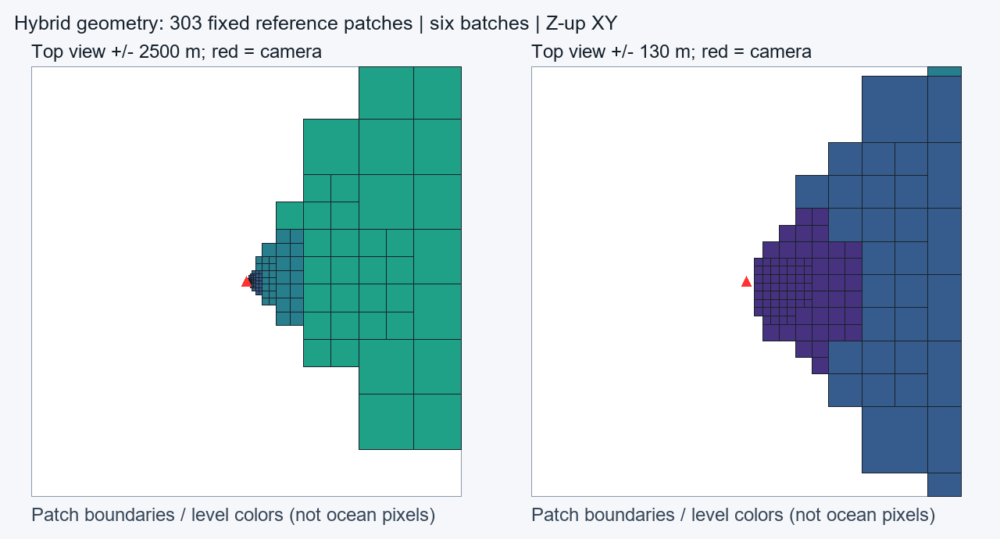

*图 17：参考实例位置与尺度的俯视图。左侧展示较大覆盖，右侧展示相机附近的多尺度排列。*

## 最后，把这些 Pass 接入渲染器的帧资源管理

实现过程中，我将初始化、风浪、局部波、表面数据和绘制分别放到 `WaveWorksJonswapInput`、`WaveWorksSpectralSimulation`、`WaveWorksLocalSimulation`、`WaveWorksSurfacePipeline` 和 `WaveWorksSurfaceRenderer`。RenderGraph 按上述数据流声明读写关系，GPU 工作使用单条 Direct 队列。

持续更新时，除了算法本身，还需要保证一帧所用的资源版本一致。常量、扰动与材质参数在提交前形成快照，图包持有这些资源；参数变化时替换上传版本，不覆盖已经提交的帧。泡沫旧历史与本帧写入保持独立，Game 和 Scene 只消费一次模拟产生的结果。

FFT scratch、位移和表面数组按已完成的帧槽复用，实例、稳定常量和纹理视图也进行缓存，减少逐帧资源创建。这样模拟、历史更新和绘制可以保持各自的职责，同时接入项目已有的 RHI 延迟执行路径。

相关 C++ 位于 `src/Renderer/Features/Ocean/`，参考 Shader 位于 `assets/shaders/Ocean/Reference/`，视图接入位于 `src/Renderer/SceneRendererReference.cpp`。
