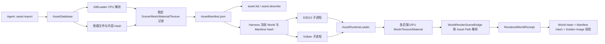

# PrismRender Stage 17-D：Agent Asset Pipeline 学习指南

## 1. 本阶段解决的问题

Stage 17-C 已经能把当前 Harness World 冻结为 Snapshot，并交给 D3D12/Vulkan 子进程渲染。但当时 Agent 仍然需要提前知道 Mesh 和 Material 的注册路径，外部 glTF 也没有稳定、可查询、可重导入的身份。

Stage 17-D 增加 Agent Asset Pipeline，使 Agent 可以：

1. 查询项目内可用的 Scene、Mesh、Material 和 Texture。
2. 导入或重新导入 `.gltf/.glb`。
3. 使用稳定 `Asset ID` 与 `prism-asset://` 路径引用子资源。
4. 获取源文件、依赖文件、内容 Hash、导入版本和结构化诊断。
5. 让 D3D12/Vulkan 从同一 Manifest 重建运行时 GPU 资源。
6. 在截图前校验 Asset Manifest Hash，避免比较不同资产版本产生的画面。

这一阶段不是制作完整 Asset Browser，也没有引入通用离线烘焙格式。它先建立对 Agent 最重要的“发现、引用、诊断、重建和验证”闭环。

## 2. 新增和修改的文件

### 2.1 新增

- `src/Asset/AssetDatabase.h`
- `src/Asset/AssetDatabase.cpp`
- `src/Asset/AssetRuntimeLoader.h`
- `src/Asset/AssetRuntimeLoader.cpp`
- `docs/AGENT_ASSET_PIPELINE_GUIDE_CN.md`
- `examples/harness/asset_pipeline_render.jsonl`
- `automation/assets/AssetManifest.json`

### 2.2 修改

- `src/Asset/GltfLoader.h`
- `src/Asset/GltfLoader.cpp`
- `src/Automation/HarnessTools.h`
- `src/Automation/HarnessTools.cpp`
- `src/Scene/WorldRenderSnapshot.h`
- `src/Scene/WorldRenderSnapshot.cpp`
- `src/Core/Application.cpp`
- `src/Core/VulkanApplication.cpp`
- `tests/EngineHarnessTests.cpp`
- `CMakeLists.txt`
- `docs/AGENT_HARNESS_GUIDE_CN.md`
- `docs/AGENT_RENDER_AUTOMATION_GUIDE_CN.md`
- `docs/AGENT_WORLD_RENDER_LOOP_GUIDE_CN.md`
- `docs/LEARNING_GUIDE_CN.md`

## 3. 总体数据流



Manifest 不保存 D3D12 Resource 或 Vulkan Buffer。它保存跨 API 的逻辑身份和导入元数据，各后端通过同一份源资产和同一套 glTF 解析逻辑创建自己的 GPU 对象。

## 4. Asset Manifest

默认文件：

```text
automation/assets/AssetManifest.json
```

顶层格式：

```json
{
  "format": "PrismAssetManifest",
  "version": 1,
  "manifestRevision": 1,
  "manifestHash": "58cc578f30792ca4",
  "assets": []
}
```

每条资产记录包含：

| 字段 | 作用 |
|---|---|
| `assetId` | 稳定 UUID 风格逻辑 ID |
| `assetPath` | World 使用的 `prism-asset://<id>` 路径 |
| `type` | `scene/mesh/material/texture` |
| `sourcePath` | 相对项目根目录的源文件路径 |
| `subresource` | glTF 内部子资源身份 |
| `contentHash` | 源文件及其依赖的组合内容 Hash |
| `importRevision` | 每次成功重导入递增 |
| `dependencies` | 其他 Asset ID 依赖 |
| `diagnostics` | 结构化导入警告或错误 |
| `metadata` | 顶点数、索引数、材质参数、纹理角色等 |

内置 Cube、Sphere、Preview Texture 和 Preview Material 不写入 Manifest，而是在 `AssetDatabase::Load` 时作为 `builtIn=true` 的只读记录加入查询结果。

## 5. 稳定 Asset ID 如何生成

稳定 ID 的输入是：

```text
lowercase(relativeSourcePath) + "|" + subresource
```

典型子资源名称：

```text
scene
mesh/0/primitive/0
material/0
material/0/texture/baseColor
material/0/texture/normal
```

`AssetDatabase::MakeStableAssetId` 对该字符串进行确定性 Hash，并设置 UUID 的 version/variant 位。只要源文件相对路径与 glTF 子资源索引不变，重新导入后的 ID 和 `prism-asset://` 路径就不变。

这使 World Snapshot、Journal 和 Agent 命令不需要保存临时内存句柄。需要注意：如果移动源文件，或者 glTF 导出器改变 Mesh/Material 索引，当前版本会把它视为新的逻辑资产。后续可增加显式重定向表解决资产移动。

## 6. 内容 Hash 和依赖诊断

`.gltf` 是 JSON 文件，真实数据可能位于外部 `.bin` 和图片中。因此只 Hash 主文件不够。

导入过程会：

1. 解析 glTF 的 `buffers[].uri` 与 `images[].uri`。
2. 忽略 Data URI 和远程 URI。
3. 对源文件与本地依赖分别计算 FNV-1a 64 位 Hash。
4. 按规范化路径排序后组合为 `contentHash`。
5. 把依赖路径与单文件 Hash 写入 Scene 记录的 `metadata.dependencyFiles`。

`ValidateImportedContent` 在渲染前重新计算这些值。文件缺失或内容变化时返回：

```text
asset_source_missing
asset_dependency_missing
asset_source_stale
```

Harness 会阻止截图并提示执行 `asset.reimport`。这样不会把“磁盘文件已经变化、Manifest 仍是旧版本”的画面当成可靠回归结果。

## 7. Harness 命令

### 7.1 `asset.list`

列出资产，可按类型与文本过滤：

```json
{
  "requestId": "list-meshes",
  "command": "asset.list",
  "arguments": {
    "type": "mesh",
    "query": "duck"
  }
}
```

返回记录数、Manifest 路径、Manifest Hash 和资产数组。`query` 会匹配名称、Asset ID、Asset Path、源路径和子资源名。

### 7.2 `asset.describe`

按 ID 或路径查询单个资产，并展开它直接依赖的资产：

```json
{
  "requestId": "describe-material",
  "command": "asset.describe",
  "arguments": {
    "assetPath": "prism-asset://b35afd20-07c1-5015-b144-7131722c4837"
  }
}
```

### 7.3 `asset.import`

首次导入 glTF：

```json
{
  "requestId": "import-startup-scene",
  "command": "asset.import",
  "arguments": {
    "path": "assets/scenes/StartupScene.gltf"
  }
}
```

当前支持 `.gltf` 和 `.glb`。重复导入已经存在的源文件会返回结构化错误，要求明确使用 `asset.reimport`。

### 7.4 `asset.reimport`

可按源路径、Asset ID 或 Asset Path 重导入：

```json
{
  "requestId": "reimport-startup-scene",
  "command": "asset.reimport",
  "arguments": {
    "path": "assets/scenes/StartupScene.gltf"
  }
}
```

重导入会：

- 保留稳定 Asset ID。
- 递增 `importRevision`。
- 更新内容 Hash、依赖、元数据和诊断。
- 删除该源文件中已经消失的旧子资源记录。
- 增加新出现的子资源记录。

## 8. glTF 子资源身份

`GltfLoader::MeshInstanceRecord` 新增：

```cpp
int nodeIndex;
int meshIndex;
std::uint32_t primitiveIndex;
int materialIndex;
```

这些值不是 GPU 句柄，而是 glTF 文件内部的稳定定位信息。`AssetDatabase` 用它们生成 Mesh、Material 和 Texture 的子资源路径；`AssetRuntimeLoader` 再用同样规则重建 Asset ID，确保查询结果与运行时注册路径一致。

## 9. 双 API 运行时重建

`AssetRuntimeLoader` 有两个入口：

```cpp
LoadManifest(projectRoot, manifestPath, D3D12Context&, AssetRegistry&);
LoadManifest(projectRoot, manifestPath, IGraphicsDevice&, AssetRegistry&);
```

共同流程：

1. 加载并验证 Manifest。
2. 检查所有源文件与依赖 Hash。
3. 对每个 Scene 重新运行 `GltfLoader`。
4. 根据稳定 ID 注册 CPU Asset。
5. 创建当前后端的 Mesh、Texture 和 Material GPU 资源。
6. 把运行时对象写入 `AssetRegistry`。
7. 再由 `WorldRenderSceneBridge` 解析 Snapshot 中的 `prism-asset://` 路径。

D3D12 走 `D3D12Context` 资源创建入口；Vulkan 走公共 `IGraphicsDevice`。材质参数、纹理角色和 Asset Path 规则完全相同，差异只保留在 RHI 资源创建层。

## 10. Manifest 身份进入渲染回执

Harness 在启动子进程前设置：

```text
PRISM_RENDER_ASSET_MANIFEST_PATH
PRISM_RENDER_EXPECTED_ASSET_MANIFEST_HASH
```

D3D12/Vulkan 返回的 `PrismRenderedWorldReceipt` 新增：

```json
{
  "expectedAssetManifestHash": "58cc578f30792ca4",
  "renderedAssetManifestHash": "58cc578f30792ca4",
  "loadedAssetSourceCount": 1,
  "assetDiagnostics": []
}
```

完整截图身份验证顺序是：

1. Snapshot 中存在 Camera 和 DirectionalLight。
2. 所有 Mesh/Material Asset Path 可解析。
3. `worldHash == renderedWorldHash`。
4. `expectedAssetManifestHash == renderedAssetManifestHash`。
5. 两个 API 的 World Hash 和 Manifest Hash 都相同。
6. 最后才比较像素。

如果第 3 或第 4 步失败，像素差异没有可信语义，Harness 会直接返回结构化失败。

## 11. 示例工作流

首次导入：

```powershell
'{"requestId":"import","command":"asset.import","arguments":{"path":"assets/scenes/StartupScene.gltf"}}' |
  .\build-windows-ci\Debug\PrismHarness.exe --headless --project-root .
```

查询资产：

```powershell
'{"requestId":"list","command":"asset.list","arguments":{"query":"StartupScene"}}' |
  .\build-windows-ci\Debug\PrismHarness.exe --headless --project-root .
```

运行导入资产的双 API 示例：

```powershell
.\build-windows-ci\Debug\PrismHarness.exe `
  --headless `
  --project-root . `
  --commands examples\harness\asset_pipeline_render.jsonl `
  --output automation\asset-pipeline-render-results.jsonl
```

示例创建 Camera、太阳和引用导入 Duck Mesh/Material 的 MeshRenderer，随后执行 D3D12/Vulkan Tonemap 对比。

## 12. 自动化测试

`EngineHarnessTests` 新增以下覆盖：

1. 临时 Manifest 首次导入 StartupScene。
2. Scene/Mesh/Material/Texture 子资源记录生成。
3. Mesh 与 Material 使用 `prism-asset://`。
4. 重导入版本递增。
5. 重导入前后 Mesh ID 和 Asset Path 不变。
6. 新鲜导入内容通过依赖与 Hash 验证。
7. `engine.describe` 暴露 Asset 命令和能力。

测试 Manifest 写入 `build-windows-ci/asset-tests`，不污染正式 Manifest。

## 13. 2026-07-16 实测结果

```text
CMake configure: passed
MSVC Debug build: passed
CTest: 7/7 passed
Imported source count: 1
Imported subresource records: 8
Asset Manifest Hash: 58cc578f30792ca4
Harness World Hash: 8a3b23a577165ed6
D3D12 rendered World Hash: 8a3b23a577165ed6
Vulkan rendered World Hash: 8a3b23a577165ed6
D3D12 rendered Manifest Hash: 58cc578f30792ca4
Vulkan rendered Manifest Hash: 58cc578f30792ca4
D3D12/Vulkan capture: 800 x 450
Maximum channel error: 0.0235294
Mean absolute error: 0.0000373094
Root mean square error: 0.000395933
Changed pixel ratio, tolerance 8: 0.0
Strict cross-API thresholds: passed
```

两张截图均实际显示导入 Duck、天空、编辑器网格和太阳光照。两个回执都报告一个加载源、一个 Render Object、零未解析资产和零资产诊断。

## 14. 设计取舍

### 14.1 当前重建源资产，而不是保存烘焙二进制

优点：

- 实现小而清晰。
- D3D12/Vulkan 共享同一 glTF 语义。
- 适合验证稳定身份、依赖和 Agent 工作流。

缺点：

- 每个子进程都要重新解析 glTF 和上传资源。
- 大型项目启动时间会变长。
- 依赖第三方格式解析器的运行时行为。

下一阶段可增加导入缓存，例如 `.prismmesh`、`.prismtex` 和 `.prismmat`，Manifest 指向内容寻址的中间产物。RHI 仍只负责把统一中间数据上传为后端资源。

### 14.2 Manifest Hash 不包含 `importRevision`

渲染身份关心的是有效资产内容和依赖关系，而不是“执行过几次导入”。因此 Manifest Hash 排除纯历史字段和诊断顺序。相同内容的重导入可以增加 revision，但不会无意义地破坏 Golden Image 缓存。

### 14.3 一份 Manifest，多套 GPU 资源

跨 API 不意味着共享原生 GPU 对象。共享的是逻辑资产、CPU 数据、Shader 语义和渲染参数；D3D12/Vulkan 必须分别创建各自的 Buffer、Image、Descriptor 和 Pipeline。

## 15. 当前边界与下一步

当前未完成：

1. 通用图片、独立 Mesh、Material 文件导入命令。
2. `.prismmesh/.prismtex/.prismmat` 离线格式、Cooked v2 与内容寻址缓存已在 Stage 17-F/H 完成。
3. Import Settings、压缩、Mip 生成和平台覆盖配置。
4. Asset Redirector、移动/重命名跟踪和引用修复。
5. Scene 运行时依赖闭包已在 Stage 29 完成；反向依赖查询和级联重导入仍可扩展。
6. 文件监听与自动重导入。
7. Editor Asset Browser、缩略图和 Inspector。
8. 资产操作事务、Undo 和权限审批。

Stage 17-E 已实现结构化进程日志、基础崩溃报告、进程墙钟性能基线和内容寻址 Source Bundle 缓存。实现见 `docs/AGENT_OBSERVABILITY_CACHE_GUIDE_CN.md`。

后续 Stage 17-F 至 17-I 已完成 Cooked v2、Cache GC/锁、公共 GPU
Timestamp、Minidump 与离线符号化；Stage 24/29/30 又完成运行时流送、
Scene 激活和 Agent 双 API 门禁。剩余列表主要是更通用的内容生产与 Editor
体验，不影响当前 glTF/Cooked 流送闭环。

## 16. 推荐学习顺序

1. 阅读 `AssetDatabase.h`，先看数据模型和公共 API。
2. 阅读 `MakeStableAssetId` 与子资源命名函数。
3. 阅读 `ImportGltf`，画出源文件到八条记录的过程。
4. 阅读 `ValidateImportedContent`，理解 stale 检查。
5. 打开 `AssetManifest.json`，手动跟踪 Scene 到 Mesh/Material 的依赖。
6. 阅读 Harness 的 `ListAssets/DescribeAsset/ImportAsset/ReimportAsset`。
7. 阅读 `PrepareRenderWorld`，看 Manifest Hash 如何与 World 一起冻结。
8. 阅读 `AssetRuntimeLoader`，比较 D3D12Context 与 IGraphicsDevice 分支。
9. 阅读 D3D12/Vulkan Application 的资产加载顺序。
10. 阅读 `WorldRenderSnapshot` 回执序列化。
11. 运行示例并检查两个回执。
12. 修改一张依赖图片的副本做临时实验，观察 stale 诊断，然后恢复并重导入。
