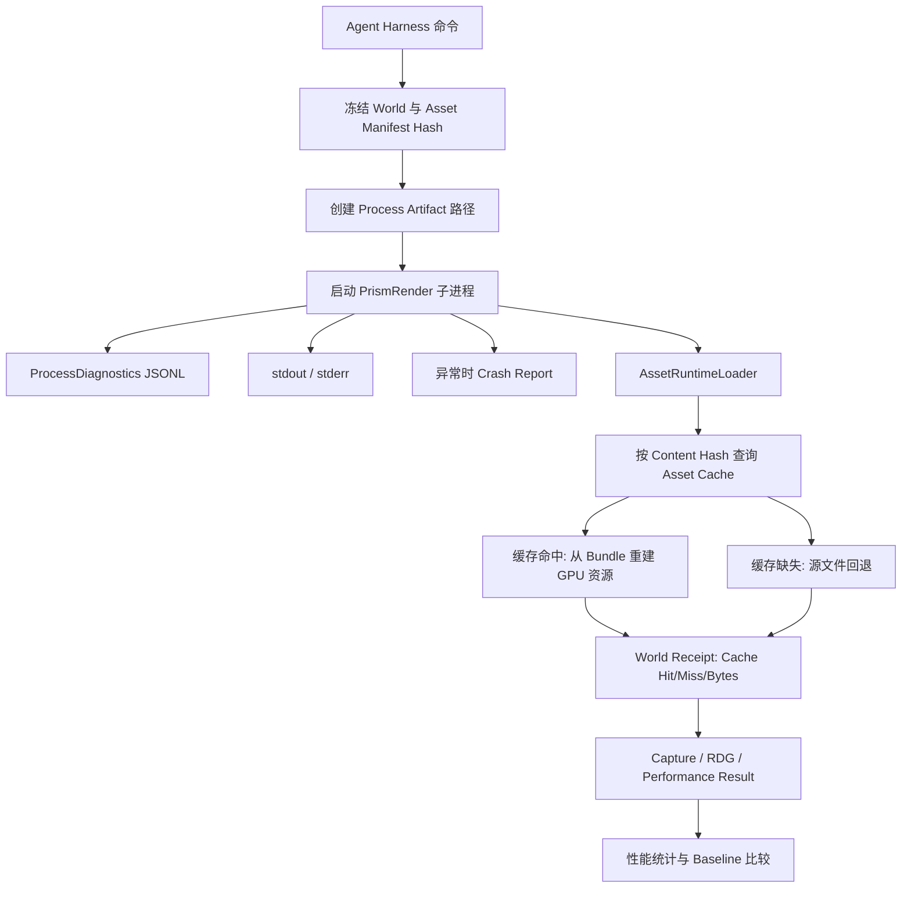

# PrismRender Stage 17-E：可观测性、性能基线与资产缓存学习指南

> 后续状态：Stage 17-F 已实现本文末尾规划的公共 D3D12/Vulkan GPU Timestamp、RDG Pass 预算、Windows Minidump/PDB 符号化和 Cooked Asset。请继续阅读 `docs/AGENT_GPU_CRASH_COOKED_GUIDE_CN.md`。

## 1. 阶段目标

Stage 17-D 让 Agent 能查询、导入和稳定引用资产，但自动化失败时仍存在三个问题：

1. Harness 只知道子进程退出码，不知道初始化到了哪一步。
2. 性能只有一次 Capture 的耗时，没有可保存、可比较的基线。
3. 每个图形后端都从源 glTF 重新读取文件，没有内容寻址的离线副本。

Stage 17-E 建立四个基础闭环：

- 结构化子进程 JSONL 日志。
- stdout、stderr 和崩溃 JSON 工件。
- 可保存和比较的性能基线。
- 内容寻址的 Asset Cache Bundle。

这是 Stage 17-E 当时的基础版本：崩溃报告还不是完整 Minidump，性能指标只有子进程墙钟时间，资产缓存保存的是可离线重建的源 Bundle。上述限制已在 Stage 17-F 完成第一版升级。

## 2. 文件变更

### 2.1 新增

- `src/Core/ProcessDiagnostics.h`
- `src/Core/ProcessDiagnostics.cpp`
- `src/Automation/PerformanceBaseline.h`
- `src/Automation/PerformanceBaseline.cpp`
- `src/Asset/AssetCache.h`
- `src/Asset/AssetCache.cpp`
- `examples/harness/observability_performance.jsonl`
- `docs/AGENT_OBSERVABILITY_CACHE_GUIDE_CN.md`

### 2.2 修改

- `src/main.cpp`
- `src/Core/ApplicationLauncher.cpp`
- `src/Core/Application.cpp`
- `src/Core/VulkanApplication.cpp`
- `src/Automation/HarnessTools.h`
- `src/Automation/HarnessTools.cpp`
- `src/Asset/AssetDatabase.cpp`
- `src/Asset/AssetRuntimeLoader.h`
- `src/Asset/AssetRuntimeLoader.cpp`
- `src/Scene/WorldRenderSnapshot.h`
- `src/Scene/WorldRenderSnapshot.cpp`
- `tests/EngineHarnessTests.cpp`
- `CMakeLists.txt`
- 现有中文学习路线文档

## 3. 完整数据流



## 4. 结构化子进程日志

### 4.1 为什么不能只依赖 stdout

stdout 适合人阅读，但不适合 Agent 稳定判断：

- 文本格式可能变化。
- 不同 API 输出内容不同。
- 无法可靠区分事件、级别和上下文。
- 崩溃前的最后阶段难以机器判断。

因此 `ProcessDiagnostics` 单独写 JSONL，每行一个事件：

```json
{
  "format": "PrismProcessLogEvent",
  "version": 1,
  "sequence": 3,
  "timestampUtc": "2026-07-16T14:03:16.602Z",
  "processId": 49544,
  "threadId": 38296,
  "level": "info",
  "event": "renderer.initialize.completed",
  "message": "Direct3D 12 renderer initialization completed.",
  "graphicsApi": "Direct3D 12",
  "details": {}
}
```

当前事件：

```text
process.start
renderer.api_selected
renderer.initialize.begin
renderer.initialize.completed
process.exit
process.cpp_exception
process.unknown_exception
process.seh_exception
```

`sequence` 是单进程内递增序号，时间为 UTC。Agent 可以先按 `event` 判断阶段，再阅读 `message/details`。

### 4.2 环境变量

Harness 为每次子进程设置：

```text
PRISM_RENDER_LOG_PATH
PRISM_RENDER_CRASH_REPORT_PATH
```

应用入口调用：

```cpp
ProcessDiagnostics::Initialize();
ProcessDiagnostics::Log(...);
```

`ApplicationLauncher` 在 API 选择和初始化边界写事件，`main.cpp` 负责进程开始、正常退出和顶层异常。

## 5. stdout 和 stderr 捕获

`RunRendererProcess` 使用 Win32 `CreateProcessW`，为子进程创建可继承文件句柄：

```text
STARTF_USESTDHANDLES
hStdOutput -> *.stdout.log
hStdError  -> *.stderr.log
hStdInput  -> NUL
```

Harness 不使用匿名 Pipe 阻塞读取，而是让子进程直接写文件。这样：

- 不会因为 Pipe 缓冲区写满而死锁。
- 子进程崩溃后工件仍保留。
- 远程 Worker 和 CI 可直接上传文件。

每个渲染结果的 `process` 字段包含：

```json
{
  "exitCode": 0,
  "timedOut": false,
  "structuredLogPath": "...jsonl",
  "stdoutPath": "...stdout.log",
  "stderrPath": "...stderr.log",
  "crashReportPath": "...crash.json",
  "structuredEvents": [],
  "stdoutTail": "",
  "stderrTail": "",
  "crashReport": {}
}
```

Tail 最多读取 16 KiB，防止无限日志直接膨胀 Harness 返回 JSON。完整日志仍保留在文件中。

## 6. 超时与失败传播

旧实现超时后立即抛异常，Agent 只能看到 `renderer_timeout`。

现在超时流程为：

1. `WaitForSingleObject` 超时。
2. Harness 终止子进程并等待退出。
3. 关闭句柄。
4. 读取已经产生的 JSONL、stdout、stderr 和 Crash Report。
5. 返回 `renderer_timeout`，并把完整 `process` 工件放入错误 details。

普通非零退出返回 `renderer_failed`，也携带同样的进程诊断。

## 7. 崩溃报告

### 7.1 C++ 顶层异常

`main.cpp` 捕获 `std::exception` 后写入：

```json
{
  "format": "PrismCrashReport",
  "version": 1,
  "graphicsApi": "Direct3D 11",
  "kind": "cpp_exception",
  "message": "The D3D11 translator exists, but a runnable D3D11 backend has not been implemented.",
  "exitCode": 1,
  "details": {}
}
```

### 7.2 Windows Structured Exception

`ProcessDiagnostics::Initialize` 安装 `SetUnhandledExceptionFilter`。SEH 报告额外记录：

- `exceptionCode`
- `exceptionAddress`
- `threadId`

当前报告用于快速分类，不包含调用栈、模块列表、寄存器和内存。企业级下一步应通过 `MiniDumpWriteDump` 生成 `.dmp`，再配合 PDB 符号化。

## 8. 内容寻址 Asset Cache

### 8.1 目录结构

默认缓存根目录：

```text
automation/cache/assets/<contentHash>/
```

StartupScene 当前生成：

```text
automation/cache/assets/78fb89f5db72587e/
  bundle.json
  files/
    assets/scenes/StartupScene.gltf
    assets/scenes/Duck0.bin
    assets/scenes/DuckCM.png
```

目录键为导入阶段已经计算出的组合 `contentHash`。内容不变时，重导入会复用同一目录。

### 8.2 为什么保留项目相对路径

`.gltf` 中的 URI 通常是相对路径。缓存如果把所有文件平铺到同一目录，原始引用会失效。

因此 Bundle 在 `files/` 下保留项目相对路径。缓存中的：

```text
files/assets/scenes/StartupScene.gltf
```

仍然能按相对关系找到：

```text
files/assets/scenes/Duck0.bin
files/assets/scenes/DuckCM.png
```

### 8.3 Bundle 格式

```json
{
  "format": "PrismAssetCacheBundle",
  "version": 1,
  "contentHash": "78fb89f5db72587e",
  "sourcePath": "assets/scenes/StartupScene.gltf",
  "cachedSourcePath": "files/assets/scenes/StartupScene.gltf",
  "totalBytes": 123306,
  "files": [
    {
      "projectPath": "assets/scenes/Duck0.bin",
      "cachePath": "files/assets/scenes/Duck0.bin",
      "contentHash": "...",
      "byteSize": 102040
    }
  ]
}
```

`AssetCache::Inspect` 会验证：

- Bundle 格式和版本。
- Bundle Content Hash。
- 每个文件存在。
- 文件长度一致。
- 每个文件内容 Hash 一致。
- Cached Source 存在。

### 8.4 导入与运行时

导入流程：

```text
AssetDatabase::ImportGltf
  -> 计算依赖 Hash
  -> 解析 glTF
  -> 创建稳定资产记录
  -> AssetCache::Build
  -> Cache 元数据写入 Scene Record
  -> 保存 Asset Manifest
```

运行时流程：

```text
AssetRuntimeLoader
  -> AssetCache::Resolve
  -> 命中时使用 cachedSourcePath
  -> 未命中时回退 sourcePath 并产生 warning
```

D3D12 和 Vulkan 都使用同一个 Cache Bundle，但仍分别创建自己的 GPU Buffer、Texture 和 Material。

### 8.5 源文件缺失与内容变化

规则如下：

- 源文件存在且 Hash 一致：正常。
- 源文件缺失但缓存完整：允许离线运行，产生 `asset_source_using_cache` 警告。
- 源文件内容变化：仍返回 `asset_source_stale`，要求重导入。
- 源文件和缓存都不可用：返回结构化错误。

内容变化不能静默使用旧缓存，否则 Agent 会误以为磁盘修改已进入画面。

## 9. `asset.cache.status`

查询全部 Bundle：

```json
{
  "requestId": "cache-status",
  "command": "asset.cache.status",
  "arguments": {}
}
```

按 Scene Asset 查询：

```json
{
  "requestId": "cache-scene",
  "command": "asset.cache.status",
  "arguments": {
    "assetPath": "prism-asset://634f6359-9c7d-5dc9-9e07-0046822e77d3"
  }
}
```

返回 Bundle 路径、缓存源路径、文件数量、字节数和验证错误。

## 10. 缓存命中进入 World Receipt

`PrismRenderedWorldReceipt` 新增：

```json
{
  "assetCacheHitCount": 1,
  "assetCacheMissCount": 0,
  "assetCachedBytes": 123306
}
```

Agent 不需要根据目录是否存在猜测缓存是否真正被运行时使用，而是直接读取渲染子进程回执。

## 11. 性能统计

`PerformanceBaseline::ComputeStatistics` 对样本计算：

- minimum
- maximum
- mean
- median
- p95

Median 用 50% 线性插值，P95 用 95% 线性插值。基线比较主要检查 Median 与 P95，避免只看平均值掩盖长尾。

回归百分比：

```text
(current - baseline) / baseline * 100
```

负数表示当前更快。

## 12. `performance.measure`

生成基线：

```json
{
  "requestId": "performance-baseline",
  "command": "performance.measure",
  "arguments": {
    "api": "d3d12",
    "stage": "tonemap",
    "width": 800,
    "height": 450,
    "warmupCount": 1,
    "sampleCount": 3,
    "baselinePath": "automation/performance/d3d12-tonemap-800x450.json",
    "updateBaseline": true
  }
}
```

比较基线：

```json
{
  "requestId": "performance-compare",
  "command": "performance.measure",
  "arguments": {
    "api": "d3d12",
    "stage": "tonemap",
    "width": 800,
    "height": 450,
    "warmupCount": 1,
    "sampleCount": 3,
    "baselinePath": "automation/performance/d3d12-tonemap-800x450.json",
    "updateBaseline": false,
    "maximumRegressionPercent": 15.0,
    "enforce": true
  }
}
```

约束：

- `warmupCount`: 0 到 5。
- `sampleCount`: 1 到 20。
- 默认最大回归：15%。
- 默认有 Baseline 时执行 enforce。

## 13. 性能身份

只有以下身份完全一致才允许比较：

```text
API
Capture Stage
Width / Height
World Hash
Asset Manifest Hash
```

这可以防止把不同场景、不同资产版本或不同分辨率的结果错误比较。

基线格式：

```json
{
  "format": "PrismPerformanceBaseline",
  "version": 1,
  "metric": "rendererProcessWallMilliseconds",
  "identity": {},
  "sampleCount": 2,
  "statistics": {}
}
```

## 14. 当前性能指标的含义

当前指标是：

```text
rendererProcessWallMilliseconds
```

它包含：

- 创建进程。
- 初始化图形 API。
- 加载 Asset Cache。
- 创建 GPU 资源和 Pipeline。
- 渲染确定性帧。
- GPU Readback 与截图。
- 子进程退出。

它适合发现启动、Shader、资源上传和完整 Capture 工作流退化，但不等于纯 GPU Frame Time。

下一阶段应增加：

- D3D12/Vulkan 公共 GPU Timestamp。
- 每 Pass Median/P95。
- CPU Frame、Render Thread、Asset Load 分段计时。
- Adapter、驱动版本、CPU 和构建配置身份。

## 15. 示例

```powershell
.\build-windows-ci\Debug\PrismHarness.exe `
  --headless `
  --project-root . `
  --commands examples\harness\observability_performance.jsonl `
  --output automation\stage17e-observability-results.jsonl
```

示例会：

1. 查询 Cache。
2. 创建 Camera、太阳和使用缓存 Duck 的 MeshRenderer。
3. 执行两次 D3D12 Tonemap Capture。
4. 保存性能基线。
5. 为每次样本留下进程日志和 World Receipt。

## 16. 测试覆盖

`EngineHarnessTests` 新增：

- Cache Bundle 构建与校验。
- 缓存源文件存在。
- 缓存包含 glTF、Buffer 和图片三个文件。
- Performance Mean、Median 和 P95。
- Baseline 保存和加载。
- 允许范围内的性能样本通过。
- 超出范围的性能回归失败。
- `engine.describe` 暴露新命令与能力。

## 17. 2026-07-16 实测

### 17.1 构建与测试

```text
CMake configure: passed
MSVC Debug full build: passed
CTest: 7/7 passed
```

### 17.2 Asset Cache

```text
Bundle count: 1
Valid bundle count: 1
Cache key: 78fb89f5db72587e
File count: 3
Total bytes: 123306
D3D12 cache hits/misses: 1 / 0
Vulkan cache hits/misses: 1 / 0
```

### 17.3 结构化日志与崩溃

正常 D3D12/Vulkan 都产生 5 条事件：

```text
process.start
renderer.api_selected
renderer.initialize.begin
renderer.initialize.completed
process.exit
```

D3D11 未实现验证产生：

```text
Crash format: PrismCrashReport
Crash kind: cpp_exception
Graphics API: Direct3D 11
Exit code: 1
Event count: 3
```

### 17.4 性能基线

第一次两样本基线：

```text
Minimum: 4116.3421 ms
Mean: 4131.6896 ms
Median: 4131.6896 ms
P95: 4145.50235 ms
Maximum: 4147.0371 ms
```

第二次真实比较：

```text
Identity matches: true
Median regression: -0.2886%
P95 regression: -0.5798%
Allowed regression: 15%
Result: passed
```

### 17.5 双 API 回归

```text
World Hash: 8a3b23a577165ed6
Asset Manifest Hash: cf635504bbb44fbb
D3D12/Vulkan cache hit: 1 / 1
MAE: 0.0000373094
RMSE: 0.000395933
Changed pixel ratio, tolerance 8: 0.0
Golden Image: passed
```

## 18. 设计取舍

### 18.1 文件工件而不是进程内全量日志

文件便于失败后保留、CI 上传和远程执行。Harness 只内嵌 Tail 和结构化事件，避免结果 JSON 无限增长。

### 18.2 先做 Source Bundle，再做 Cooked Asset

Source Bundle 已解决：

- 源文件离线缺失。
- 两个 API 使用同一资产内容。
- 内容 Hash 命中和损坏验证。

但它仍会运行 glTF Parser。后续 `.prismmesh/.prismtex/.prismmat` 才能减少解析与平台转换成本。

### 18.3 先做进程墙钟，再统一 GPU Profiler

D3D12 已存在 GPU Timestamp，但 Vulkan 还没有完全相同的公共 Profiler 输出。当前先建立跨 API 都能工作的基线协议，后续在不改变 Baseline 身份模型的情况下新增 GPU 指标。

## 19. Stage 17-E 当时的边界

以下内容在 Stage 17-E 结束时仍待实现，其中第 1、3、4、6 项已由 Stage 17-F 完成基础版：

1. Windows Minidump 和 PDB 符号化。
2. 日志分类、Span/Correlation ID 和跨进程 Trace。
3. 公共 D3D12/Vulkan GPU Timestamp。
4. 每 RDG Pass 的性能预算。
5. Adapter、驱动、CPU、Build Config 基线身份。
6. `.prismmesh/.prismtex/.prismmat` Cooked 格式。
7. Cache GC、容量预算、锁和并发导入。
8. 远程 Cache 与 CI 工件下载。
9. 自动性能趋势数据库。

Stage 17-F 的实际实现与验证结果见 `docs/AGENT_GPU_CRASH_COOKED_GUIDE_CN.md`。

后续状态：第 1 至 7 项已由 Stage 17-F 至 17-I 完成；Adapter/驱动/CPU/
Build/Shader 身份与 CPU Trace 由 Stage 17-G 完成。远程 Cache 和集中式
趋势数据库仍属于外部服务，不是本地 Harness 基线。

## 20. 推荐学习顺序

1. 阅读 `ProcessDiagnostics.h`，理解日志与 Crash API。
2. 阅读 `main.cpp`，跟踪顶层异常边界。
3. 阅读 `ApplicationLauncher.cpp`，观察 API 与初始化事件。
4. 阅读 `RunRendererProcess`，理解 Win32 句柄继承。
5. 阅读 `SerializeRendererProcess`，看工件如何进入命令结果。
6. 阅读 `AssetCache.h`，先理解 Bundle 数据结构。
7. 阅读 `AssetCache::Build/Inspect`。
8. 打开真实 `bundle.json`，核对三个缓存文件。
9. 阅读 `AssetDatabase::ImportGltf` 的 Cache Build 调用。
10. 阅读 `AssetRuntimeLoader` 的 Cache Resolve 分支。
11. 阅读 World Receipt 新增缓存统计。
12. 阅读 `PerformanceBaseline::ComputeStatistics/Compare`。
13. 阅读 `MeasurePerformance`，画出 Warmup、Sample、Save、Compare 流程。
14. 运行示例并检查每个 Process Artifact。
15. 最后故意使用不匹配的分辨率比较 Baseline，观察身份拒绝。
