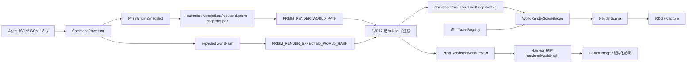

# PrismRender Stage 17-C：Agent World 到双 API 渲染闭环

## 1. 本阶段解决的问题

Stage 17-B 已经能通过 Harness 启动 D3D12/Vulkan、截图、查询 RDG 和比较 Golden Image，但当时子进程渲染的是应用自己的启动场景，不一定是 Agent 刚刚通过命令修改的 Engine World。

这会产生一个严重问题：

- Harness 中的 `worldHash` 表示 Agent 当前编辑的 World。
- 子进程中的画面可能来自默认预览场景。
- 即使 D3D12/Vulkan 截图一致，也不能证明它们渲染了 Agent 创建的内容。

Stage 17-C 完成以下闭环：

1. Harness 冻结当前完整 `PrismEngineSnapshot`。
2. Snapshot 通过环境变量传入渲染子进程。
3. D3D12 与 Vulkan 建立相同的 Asset Path 注册表。
4. 两个后端把 Snapshot World 同步到各自的 `RenderScene`。
5. 子进程写出 `PrismRenderedWorldReceipt`。
6. Harness 校验 `worldHash == renderedWorldHash`。
7. 哈希一致后才执行 RDG 查询、截图或跨 API Golden Image 比较。

因此现在的跨 API 对比语义是：

> 确认两个后端渲染了同一份确定性 World，然后比较它们的图像结果。

## 2. 文件变更

### 2.1 新增文件

- `src/Scene/WorldRenderSnapshot.h`
- `src/Scene/WorldRenderSnapshot.cpp`
- `examples/harness/render_current_world.jsonl`
- `docs/AGENT_WORLD_RENDER_LOOP_GUIDE_CN.md`

### 2.2 主要修改文件

- `src/Engine/CommandSystem.h/.cpp`
- `src/Automation/HarnessTools.h/.cpp`
- `src/Scene/WorldRenderSceneBridge.h/.cpp`
- `src/Scene/DefaultSceneFactory.h/.cpp`
- `src/Scene/SceneLoader.h/.cpp`
- `src/Core/Application.cpp`
- `src/Core/VulkanApplication.h/.cpp`
- `src/Renderer/RenderCapture.h`
- `tests/EngineHarnessTests.cpp`
- `tests/WorldRenderSceneBridgeTests.cpp`
- `CMakeLists.txt`

## 3. 完整数据流



同一个 `render.compare_apis` 请求只生成一次 Snapshot。D3D12 与 Vulkan 依次读取同一个文件和同一个预期哈希，避免两个捕获之间 World 被再次序列化或修改。

## 4. 为什么传输完整 Snapshot

只保存 `WorldSerializer::Serialize(world)` 不足以保持 Harness 状态身份，因为当前哈希还包含：

- `fixedDeltaSeconds`
- `simulation tick`
- `randomSeed`
- 完整 ECS World

`CommandProcessor::CaptureState()` 的格式为：

```json
{
  "format": "PrismEngineSnapshot",
  "version": 1,
  "simulation": {
    "fixedDeltaSeconds": 0.016666666666666666,
    "tick": 60,
    "randomSeed": 42
  },
  "world": {
    "format": "PrismEngineWorld",
    "version": 2,
    "entities": []
  }
}
```

本阶段新增：

```cpp
bool CommandProcessor::SaveSnapshot(path, outError) const;
bool CommandProcessor::LoadSnapshotFile(path, outError);
```

保存和加载都经过项目根目录限制。加载后调用 `ResetJournal(snapshot)`，使本地 Processor 的 World、模拟状态、初始状态和 Journal 基线保持一致。

## 5. Harness 如何准备 World

`HarnessTools::PrepareRenderWorld` 支持三种模式。

### 5.1 当前 World

默认行为是渲染当前内存 World：

```json
{
  "requestId": "capture-current",
  "command": "render.capture",
  "arguments": {
    "api": "d3d12",
    "stage": "tonemap"
  }
}
```

Harness 会：

1. 读取 `processor.ComputeStateHash()`。
2. 保存 `automation/snapshots/capture-current.prism-snapshot.json`。
3. 用新的临时 `CommandProcessor` 重新加载文件。
4. 再次计算哈希。
5. 如果往返哈希不同，返回 `snapshot_roundtrip_mismatch`，不启动 GPU 子进程。

也可以显式写：

```json
"useCurrentWorld": true
```

### 5.2 启动场景兼容模式

如果只是验证传统内置启动场景：

```json
"useCurrentWorld": false
```

这时不传 Snapshot，子进程保持原有 Preview Scene + StartupScene.gltf 行为。`examples/harness/render_validation.jsonl` 使用此模式。

### 5.3 指定已有 Snapshot

```json
{
  "worldSnapshot": "automation/snapshots/approved.prism-snapshot.json"
}
```

`worldSnapshot` 与 `useCurrentWorld=true` 互斥。显式 Snapshot 会先在 Harness 中加载和计算哈希，然后再交给渲染器。

## 6. 固定捕获环境

Harness 为子进程设置：

| 环境变量 | 作用 |
|---|---|
| `PRISM_RENDER_HEADLESS=1` | 创建隐藏 GLFW 窗口 |
| `PRISM_RENDER_DETERMINISTIC=1` | 禁止动态相机输入 |
| `PRISM_RENDER_WIDTH` | 固定窗口宽度，范围 64 到 8192 |
| `PRISM_RENDER_HEIGHT` | 固定窗口高度，范围 64 到 8192 |
| `PRISM_RENDER_WORLD_PATH` | 完整 Snapshot 路径 |
| `PRISM_RENDER_EXPECTED_WORLD_HASH` | Harness 预期哈希 |
| `PRISM_RENDER_WORLD_REPORT_PATH` | 子进程回执路径 |
| `PRISM_RENDER_CAPTURE_PATH` | 截图输出 |
| `PRISM_RENDER_CAPTURE_STAGE` | 捕获 Pass |
| `PRISM_RENDER_RDG_REPORT_PATH` | RDG 报告输出 |

`Application` 和 `VulkanApplication` 都通过 `ReadRenderWindowDimension` 使用相同窗口尺寸，避免后端采用不同分辨率。

## 7. 双后端如何加载同一 World

`LoadWorldRenderSnapshot` 执行以下步骤：

1. `CommandProcessor::LoadSnapshotFile` 加载 Snapshot。
2. 重新计算 `renderedWorldHash`。
3. 与 `expectedWorldHash` 比较。
4. 检查确定性渲染约束。
5. 调用 `WorldRenderSceneBridge::SynchronizeToRenderScene`。
6. 检查所有 Mesh/Material Asset Path。
7. 返回 `WorldRenderSnapshotResult`。

当前严格约束为：

- 必须恰好有一个 `Camera`。
- 必须恰好有一个 `DirectionalLight`，它代表场景太阳。
- 所有 `MeshRenderer.meshAsset` 必须能解析。
- 所有 `MeshRenderer.materialAsset` 必须能解析。

这样可避免以下模糊行为：

- 没有 Camera 时偷偷沿用启动场景相机。
- 没有太阳时偷偷沿用默认 DirectionalLight。
- 资源失败时对象静默消失。
- 多个 Camera 时由容器顺序隐式决定当前相机。

## 8. 为什么必须统一 AssetRegistry

World 中保存的是稳定路径，不是 GPU 指针：

```text
builtin://editor-preview/meshes/cube
builtin://editor-preview/materials/Preview_Warm
gltf://meshes/3/SomeNode
gltf://materials/4/SomeNode
```

Stage 17-B 中：

- D3D12 Preview Scene 会注册 Asset Path。
- Vulkan Preview Scene 只创建运行时对象，没有注册对应路径。
- Vulkan glTF Loader 也没有写入共享 AssetRegistry。

因此同一 World 在 D3D12 能解析，在 Vulkan 可能失败。

本阶段增加：

```cpp
DefaultSceneFactory::PopulateEditorPreviewScene(
    AssetRegistry&,
    IGraphicsDevice&,
    RenderScene&);

SceneLoader::LoadFromGltf(
    const std::string&,
    IGraphicsDevice&,
    AssetRegistry&,
    RenderScene&,
    ...);
```

Vulkan 现在按与 D3D12 相同的顺序注册：

1. Cube 和 UV Sphere。
2. 三个 Preview Texture。
3. 三个 Preview Material。
4. glTF Mesh。
5. 每个 glTF 材质的五类纹理。
6. glTF Material。

路径和计数规则一致后，Snapshot 中的引用才具有跨 API 可移植性。

## 9. 结构化资源错误

`WorldRenderSyncResult::unresolvedAssets` 从字符串列表升级为：

```cpp
struct UnresolvedRenderAsset
{
    std::string entityId;
    std::string entityName;
    std::string assetType;
    std::string assetPath;
};
```

实际错误结果示例：

```json
{
  "success": false,
  "error": {
    "code": "unresolved_render_assets",
    "details": {
      "unresolvedAssets": [
        {
          "entityId": "20000000-0000-4000-8000-000000000003",
          "entityName": "BrokenObject",
          "assetType": "mesh",
          "assetPath": "builtin://missing/mesh"
        },
        {
          "entityId": "20000000-0000-4000-8000-000000000003",
          "entityName": "BrokenObject",
          "assetType": "material",
          "assetPath": "builtin://missing/material"
        }
      ]
    }
  }
}
```

Agent 可以据此定位实体并修正指定字段，不需要解析控制台文本。

## 10. 渲染回执

每个使用 Snapshot 的子进程都会写：

```json
{
  "format": "PrismRenderedWorldReceipt",
  "version": 1,
  "success": true,
  "graphicsApi": "Vulkan",
  "snapshotPath": "D:/.../world-compare.prism-snapshot.json",
  "expectedWorldHash": "dac924b4b9facc82",
  "renderedWorldHash": "dac924b4b9facc82",
  "entityCount": 3,
  "cameraCount": 1,
  "directionalLightCount": 1,
  "renderObjectCount": 1,
  "unresolvedAssets": []
}
```

Harness 不再把所有非零退出都压缩成 `renderer_failed`。如果回执存在且包含失败原因，Harness 优先返回回执中的错误码和详细字段。

工具成功结果新增：

- `worldSource`
- `worldHash`
- `renderedWorldHash`
- `snapshotPath`
- `worldReceiptPath`
- `worldReceipt`
- `width`
- `height`

## 11. `render.compare_apis` 的新语义

执行顺序为：

1. 冻结一次 Snapshot。
2. D3D12 加载 Snapshot。
3. 校验 D3D12 `renderedWorldHash`。
4. 捕获 D3D12 指定 Stage。
5. Vulkan 加载同一 Snapshot。
6. 校验 Vulkan `renderedWorldHash`。
7. 捕获 Vulkan 指定 Stage。
8. 比较分辨率、MAE、RMSE、Changed Pixel Ratio。
9. 根据阈值决定命令成功或失败。

哈希不一致时不会继续 Golden Image 比较，因为此时图像差异已经失去诊断意义。

## 12. 可运行示例

完整示例：

```powershell
.\build-windows-ci\Debug\PrismHarness.exe `
  --headless `
  --project-root . `
  --commands examples\harness\render_current_world.jsonl `
  --output automation\render-current-world-results.jsonl
```

示例通过 JSONL 创建：

- 一个 Camera。
- 一个 DirectionalLight 太阳。
- 一个使用内置 Cube Mesh 和 Preview_Warm Material 的对象。
- 固定时间步、随机种子和 60 个模拟 Tick。
- D3D12 RDG 报告。
- D3D12/Vulkan Tonemap 对比。

## 13. 自动验证结果

2026-07-16 实测：

```text
CMake configure: passed
MSVC Debug build: passed
CTest: 7/7 passed
Capture size: 1280 x 720
Entity count: 3
Render object count: 1
Harness worldHash: dac924b4b9facc82
D3D12 renderedWorldHash: dac924b4b9facc82
Vulkan renderedWorldHash: dac924b4b9facc82
D3D12 RDG pass count: 8
Mean absolute error: 0.0000233595
Root mean square error: 0.000304844
Changed pixel ratio, tolerance 8: 0.0
Strict cross-API thresholds: passed
Structured unresolved asset failure: passed
```

截图中两个后端都实际显示 Agent 创建的暖色 Cube、天空、太阳光照和编辑器网格，不是空白帧或启动场景误捕获。

## 14. 设计取舍

### 14.1 使用文件传输而不是共享内存

优点：

- 容易检查和复现。
- 可以作为失败工件保留。
- 子进程边界清晰。
- 后续 CI 和远程 Worker 可直接复用。

缺点：

- 每次请求产生磁盘 IO。
- 大型 World 的序列化成本会增加。

当前 Harness 以确定性和可诊断性为优先，文件传输更合适。未来可增加内容寻址缓存，Hash 相同的 Snapshot 不重复写入。

### 14.2 先注册资源再同步 World

World 同步只能解析 Asset Path，不能负责导入任意新文件。本阶段先加载内置资源和 StartupScene.gltf，再同步 Snapshot。

这意味着当前可直接使用：

- 内置 Preview Mesh/Material。
- StartupScene.gltf 已注册的资源路径。

Stage 17-D 已将该临时限制升级为 Asset Manifest：外部 glTF 先经过 `asset.import/reimport`，D3D12/Vulkan 再从同一 Manifest 注册稳定的 `prism-asset://` 路径。

### 14.3 串行执行双 API

D3D12 与 Vulkan 当前按顺序启动，避免两个隐藏窗口同时争用 GPU、环境变量和输出路径。代价是总时间为两个后端耗时之和。

## 15. Stage 17-E 后的边界和下一阶段

Stage 17-D 已完成：

1. `asset.list`、`asset.describe` 和按路径查询。
2. `.gltf/.glb` 的 `asset.import` 与 `asset.reimport`。
3. 稳定 Asset ID、依赖记录和内容 Hash。
4. D3D12/Vulkan 共用 Manifest 运行时资产构建入口。
5. Harness 可先查询 Mesh/Material，再创建 MeshRenderer。
6. Asset Manifest Hash 进入双 API 渲染回执。

Stage 17-E 又完成：

1. 结构化子进程 JSONL 日志与 stdout/stderr 工件。
2. C++/SEH 基础 Crash Report。
3. Asset Source Bundle 内容寻址缓存。
4. World Receipt Cache Hit/Miss/Bytes。
5. 进程墙钟性能 Baseline。

仍待完成：

1. RenderSettings 进入 Snapshot/Command/Undo。
2. 环境贴图、天空设置和后处理设置的 World 级数据模型。
3. Windows Minidump、PDB 符号化和跨进程 Trace。
4. Snapshot 内容寻址缓存与 Cooked Asset 格式。
5. 完整资产依赖 DAG、反向依赖和级联重导入。
6. 公共 GPU Timestamp、MCP Adapter 与长任务 Checkpoint。

Stage 17-D 的完整实现见 `docs/AGENT_ASSET_PIPELINE_GUIDE_CN.md`。

Stage 17-E 已进一步让 World Receipt 返回 Asset Cache Hit/Miss/Bytes，并为每次子进程保留结构化日志、stdout/stderr 和 Crash Report。性能采样也使用相同 World Hash 与 Manifest Hash 作为基线身份。完整实现见 `docs/AGENT_OBSERVABILITY_CACHE_GUIDE_CN.md`。

## 16. 推荐学习顺序

1. 阅读 `CommandProcessor::CaptureState`，确认 Hash 包含哪些数据。
2. 阅读 `SaveSnapshot/LoadSnapshotFile`，理解文件边界和 Journal 重置。
3. 阅读 `HarnessTools::PrepareRenderWorld`，跟踪当前 World 如何被冻结。
4. 阅读 `CaptureRender`，整理全部环境变量及其生命周期。
5. 阅读 `LoadWorldRenderSnapshot`，理解哈希、Camera、Sun 和资产验证顺序。
6. 阅读 `WorldRenderSceneBridge::SynchronizeToRenderScene`，跟踪一个 MeshRenderer。
7. 对比 D3D12 和 Vulkan 的 `DefaultSceneFactory` 注册路径。
8. 阅读 Vulkan 的带 `AssetRegistry` glTF Loader。
9. 查看两个 `PrismRenderedWorldReceipt`，确认 API 不同但 Hash 相同。
10. 故意写错一个 Material Path，观察 `unresolved_render_assets`。
11. 修改 Camera 或 simulation tick，再确认 Snapshot Hash 和截图一起变化。
12. 最后运行 `render.compare_apis`，理解身份验证为什么必须早于像素比较。
