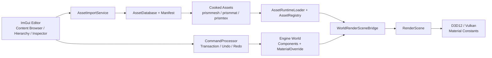
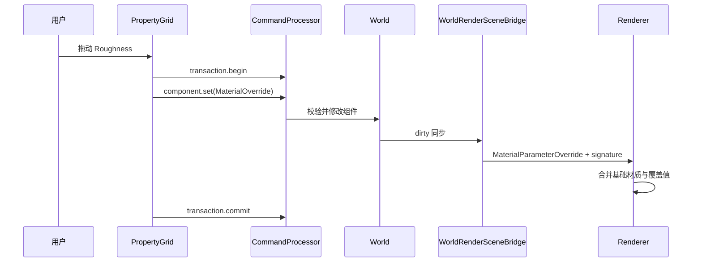

# PrismRender 编辑器资源与属性工作流学习指南

## 1. 本阶段目标

本阶段把 PrismRender 从“能显示调试界面和预览场景”推进到一套可实际使用的渲染器编辑工作流：

- 从编辑器导入 glTF、GLB 和常见 8 位图片；
- 用 Content Browser 搜索、筛选、重导入资源；
- 将 Scene 或 Mesh 资源拖入视口，生成可保存的 World 实体；
- 在 Hierarchy 中稳定选择、删除、聚焦和调整父子关系；
- 在 Inspector 中编辑 Transform、MeshRenderer、相机与灯光等组件；
- 通过 MaterialOverride 调整实例材质参数，并立即反映到 D3D12/Vulkan 渲染路径；
- 所有 World 编辑继续经过 CommandProcessor，因此保留撤销、重做、事务、日志和序列化能力。

这一实现没有恢复神经材质。MaterialOverride 只保存少量标量、颜色与开关，纹理仍由基础 Material 共享，因此不会引入训练环境、网络权重或额外的大块显存常驻。

## 2. 用户操作

### 2.1 导入资源

1. 启动 `PrismRender.exe`。
2. 在 `Content Browser` 中单击 `Import...`。
3. 选择以下格式之一：
   - 场景：`.gltf`、`.glb`
   - 图片：`.png`、`.jpg`、`.jpeg`、`.tga`、`.bmp`
4. 外部文件会复制到项目的 `assets/imported/<资源名>/` 下。外部 `.gltf` 引用的 buffer 和 image 依赖会一并复制到 `dependencies/`，并重写 URI。
5. 导入器更新 `automation/assets/AssetManifest.json`，生成 `.prismmesh`、`.prismmat`、`.prismtex` Cooked Asset，并刷新运行时 AssetRegistry。

导入过的资源可在 Content Browser 中选中后单击 `Reimport`。重导入沿用稳定 Asset ID 和 `prism-asset://` 路径；已有 World 引用不需要重绑。

### 2.2 把资源加入场景

- 双击 Scene/Mesh，或选中后单击 `Add to Scene`；
- 也可以把 Scene/Mesh 从 Content Browser 拖到 Scene 视口；
- Scene 资源会按导入时保存的每个实例矩阵创建多个实体；
- Mesh 资源会创建一个实体，并优先找到其原始 glTF 实例对应的材质；若没有对应材质，则使用内置 `Preview_Neutral`。

一次 Scene 实例化放在同一个 CommandProcessor 事务中，所以一次 Undo 会整体撤销，而不是逐个删除子网格。

### 2.3 编辑实体

- 在 Hierarchy 或 Scene 视口中单击实体进行选择；
- 双击 Hierarchy 中的实体，或在视口选中后按 `F` 聚焦；
- `W`、`E`、`R` 分别切换移动、旋转、缩放 Gizmo；
- 将一个 Hierarchy 实体拖到另一个实体上可设置父级；
- Inspector 的 `Add Component` 可添加 MeshRenderer、MaterialOverride、Camera 和灯光组件；
- 非必需组件可通过 `Remove Component` 删除；
- `Ctrl+Z`/`Ctrl+Y` 撤销或重做，`Ctrl+S` 保存 World，`Ctrl+O` 重新载入 World。

### 2.4 调整材质参数

1. 选择带 MeshRenderer 的实体。
2. 在 Inspector 的 `Add Component` 中选择 `MaterialOverride`。
3. 初始值会从当前基础 Material 复制。
4. 可修改：
   - Base Color、Metallic、Roughness；
   - Emissive Color、Emissive Strength；
   - Normal Scale、Occlusion Strength；
   - Alpha Cutoff、Alpha Mode；
   - 五类基础纹理是否参与着色。

覆盖值保存在实体的 World 数据中。切换 MeshRenderer 的 Material 资源不会修改共享 Material Asset；删除 MaterialOverride 后，实体恢复使用基础材质参数。

## 3. 总体架构



这里刻意保留了两个边界：

- AssetDatabase 管理“资源身份和离线产物”，AssetRegistry 管理“当前进程中的 CPU/GPU 对象”；
- 编辑器不直接修改 RenderScene，而是修改 World，再由 WorldRenderSceneBridge 同步。

这使自动化 Harness、编辑器与未来脚本接口使用同一套命令语义，也避免 UI 成为第二套不可序列化的状态来源。

## 4. 资源导入实现

### 4.1 AssetImportService

`AssetImportService` 是编辑器面对的高层入口，负责：

- 判断扩展名并分派给 glTF 或图片导入器；
- 将项目外文件安全复制到项目内部；
- 收集外部 `.gltf` 的 buffer/image 依赖并重写相对 URI；
- 提供 Import 与 Reimport 两条明确路径；
- 暴露同一个 AssetDatabase 给 Content Browser。

AssetDatabase 仍负责稳定 ID、内容哈希、Cooked Asset、缓存、Manifest revision 和诊断。这样 GUI 没有复制原有 Harness 的资产逻辑。

### 4.2 图片导入

`ImageLoader` 使用项目已有 tinygltf 附带的 stb_image，将输入统一解码成 RGBA8。`AssetDatabase::ImportTexture` 随后：

1. 计算源文件内容哈希；
2. 创建稳定 Texture Asset 记录；
3. 写入 `.prismtex`；
4. 创建离线缓存 bundle；
5. 更新 Manifest。

当前图片统一标记为 sRGB。这适合独立颜色纹理，但未来为法线、金属度、粗糙度等数据纹理提供专门导入设置时，应允许选择 Linear 色彩空间。

### 4.3 运行时热刷新

导入成功后，Application 在安全点执行：

1. `D3D12Context::WaitForGpu()`；
2. 重新读取 Manifest 和 Cooked Asset；
3. 使用稳定路径在 AssetRegistry 的原 Handle 位置替换运行时资源；
4. 标记 World 到 RenderScene 的同步为 dirty。

等待 GPU 会造成一次编辑器停顿，但导入本来就是低频操作。这个方案优先保证旧资源不再被在途命令引用；后续可用延迟释放队列和后台导入消除同步等待。

## 5. 编辑器面板实现

### 5.1 Content Browser

Content Browser 读取 AssetDatabase，而不是扫描文件夹，因此显示的是已经获得稳定身份的可用资源。它提供：

- 名称/路径搜索；
- Scene、Mesh、Material、Texture 类型筛选；
- 源文件、导入 revision 和内置资源标识；
- 导入与重导入结果提示；
- Scene/Mesh 拖放 payload。

拖放数据只保存稳定 Asset Path 和类型。接收端再到 AssetDatabase 查询记录，避免把临时对象指针跨 UI 帧传递。

### 5.2 Hierarchy 与稳定选择

旧面板通过 RenderObject 数组下标保存选择；对象增删或同步后，下标可能指向另一个对象。现在选择状态使用 `EntityId`：

- Hierarchy 来自 World，能显示没有 MeshRenderer 的相机和灯光；
- RenderObject 也携带对应 EntityId；
- World 变化后若实体不存在，选择会自动清空；
- 视口拾取结果直接写入 EntityId。

Hierarchy 父子关系仍是 World 数据。设置父级会检查实体存在、自引用和环路。

### 5.3 反射驱动 Inspector

ReflectionRegistry 的 PropertyDescriptor 新增：

- 显示名和分类；
- Color、AngleRadians 等编辑提示；
- 最小值、最大值、步进；
- AssetPath 可接受的资源类型。

`PropertyGrid` 根据 PropertyType 生成 ImGui 控件，并通过 `component.get` 读取、`component.set` 写入。连续拖动会自动开始和提交事务，因此一段拖动只形成一个 Undo 步骤。

MeshRenderer 的 Mesh/Material 字段支持：

- 下拉选择同类型 Asset；
- 从 Content Browser 接收同类型拖放；
- 保留稳定 Asset Path，而不是保存进程内 Handle。

## 6. 材质实例参数的数据流



`MaterialParameterResolver` 是 D3D12 和 Vulkan 共用的合并函数。基础 Material 提供纹理对象和默认参数；MaterialOverride 仅替换常量值。D3D12 每帧写入 Material Constant Buffer，Vulkan 用显式 signature 判断是否需要重建对象材质资源。

## 7. 文件变更

### 7.1 新增文件

- `src/Asset/AssetImportService.h/.cpp`：编辑器导入编排和外部资源归档；
- `src/Asset/ImageLoader.h/.cpp`：RGBA8 图片解码；
- `src/Platform/FileDialog.h/.cpp`：Windows 文件选择器；
- `src/UI/ContentBrowserPanel.h/.cpp`：资源浏览、导入、重导入和拖放；
- `src/UI/PropertyGrid.h/.cpp`：反射驱动属性编辑器；
- `src/Renderer/MaterialParameterResolver.h/.cpp`：跨后端材质常量合并；
- `docs/EDITOR_ASSET_WORKFLOW_LEARNING_GUIDE_CN.md`：本文档。

### 7.2 主要修改文件

- `src/UI/EditorLayer.h/.cpp`：Dock 布局、Hierarchy、稳定选择、Inspector、Gizmo 与 Content Browser 集成；
- `src/Core/Application.h/.cpp`：资源服务生命周期、热刷新、Scene/Mesh 实例化；
- `src/Asset/AssetDatabase.h/.cpp`：独立图片导入；
- `src/Asset/AssetRuntimeLoader.cpp`：稳定 Handle 上替换重导入资源；
- `src/Engine/Components.h`、`World.h`、`WorldSerializer.cpp`：MaterialOverride World 数据与持久化；
- `src/Engine/Reflection.h/.cpp`、`CommandSystem.h/.cpp`：属性元数据、读取、校验、命令编辑；
- `src/Scene/RenderObject.h`、`WorldRenderSceneBridge.cpp`：材质覆盖同步与签名；
- `src/Renderer/D3D12SceneRenderer.cpp`、`VulkanSceneRenderer.h/.cpp`：覆盖值进入 GPU 常量；
- `tests/EngineHarnessTests.cpp`、`tests/WorldRenderSceneBridgeTests.cpp`：导入、序列化、校验与桥接测试；
- `CMakeLists.txt`：新增源文件和 Windows Shell/COM 链接库。

## 8. 验证方法

配置和编译：

```powershell
cmake -S . -B build-windows-ci
cmake --build build-windows-ci --config RelWithDebInfo --parallel 4
```

核心自动化测试：

```powershell
ctest --test-dir build-windows-ci -C RelWithDebInfo `
  -R "^(EngineHarness|WorldRenderSceneBridge)$" `
  --output-on-failure
```

手动验收建议：

1. 导入一个项目外的 `.gltf`，确认源文件及依赖被复制到 `assets/imported/`；
2. 在 Content Browser 中搜索资源并拖到 Scene；
3. 确认 Hierarchy 新实体与原场景实例数量一致；
4. 移动实体，执行 Undo/Redo；
5. 添加 MaterialOverride，调整 Base Color、Metallic 和 Roughness，观察实时画面；
6. 保存 World、重启、载入，确认 Transform、资源引用和材质覆盖仍存在；
7. 修改源资源并 Reimport，确认稳定路径不变且画面刷新。

## 9. 当前边界与下一步

这一阶段提供的是面向渲染器项目的编辑器基础，不把 PrismRender 扩张为完整游戏引擎。当前明确边界如下：

- 暂不支持 FBX、OBJ、DDS、KTX2、HDR/EXR；
- Content Browser 暂无缩略图、文件夹树和资源重命名/删除；
- 独立图片已可导入，但还没有可保存的 Material Asset 编辑器来把任意图片重绑到材质纹理槽；
- MaterialOverride 是实体级参数实例，不是可被多个实体共享的独立 Material Instance Asset；
- 导入与 GPU 刷新目前同步执行；
- 重导入删除掉的旧子资源仍可能留在运行时 Registry 中，直到进程结束，但已从 Manifest 和 Content Browser 消失；
- Hierarchy 已保存父子关系，但渲染同步仍把 Transform 当作世界空间值，没有进行父子矩阵传播。

推荐按以下顺序继续：

1. 增加 Material Instance Asset 与纹理槽/色彩空间导入设置；
2. 增加资源缩略图、文件夹树、删除/移动及引用检查；
3. 为导入器增加后台任务、进度与延迟 GPU 资源释放；
4. 实现 Hierarchy 的局部 Transform 和世界矩阵传播；
5. 再考虑 FBX/OBJ、KTX2/DDS 和 HDR 环境资源等格式扩展。
