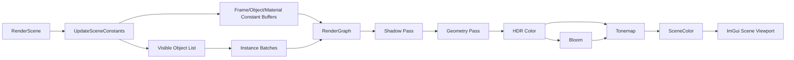

# PrismRender 项目学习指南

> 当前执行路线说明：Stage 18 已关闭 RDG 自适应调度与原生命令并行录制尾项；Stage 19 已完成第一轮生产级 RHI；Stage 20 已完成强类型 RDG 资源模型；Stage 21 已将 D3D12/Vulkan 的 Shadow、GBuffer、Deferred、Hi-Z、Bloom 和 Tonemap 迁入同一参数化渲染前端。实现分别见 `docs/PRODUCTION_RHI_GUIDE_CN.md`、`docs/RDG_RESOURCE_MODEL_GUIDE_CN.md` 与 `docs/SHARED_RENDER_GRAPH_FRONTEND_GUIDE_CN.md`。下文较早编写的“Stage 18 时间域效果、Stage 19 大规模光照”属于效果功能路线，不代表当前架构实施编号。

本文档面向希望从零读懂 PrismRender 的开发者。它既描述当前代码，也解释各模块背后的图形学和 Direct3D 12 概念。

> 项目定位：PrismRender 是实时渲染器与渲染编辑器，不是完整游戏引擎。编辑器功能用于观察、配置和验证渲染功能。

## 1. 当前阶段

项目已完成 Stage 17-P：在 Stage 16 跨 API 数值一致性的基础上，新增独立 PrismEngine/PrismEditor/PrismRenderer/PrismHarness 目标，以及 UUID、World/ECS、Reflection、事务、Undo/Redo、Journal Replay、Headless JSONL、当前 World 双 API 渲染闭环、Agent Asset Pipeline、进程可观测性、GPU/CPU 性能预算、Cooked Asset v2、缓存 GC、离线 Minidump 符号化、RDG Pass Culling、资源生命周期与队列计划，并将瞬态资源规划接入 D3D12 Heap/Placed Resource 和 Vulkan Alias Memory。Compute Bloom、完整 mip-chain Hi-Z、D3D12 Fence 与 Vulkan Timeline Semaphore、跨队列 GPU 时间轴、依赖 DAG 和独立 Queue Batch 已经落地；成本模型 v2 进一步加入 P50/P95、过期、DAG Pass 预测、受控探索和并发安全持久化，D3D12/Vulkan 也已能由工作线程直接录制原生 Command List/Command Buffer。重负载 A/B 表明当前图尚未形成 GPU overlap，强制多队列仍不盈利，因此 `auto` 保持实测正收益门禁。

| 阶段 | 主要内容 | 状态 |
| --- | --- | --- |
| Stage 1 | GLFW 窗口、D3D12 Device、SwapChain、三角形 | 完成 |
| Stage 2 | Mesh、Transform、Camera、多对象 | 完成 |
| Stage 3 | Shader、Texture、Material、基础光照 | 完成 |
| Stage 4 | Shadow、PBR、IBL、HDR、Bloom、Tonemap | 完成基础版 |
| Stage 5 | Frustum Culling、GPU Instancing、PSO Cache、统计 UI | 完成基础版 |
| Stage 6 | RenderGraph、GPU Profiler、CSM、线性 HDR、场景序列化 | 完成 |
| Stage 7 | API 中立类型、D3D12/D3D11 转换器、跨 API 转换测试 | 完成 |
| Stage 8 | Slang、ShaderBinary、DXIL/SPIR-V、跨目标反射测试 | 完成 |
| Stage 9 | Vulkan Device、Swapchain、Command、SPIR-V Pipeline、截图 | 完成基础版 |
| Stage 10 | 公共资源接口、Vulkan DescriptorSet、Mesh/Texture/Material、Context RenderGraph Pass | 完成基础版 |
| Stage 11 | 公共 Pipeline、Draw/Dispatch/Barrier、Vulkan Pipeline、D3D12 Adapter、共享 Pass | 完成基础版 |
| Stage 12 | TextureView、Rendering Scope、Vulkan Dynamic Rendering、D3D12 资源后端、共享 Shadow | 完成基础版 |
| Stage 13 | GBuffer、Deferred、HDR、Bloom、Tonemap 跨 API 执行层与 D3D12 Attachment 迁移 | 当前完成基础版 |
| Stage 14 | 共享 RenderScene/Camera、动态 Buffer Offset、RenderGraph 自动 Barrier | 完成基础版 |
| Stage 15 | D3D12 高级资源/Draw 迁移、glTF/Cubemap/Settings 统一、Golden Image | 完成基础版 |
| Stage 16 | 共享 DescriptorSet/Shader、PBR/IBL/CSM 数值对齐、逐 Pass 严格回归 | 完成 |
| Stage 17 | Agent Harness、资产/进程诊断、RDG 编译、原生瞬态资源、多队列、自适应成本模型与原生命令并行录制 | 完成 Stage 17-P |

当前版本已经适合作为现代双 API 渲染流程、RDG 和 Agent Harness 的学习项目，但生产级 RHI、异步上传、Bindless、GPU Driven Rendering 与 Linux Vulkan 仍属于后续阶段。

## 2. 构建与运行

在 Visual Studio Developer PowerShell 中执行：

```powershell
Set-Location D:\unity_project\PrismRender
cmake -S . -B build-windows-ci
cmake --build build-windows-ci --config Debug
.\build-windows-ci\Debug\PrismRender.exe
.\build-windows-ci\Debug\PrismRender.exe --api=vulkan
```

依赖由 CMake 管理：

- GLFW：窗口和输入
- Dear ImGui Docking：编辑器 UI
- ImGuizmo：Transform 操作轴
- tinygltf：glTF 解析
- nlohmann/json：`.prism.json` 场景文档
- Slang 2026.8.1：HLSL/Slang 编译为 DXIL、SPIR-V，并提供统一反射
- GLAD Vulkan 1.3：通过 GLFW 动态加载系统 Vulkan Runtime，不强制依赖 Vulkan SDK

运行时会由 Slang 从 `assets/shaders/` 编译 HLSL。C++ 编译成功不代表 Shader 一定正确，因此修改 Shader 后必须执行 `ShaderCompiler` 测试并实际启动程序。

## 3. 推荐阅读顺序

不要从最长的渲染文件第一行一路向下读。建议按数据流阅读：

1. `src/main.cpp`、`src/Core/ApplicationLauncher.cpp`
2. `src/Core/Application.cpp`、`src/Core/VulkanApplication.cpp`
3. `src/Platform/Window.*`
4. `src/RHI/D3D12/D3D12Context.*`
5. `src/RHI/GraphicsApi.*`、`GraphicsTypes.*`
6. `src/RHI/D3D12/D3D12TypeConversions.*`
7. `src/RHI/D3D11/D3D11TypeConversions.*`
8. `src/RHI/ShaderTypes.*`
9. `src/RHI/GraphicsResources.*`、`PipelineState.*`、`Rendering.*`、`IGraphicsDevice.h`、`ICommandContext.h`
10. `src/RHI/Vulkan/VulkanLoader.*`、`VulkanTypeConversions.*`、`VulkanContext.*`
11. `src/RHI/Vulkan/VulkanResources.*`、`VulkanPipeline.*`
12. `src/Asset/IShaderCompiler.h`、`SlangShaderCompiler.*`、`ShaderManager.*`
13. `src/Asset/Mesh.*`、`Texture.*`、`Material.*`
14. `src/Renderer/RenderGraph.*`、`RhiPasses.*`
15. `src/Renderer/VulkanSceneRenderer.*`、`assets/shaders/RhiScene.hlsl`、`RhiSky.hlsl`
16. `src/RHI/D3D12/D3D12Resources.*`、`D3D12GraphicsDevice.*`、`D3D12PipelineView.*`、`D3D12CommandContextAdapter.*`
17. `src/Renderer/VulkanTriangleRenderer.*`：作为 Stage 9 最小基线对照
18. `src/Scene/RenderScene.*`、`Camera.*`、`Transform.*`
19. `src/Renderer/D3D12SceneRenderer.h`
20. `src/Renderer/D3D12SceneRenderer.cpp`
21. `assets/shaders/ShaderBindings.hlsli`
22. `assets/shaders/Mesh.hlsl`
23. `assets/shaders/Shadow.hlsl`
24. `assets/shaders/Deferred.hlsl`
25. `assets/shaders/PostProcess.hlsl`
26. `src/UI/EditorLayer.*`、`DebugPanel.*`
27. `src/Scene/SceneSerializer.*`

每读完一个模块，先回答三个问题：谁拥有资源、谁更新数据、数据在哪个帧阶段被 GPU 使用。

## 4. 目录与职责

### Core

`Application` 负责组装系统和控制主循环，`FrameTimer` 负责帧时间。业务逻辑不应该继续堆进 `main.cpp`。

主循环顺序：

1. 轮询窗口事件
2. 处理窗口 Resize
3. 创建 ImGui 帧
4. 更新编辑器和相机
5. `D3D12Context::BeginFrame`
6. `SceneRenderer::Render`
7. 将 ImGui 绘制到 SwapChain BackBuffer
8. `D3D12Context::EndFrame`
9. Present 和 Fence Signal

### Platform

`Window` 包装 GLFW，提供：

- Win32 原生窗口句柄
- 键盘和鼠标状态
- 鼠标滚轮增量
- Resize 事件
- 光标捕获

GLFW 只负责窗口和输入，实际渲染 API 是 Direct3D 12。

### RHI

`D3D12Context` 当前是轻量 RHI，拥有：

- DXGI Factory 和硬件 Adapter
- D3D12 Device
- Direct Command Queue
- 每帧 CommandAllocator
- GraphicsCommandList
- 双缓冲 SwapChain
- RTV、DSV、SRV Heap
- 每帧 Fence Value 和同步事件

`BeginFrame` 会等待当前 BackBuffer 对应的 Fence，然后重置 Allocator 和 CommandList。`EndFrame` 关闭并提交 CommandList、Present，再 Signal Fence。

这保证 CPU 不会重置 GPU 仍在使用的命令内存。

当前限制：SRV Heap 是固定容量并且只增不减。后续应实现 DescriptorAllocator 和延迟释放。

Stage 7 开始后，上层代码不应继续直接发明新的 `DXGI_FORMAT`、`D3D12_RESOURCE_STATES` 或 PSO 状态组合。先使用 `GraphicsTypes.h` 中的 Prism 类型描述意图，再由对应 API 转换器生成原生描述。

### Asset

资产分为两层：

- `MeshAsset`、`TextureAsset`、`MaterialAsset`：CPU 侧资产数据
- `Mesh`、`Texture`、`Material`：D3D12 运行时资源

`AssetRegistry` 使用 Handle 管理两层对象，同时保存稳定资产 URI，例如：

```text
builtin://editor-preview/meshes/cube
gltf://materials/3/Duck
```

场景序列化优先保存 URI，Handle 只作为兼容回退。因为 Handle 可能随导入顺序变化，不能单独作为永久资产标识。

### Scene

`RenderScene` 当前保存：

- 一个 Camera
- 一个 DirectionalLight
- 最多四个 PointLight
- 一个平铺的 `RenderObject` 数组

`RenderObject` 连接 Transform、Mesh Handle、Material Handle 和运行时资源。

当前没有 Entity ID、父子层级和 Component。后续添加场景层级时，不应直接继续扩展 `RenderObject`，而应引入 Entity/Component 数据模型，再生成面向渲染器的 RenderScene。

### Renderer

`SceneRenderer` 拥有渲染所需的 PSO、RootSignature、ConstantBuffer、RenderTarget、ShadowMap 和统计信息。

当前主要 Pass：

```text
Shadow
  -> Geometry (Forward 或 GBuffer + Deferred Lighting)
  -> Bloom
  -> Tonemap
  -> SceneColor
  -> ImGui Scene Viewport
```

### UI

`EditorLayer` 提供 Scene、Hierarchy、Inspector 和主菜单。

`DebugPanel` 提供功能开关、CPU/GPU Pass 时间、Draw Call、裁剪和实例化统计。

编辑器操作：

- 右键 + WASD/QE：飞行相机
- Shift/Ctrl：加速或减速
- Alt + 左键：环绕
- 中键：平移
- 滚轮：推拉
- F：聚焦选中对象
- W/E/R：移动、旋转、缩放 Gizmo
- Ctrl+S：保存场景
- Ctrl+O：加载场景

默认场景文档位置：`assets/scenes/EditorScene.prism.json`。

## 5. 一帧渲染的数据流



### 常量缓冲

每个 Frame Slot 都有独立的 ConstantBuffer，避免 CPU 修改 GPU 仍在读取的数据。

- `FrameConstants`：Camera、灯光、级联矩阵、渲染开关
- `ObjectConstants`：World、WorldViewProjection
- `MaterialConstants`：颜色、Metallic、Roughness、纹理开关
- `PostProcessConstants`：Exposure、Bloom、天空、太阳、网格

D3D12 CBV 地址要求 256 字节对齐。代码会将每个对象的常量块步长向上对齐，而不是依靠 C++ 结构体本身填充到 256 字节。

## 6. RenderGraph 编译基础版

文件：`src/Renderer/RenderGraph.*`

当前 RenderGraph 负责：

- 注册外部资源
- 声明 Pass 的读写依赖
- 标记最终输出和 Side Effect
- 从输出根反向执行 Pass Culling
- 建立 RAW/WAR/WAW 执行依赖
- 计算瞬态资源 FirstUse/LastUse
- 为兼容且不重叠的资源规划别名槽
- 生成 Graphics/Compute 跨队列同步计划
- 在执行前检查资源是否已导入或由前序 Pass 产生
- 顺序执行 Active Pass
- 自动生成整纹理 ResourceBarrier
- 自动记录每个 Pass 的 CPU 时间
- 为 GPU Profiler 提供统一 Marker 边界

示意代码：

```cpp
graph.ImportResource("SceneData");
graph.MarkOutput("HdrColor");
graph.AddPass(
    "Geometry",
    {"SceneData", "ShadowMap"},
    {"HdrColor"},
    [&]() { RenderForwardPass(context); });
```

重要边界：当前版本已经具有编译型 RDG 基础，但还没有：

- 自动拓扑排序
- Resource Handle
- 子资源级状态
- RDG 拥有的瞬态 RenderTarget 实例化
- D3D12 Placed Resource / Vulkan Alias Memory
- 原生 Async Compute Queue 提交

当前 `physicalAliasingApplied=false`，`queueExecutionMode=serial_fallback`。实现细节见 `docs/AGENT_RDG_COMPILER_GUIDE_CN.md`。

## 7. GPU 时间戳分析

文件：`src/Renderer/GpuProfiler.*`

D3D12 GPU 时间不能用 CPU 的 `std::chrono` 精确测量。GPU Profiler 使用：

- `D3D12_QUERY_HEAP_TYPE_TIMESTAMP`
- `ID3D12GraphicsCommandList::EndQuery`
- `ResolveQueryData`
- Readback Buffer
- `ID3D12CommandQueue::GetTimestampFrequency`

每个 Pass 写入开始和结束 Timestamp。GPU Tick 差值除以 Queue Frequency 后得到毫秒。

结果不是当前帧立即读取。Profiler 等对应 Frame Slot 的 Fence 完成后，在该 Slot 再次使用时读取结果。这避免强制 `WaitForGpu`，不会为了分析而破坏流水线并行。

## 8. 级联阴影 CSM

当前方向光阴影使用三个 Cascade，每个 Cascade 是 `Texture2DArray` 的一层。

### 为什么需要级联

单张正交阴影图同时覆盖相机附近和远处时，近处只有很少 Texel，容易出现锯齿。CSM 把相机视锥按距离切成多段，近处 Cascade 覆盖范围小，因此单位世界距离拥有更多阴影 Texel。

### Split 计算

代码混合 Uniform Split 和 Logarithmic Split：

```text
split = lerp(uniform, logarithmic, lambda)
```

`cascadeSplitLambda` 越接近 1，分辨率越集中在相机附近。

### 每个 Cascade 的矩阵

1. 根据 FOV、Aspect、Near 和 Far 计算八个世界空间视锥角点
2. 求角点中心和包围半径
3. 沿方向光方向建立 Light View
4. 把中心吸附到 Shadow Texel 大小，减少相机移动时的闪烁
5. 建立包围当前视锥段的正交投影

### PCF

Shader 使用 `SamplerComparisonState` 和 3×3 `SampleCmpLevelZero`。九次比较结果平均后得到软化边缘。

当前仍可继续扩展：

- Cascade 交界混合
- Receiver Plane Bias
- Normal Offset Bias
- PCSS
- Shadow Caster Culling

## 9. 线性 HDR

主颜色目标是 `R16G16B16A16_FLOAT`。

正确流程：

```text
线性纹理与材质
  -> 光照结果允许大于 1
  -> HDR RenderTarget
  -> Bright Extract / Bloom
  -> Exposure
  -> ACES Tonemap
  -> LDR SceneColor
```

早期代码在 Mesh 和 Deferred Shader 输出前使用 `saturate(lighting)`，这会提前丢失高亮能量。Stage 6 已改为只限制负值，超过 1 的能量保留到 Bloom 和 Tonemap。

注意：真正完整的颜色管理还需要 sRGB Texture View、HDR 环境贴图、自动曝光和显示器输出色域管理。

## 10. 场景序列化

文件：`src/Scene/SceneSerializer.*`

场景格式使用版本化 JSON：

```json
{
  "format": "PrismRenderScene",
  "version": 1,
  "camera": {},
  "directionalLight": {},
  "pointLights": [],
  "objects": []
}
```

对象保存：

- Name
- Visible
- Mesh URI 和兼容 Handle
- Material URI 和兼容 Handle
- Position、Rotation、Scale

加载过程使用事务式思路：

1. 解析并验证 JSON
2. 解析所有资产引用
3. 在临时数组中构建对象
4. 任意资产缺失则返回错误，不修改当前场景
5. 全部成功后替换 Camera、Light 和 Object 数组

后续格式升级必须增加 `version` 并编写迁移逻辑，不能静默改变旧字段含义。

## 11. Forward 与 Deferred

### Forward

每个对象在 Pixel Shader 中直接完成材质与灯光计算。优点是路径直观、透明物体友好；缺点是大量灯光会重复计算。

### Deferred

第一阶段写 GBuffer：

- World Position + Roughness
- Normal + Metallic
- Albedo + Occlusion
- Emissive + Alpha

第二阶段使用全屏三角形读取 GBuffer 并统一计算光照。

当前 GBuffer 使用四张全分辨率 RGBA16F，便于学习但带宽较高。后续可以从 Depth 重建 World Position，并压缩 Normal 和材质通道。

## 12. PBR 与 IBL

直接光照使用 Cook-Torrance 模型：

- GGX Normal Distribution
- Smith Geometry
- Schlick Fresnel
- Metallic/Roughness 工作流

IBL Split-Sum 使用：

- Irradiance Cubemap：漫反射环境光
- Prefiltered Specular Cubemap Array：不同 Roughness 的反射
- BRDF LUT：预积分 Fresnel 和 Geometry 项

当前 IBL 在 CPU 上以较低采样数烘焙，目标是清晰展示算法。生产版本应使用 Compute Shader、HDR 浮点纹理和 Mip 链。

## 13. 裁剪、实例化与 PSO Cache

### Frustum Culling

CPU 使用保守包围球测试对象是否与相机视锥相交。被裁剪对象不会进入后续 Draw List。

### GPU Instancing

共享 Mesh 和 Material 的对象被分到同一批次。每实例数据包含 World 和 WorldViewProjection Matrix，作为第二个 Vertex Buffer 输入。

### PSO Cache

当前缓存是进程内 `unordered_map<string, ComPtr<ID3D12PipelineState>>`，防止运行期间重复创建相同 PSO。

它不是持久化 Pipeline Library。后续需要把 Shader Hash、Render State 和 RT Format 组合成可靠 Key，并支持磁盘缓存。

## 14. 调试方法

建议按以下顺序定位黑屏或异常：

1. 确认程序没有抛出 HLSL 编译错误
2. 打开 D3D12 Debug Layer 输出
3. 检查 RootSignature 与 HLSL Register 是否一致
4. 检查 ConstantBuffer C++ 和 HLSL 字段顺序
5. 检查 Resource State 和 Barrier
6. 检查 Descriptor Heap、Descriptor Table 起始位置
7. 使用 PIX 查看 Draw Call、纹理和 Pipeline State
8. 使用 `PRISM_RENDER_CAPTURE_PATH` 输出最终 SceneColor

自动截图示例：

```powershell
$env:PRISM_RENDER_CAPTURE_PATH = "D:\temp\PrismFrame.bmp"
.\build-windows-ci\Debug\PrismRender.exe
```

场景保存加载回环：

```powershell
$env:PRISM_RENDER_SCENE_ROUNDTRIP_PATH = "D:\temp\RoundTrip.prism.json"
.\build-windows-ci\Debug\PrismRender.exe
```

## 15. 建议练习

按顺序完成这些小实验，比只读代码更容易建立理解：

1. 修改太阳方向并观察 CSM
2. 关闭 Cascade Shadows，对比近处阴影分辨率
3. 调整 Cascade Split，记录三个 Cascade 的覆盖变化
4. 把物体 Emissive 提高到 10，对比线性 HDR 和 Bloom
5. 在 RenderGraph 中增加一个无副作用 Debug Pass
6. 给 GPU Profiler 增加新的 Pass 名称
7. 保存场景，手动修改 JSON 中的位置后重新加载
8. 故意修改资产 URI，验证加载失败时当前场景不会被清空
9. 在 Forward 和 Deferred 间切换并比较 Draw Call 与 GPU 时间
10. 增加 100 个共享 Mesh/Material 的对象，比较 Instancing 开关

11. 给 `Format` 增加一个新格式，并同时补齐 D3D12、D3D11 转换和测试
12. 构造非法 Cube Texture，观察共享合法性检查如何阻止两个后端产生不同结果
13. 对比 D3D12 `ResourceState` 与 D3D11 `BindFlags`，解释显式状态和隐式状态模型的差异

## 16. 多 API RHI 转换层

### 16.1 目标与边界

文件：

- `src/RHI/GraphicsApi.*`
- `src/RHI/GraphicsTypes.*`
- `src/RHI/D3D12/D3D12TypeConversions.*`
- `src/RHI/D3D11/D3D11TypeConversions.*`
- `tests/RhiTypeTranslationTests.cpp`

Stage 7 当前实现的是可编译、可测试、已被 D3D12 主路径使用的 API 类型翻译层。它解决“同一个渲染意图如何转换成不同 API 原生描述”的问题。

它暂时不等于完整 D3D11 渲染后端。完整后端还需要 Device、SwapChain、CommandContext、资源对象、Shader 和 ImGui Backend 的实现。这里刻意区分“类型转换”和“执行后端”，避免用空接口假装已经能够在第二 API 上绘制完整场景。

### 16.2 中立类型

上层使用这些 Prism 类型：

- `GraphicsApi`
- `Format`
- `TextureUsage`
- `ResourceState`
- `MemoryAccess`
- `TextureDescription`
- `SamplerDescription`
- `RasterizerDescription`
- `DepthStencilDescription`
- `BlendAttachmentDescription`

示例：

```cpp
RHI::TextureDescription description{};
description.width = 1920;
description.height = 1080;
description.format = RHI::Format::Rgba16Float;
description.usage = RHI::TextureUsage::ShaderResource
                    | RHI::TextureUsage::RenderTarget;
```

D3D12 转换：

```cpp
const D3D12_RESOURCE_DESC native =
    RHI::D3D12::ToNativeTextureDescription(description);
```

D3D11 转换：

```cpp
const D3D11_TEXTURE2D_DESC native =
    RHI::D3D11::ToNativeTextureDescription(description);
```

两套转换都先调用 `ValidateTextureDescription`。共享验证非常重要，否则同一个非法描述可能在 D3D12 被拒绝，却在 D3D11 被静默降级，最终造成难以复现的后端差异。

### 16.3 显式与隐式状态模型

D3D12 是显式 API。`ResourceState::ShaderResource` 会转换成：

```text
D3D12_RESOURCE_STATE_PIXEL_SHADER_RESOURCE
| D3D12_RESOURCE_STATE_NON_PIXEL_SHADER_RESOURCE
```

渲染器必须在读写用途变化时发出 ResourceBarrier。

D3D11 由驱动管理大部分状态转换，没有对应的显式 Barrier。相同 Prism 状态会转换为创建资源和绑定 View 所需的 `D3D11_BIND_*` 标记。切换到写用途前，D3D11 Backend 仍需主动从冲突的 SRV Slot 解绑资源。

因此多 API RHI 不应该假设所有 API 拥有同样的底层操作。共享的是渲染意图，不是强行统一每一个原生命令。

### 16.4 当前主路径如何使用转换层

当前 D3D12 路径已经使用 Prism 类型生成：

- SwapChain 与 Depth 格式
- BackBuffer Present/RenderTarget 状态
- Depth Texture 描述
- HDR 和 Shadow 格式
- Rasterizer State
- DepthStencil State
- Blend State

Debug 面板会显示当前执行 API 为 `Direct3D 12`。D3D11 转换器由独立测试目标验证，为下一阶段的真实 D3D11 Backend 提供原生描述生成能力。

### 16.5 转换测试

构建后执行：

```powershell
ctest --test-dir build-windows-ci -C Debug --output-on-failure
```

`RhiTypeTranslation` 会验证：

- API 名称与别名解析
- 通用 Texture 描述合法性
- D3D12/D3D11/Vulkan Format 映射
- D3D12 ResourceState 与 ResourceFlags
- D3D11 BindFlags、Usage 与 CPU Access
- Vulkan ImageUsage、PipelineStage、AccessMask 和 ImageLayout
- Comparison Sampler
- Rasterizer、DepthStencil 和 Blend

新增任何中立枚举时，必须同时补齐所有现有后端转换器和测试。漏掉一个后端应该表现为编译或测试失败，而不是运行时悄悄使用错误默认值。

### 16.6 实现完整第二后端的顺序

按照以下顺序扩展，不要直接复制 `SceneRendererStage4.cpp`：

1. 定义 `IGraphicsDevice`、`ISwapChain`、`ICommandContext`、`IGraphicsResource` 的最小接口
2. 定义 API 无关的 Buffer、Texture、Sampler、Pipeline Handle
3. 把 `Asset::Mesh/Texture/Material` 中的 D3D12 对象迁移到 Backend Resource 实现
4. 用 `D3D12Backend` 适配当前功能，确保画面和性能不回退
5. 实现 Vulkan Device、SwapChain、Queue 和 CommandContext
6. 把 D3D11 保留为可选兼容后端，不再阻塞现代跨平台主线
7. 抽象 ImGui Renderer Backend，让 GLFW Platform Backend 保持共享
8. 通过现有 Slang 编译层为 D3D12 生成 DXIL、为 Vulkan 生成 SPIR-V
9. 让 RenderGraph Pass 只依赖 `ICommandContext`，禁止直接接收 `ID3D12GraphicsCommandList*`
10. 使用同一 Scene、同一 Camera 和同一 RenderSettings 分别输出 D3D12/Vulkan 截图
11. 建立 Golden Image 差异阈值，检查两个 API 的构图、深度、阴影和 Tonemap 一致性
12. 最后增加启动参数或配置文件，例如 `--api=d3d12` 和 `--api=vulkan`

Stage 15 完成输入统一；Stage 16 随后完成共享 Slang Shader、PBR/IBL、
CSM、材质、后处理与输出规则的数值对齐。当前既保留每后端 Golden，也用
严格跨 API Golden Image 作为回归门禁。

### 16.7 Vulkan 扩展顺序

Vulkan 不应直接复用 D3D11 的隐式绑定思路。现代跨平台路线中，Vulkan 是 D3D12 之后的第二个完整后端：

1. 增加 `VulkanTypeConversions`：已完成
2. 映射 `Format` 到 `VkFormat`：已完成
3. 映射 `ResourceState` 到 Pipeline Stage、Access Mask 和 Image Layout：已完成基础版
4. 实现 Queue Family 和 CommandPool 生命周期：已完成
5. 实现 DescriptorSet/DescriptorPool 分配：已完成基础版
6. 使用 Slang SPIR-V：Triangle 与纹理 Forward 场景已完成，Reflection 自动布局待接入
7. 处理 Vulkan NDC、Y 轴和深度范围差异：负高度 Viewport与透视 Camera 已通过截图验证
8. 加入截图回归测试：Stage 16 已完成统一场景与逐 Pass 双 API 像素差异测试

## 17. Slang 跨 API Shader 层

Stage 8 已把旧的 `D3DCompileFromFile`/FXC 路径替换为 Slang：

```text
HLSL/Slang -> IShaderCompiler -> ShaderBinary + ShaderReflection
                                  |              |
                                  |              +-> RootSignature/DescriptorSetLayout
                                  +-> DXIL(D3D12) / SPIR-V(Vulkan)
```

当前 D3D12 主路径消费 Slang 生成的 Shader Model 6 DXIL，Vulkan 消费
同源 SPIR-V。Stage 16 已由 Slang Reflection 生成并校验公共 Pipeline
Layout/DescriptorSet Layout，两端不再维护不同的高级 Shader 算法。

完整实现、文件职责、编译 API 调用顺序、Binding 约定、常量布局和排错方法见：

- `docs/SLANG_RHI_GUIDE_CN.md`

## 18. Vulkan 可运行场景后端

Stage 9 已实现 `--api=vulkan`、Vulkan Instance/Device/Surface/Swapchain、双帧同步、Resize 和自动截图；Stage 10 加入公共资源；Stage 11 加入公共 Pipeline；Stage 12 加入 Dynamic Rendering 与 Shadow；Stage 13 加入 GBuffer、Deferred、HDR、Bloom 和 Tonemap；Stage 14 加入共享场景、动态 Offset 和自动 Barrier；Stage 15 加入 D3D12 高级资源跟踪、公共 Cubemap、完整启动输入统一与 Golden Image。对象生命周期、命令流和基础后端实现见：

- `docs/VULKAN_RHI_GUIDE_CN.md`

Stage 10 的逐文件实现、数据流、矩阵约定、排错过程和验证方法见：

- `docs/RHI_RESOURCE_GUIDE_CN.md`

Stage 11 的 Pipeline、Vulkan 实现、D3D12 增量适配和共享 Pass 见：

- `docs/RHI_PIPELINE_PASS_GUIDE_CN.md`

Stage 12 的 TextureView、Rendering Scope、D3D12 资源后端和 Shadow 迁移见：

- `docs/RHI_RENDERING_SHADOW_GUIDE_CN.md`

Stage 13 的共享高级 Pass、Vulkan 完整链和 D3D12 Attachment 迁移见：

- `docs/RHI_DEFERRED_POST_PROCESS_GUIDE_CN.md`

Stage 14 的共享场景、动态 Buffer Offset、自动 Barrier 与验证过程见：

- `docs/RHI_SCENE_DYNAMIC_BARRIER_GUIDE_CN.md`

Stage 15 的 D3D12 高级资源迁移、glTF/Cubemap/Settings 统一与 Golden Image 见：

- `docs/RHI_BACKEND_PARITY_GOLDEN_GUIDE_CN.md`

当前 D3D12 仍承载 Windows ImGui Editor；Vulkan 作为跨平台 Runtime/
Headless 后端。两端已经通过公共 RenderScene、Mesh、Texture、Material、
Pipeline、动态 Offset、Rendering Scope 与共享 Slang Shader 运行同一
PBR/IBL、CSM、Deferred、Bloom 和 Tonemap 链。Vulkan 不包含 Editor UI
不影响渲染前端和最终场景输出对齐。

## 19. 后续路线

### Stage 10：资源与公共 RHI 接口（已完成基础版）

- `IGraphicsDevice`、`ICommandContext`、公共资源接口：已完成
- Vulkan Buffer/Texture/Sampler/DescriptorPool/DescriptorSet：已完成基础版
- Mesh/Texture/Material 公共路径：已完成基础版
- Context RenderGraph Pass：已完成
- SwapChain：由平台 Application 与后端 Context 持有，不作为公共 Pass 资源暴露
- Upload Ring、Upload Ticket、专用 Copy/Transfer Queue 与延迟释放：Stage 28 已完成

### Stage 11：Pipeline 与共享 Pass 执行层（已完成基础版）

- 公共 Graphics/Compute Pipeline 描述与校验：已完成
- 公共 Pipeline Binding、Draw、Dispatch、TextureBarrier：已完成基础版
- Vulkan Graphics/Compute Pipeline：已完成基础版
- Vulkan Sky/Geometry 共享 Pass：已完成
- D3D12 Pipeline View 与 Command Adapter：已完成第一批全屏 Pass
- RenderTarget/DepthTarget 与 Rendering Scope：Stage 12 已完成

### Stage 12：Rendering Attachment 与共享 Shadow（已完成基础版）

- 公共 TextureView、Load/Store/Clear 和 Rendering Scope：已完成
- Vulkan 1.3 Dynamic Rendering、离屏和纯深度 Pipeline：已完成
- D3D12 Buffer/Texture/Sampler/View/Descriptor/Pipeline 后端：已完成基础版
- Vulkan 单层方向光 Shadow 和主场景采样：已完成
- D3D12 CSM Texture/View/Rendering Scope 迁移：已完成
- 自动 Barrier：Stage 20 已完成 Texture 子资源与 Buffer Range；Descriptor 回收和 Vulkan CSM 已完成

### Stage 13：高级 Pass 跨后端迁移（已完成基础版）

- D3D12 HDR/GBuffer/Bloom/SceneColor 适配公共 Rendering Scope：已完成
- D3D12 Shadow Pipeline Adapter：已完成；动态 CBV/Instancing 仍待公共化
- Vulkan GBuffer、Deferred Lighting：已完成
- Vulkan HDR、Bloom 和 Tonemap：已完成
- 共享 Geometry/Fullscreen Rendering Pass：已完成
- Slang Reflection 自动生成 Pipeline Layout：Stage 16 已完成
- ImGui Vulkan Renderer Backend：不属于当前 Vulkan Runtime/Headless 基线
- D3D12/Vulkan Golden Image 对比：Stage 16 与 Stage 30 已完成

### Stage 14：共享场景与资源状态（已完成基础版）

- 公共预览场景描述、RenderScene 和 Camera：已完成
- Vulkan CameraController：已完成
- Vulkan/D3D12 动态常量 Buffer 后端映射：已完成
- Vulkan 对象常量运行路径：已完成
- RenderGraph 整纹理自动 Barrier：已完成 Vulkan 高级链
- D3D12 高级纹理与 Draw 基础迁移：已在 Stage 15 完成
- Mip/ArrayLayer 子资源级跟踪：Stage 20 已完成

### Stage 15：后端输入统一与 Golden Image（已完成基础版）

- D3D12 高级纹理进入公共 RenderGraph：已完成
- D3D12 Mesh/Instance Draw 进入 ICommandContext：已完成
- glTF、Camera、太阳、Cubemap、RenderSettings 统一：已完成基础版
- 每后端 Golden 回归与跨 API 趋同报告：已完成
- 公共 D3D12 高级 DescriptorSet 与跨 API PBR/IBL 数值对齐：已在 Stage 16 完成

### Stage 16：跨 API 数值一致性（已完成）

- 公共 Frame/Object/Material/Shadow/PostProcess 常量结构：已完成
- Slang Reflection 自动生成 DescriptorSet Layout：已完成
- D3D12 高级 Pass 迁移到公共 Pipeline 和 DescriptorSet：已完成
- D3D12/Vulkan 共用 Mesh、Shadow、Deferred、PostProcess Shader：已完成
- 完整材质、三层 CSM、IBL、PBR、Bloom、ACES 与 sRGB 输出对齐：已完成
- Shadow/GBuffer/HDR/Bloom/Tonemap 逐 Pass 严格捕获：已完成
- 实现细节：`docs/RHI_NUMERICAL_PARITY_GUIDE_CN.md`

### Stage 17：Agent Harness 基础闭环（已完成）

- PrismRenderer、PrismEngine、PrismEditor、PrismHarness 目标拆分：已完成
- Entity UUID、World/ECS 和组件 Reflection：已完成基础版
- World 版本迁移、Snapshot、固定时间步和 World Hash：已完成
- Command、事务、Undo/Redo、Journal Replay：已完成
- Headless JSON/JSONL、幂等 requestId 和路径限制：已完成
- 实现细节：`docs/AGENT_HARNESS_GUIDE_CN.md`
- ECS 到 RenderScene 同步、ImGui Command 路径：Stage 17-B 已完成基础版
- Shader/Capture/Golden/RDG Harness 自动化：Stage 17-B 已完成
- 当前 Harness World 到 D3D12/Vulkan 的完整 Snapshot 渲染闭环：Stage 17-C 已完成
- 跨进程 worldHash/renderedWorldHash 校验、统一 Asset Path 和结构化资源错误：Stage 17-C 已完成
- Asset Manifest、稳定 Asset ID、依赖 Hash、`asset.list/describe/import/reimport`：Stage 17-D 已完成
- D3D12/Vulkan 共用 Manifest 运行时重建、Manifest Hash 回执校验：Stage 17-D 已完成
- JSONL 子进程日志、stdout/stderr、Crash Report：Stage 17-E 已完成基础版
- 性能采样、Baseline 保存/比较与身份校验：Stage 17-E 已完成基础版
- 内容寻址 Asset Cache Bundle 与双 API 缓存命中回执：Stage 17-E 已完成基础版
- D3D12/Vulkan 公共 GPU Timestamp、每 RDG Pass P95 预算：Stage 17-F 已完成基础版
- Windows Minidump、PDB 符号化与 `crash.inspect`：Stage 17-F 已完成基础版
- `.prismmesh/.prismtex/.prismmat` Cooked Asset 与双 API 运行时加载：Stage 17-F 已完成基础版
- D3D12/Vulkan 运行时硬件身份、CPU/构建/Shader/可执行文件身份：Stage 17-G 已完成
- 跨进程关联 ID、嵌套 CPU Span Trace、CPU P95 预算与性能基线 v2：Stage 17-G 已完成
- Cooked Asset v2、Payload 校验、可选 RLE 压缩与 v1 兼容：Stage 17-H 已完成
- 内容哈希缓存 GC、访问时间、容量预算和 dry-run：Stage 17-H 已完成
- Build/PDB CodeView 身份、Crash Report v2 与构建身份工件：Stage 17-I 已完成
- 离线 Dump 模块解析、调用栈恢复、独立 CLI 与 `crash.symbolize`：Stage 17-I 已完成
- 输出根、Side Effect、Pass Culling 与执行依赖：Stage 17-J 已完成
- 瞬态资源生命周期、别名槽与跨队列同步计划：Stage 17-J 已完成
- D3D12 Heap/Placed Resource、Vulkan Alias Memory 与原生 Aliasing Barrier：Stage 17-K 已完成
- D3D12 Compute Queue/Fence、Vulkan Compute Queue/Timeline Semaphore 与提交探针：Stage 17-K 已完成
- Compute Bloom、完整 mip-chain Hi-Z 与高级 RDG 原生多队列执行：Stage 17-L 已完成
- D3D12/Vulkan 跨队列 Timestamp 校准、Overlap 统计与串行/多队列 A/B：Stage 17-M 已完成
- RDG 执行依赖传递约简、独立 Queue Batch、DAG 拓扑调度与双 API 后端提交：Stage 17-N 已完成
- 历史 GPU 成本模型、auto 正收益决策、API 中立并行命令录制与集中 Batch 提交：Stage 17-O 已完成
- P50/P95、历史过期、DAG 预测、受控探索、并发安全持久化与 D3D12/Vulkan 原生命令并行录制：Stage 17-P 已完成
- MCP Adapter：Stage 25 已完成，详见 `docs/MCP_AGENT_ADAPTER_GUIDE_CN.md`
- Stage 17-B 实现细节：`docs/AGENT_RENDER_AUTOMATION_GUIDE_CN.md`
- Stage 17-C 实现细节：`docs/AGENT_WORLD_RENDER_LOOP_GUIDE_CN.md`
- Stage 17-D 实现细节：`docs/AGENT_ASSET_PIPELINE_GUIDE_CN.md`
- Stage 17-E 实现细节：`docs/AGENT_OBSERVABILITY_CACHE_GUIDE_CN.md`
- Stage 17-F 实现细节：`docs/AGENT_GPU_CRASH_COOKED_GUIDE_CN.md`
- Stage 17-G 实现细节：`docs/AGENT_PERFORMANCE_IDENTITY_CPU_TRACE_GUIDE_CN.md`
- Stage 17-H 实现细节：`docs/AGENT_COOKED_V2_CACHE_GC_GUIDE_CN.md`
- Stage 17-I 实现细节：`docs/AGENT_OFFLINE_MINIDUMP_SYMBOLIZATION_GUIDE_CN.md`
- Stage 17-J 实现细节：`docs/AGENT_RDG_COMPILER_GUIDE_CN.md`
- Stage 17-K 实现细节：`docs/AGENT_RDG_NATIVE_RESOURCE_QUEUE_GUIDE_CN.md`
- Stage 17-L 实现细节：`docs/AGENT_RDG_ASYNC_COMPUTE_GUIDE_CN.md`
- Stage 17-M 实现细节：`docs/AGENT_RDG_QUEUE_TIMELINE_GUIDE_CN.md`
- Stage 17-N 实现细节：`docs/AGENT_RDG_DAG_QUEUE_BATCH_GUIDE_CN.md`
- Stage 17-O 实现细节：`docs/AGENT_RDG_COST_MODEL_PARALLEL_RECORDING_GUIDE_CN.md`
- Stage 17-P 实现细节：`docs/AGENT_RDG_ADAPTIVE_NATIVE_RECORDING_GUIDE_CN.md`

### Stage 18：时间域与屏幕空间效果

- Motion Vector：已完成，见 `MOTION_VECTOR_TAA_GUIDE_CN.md`
- TAA：已完成，见 `MOTION_VECTOR_TAA_GUIDE_CN.md`
- GTAO：已完成，见 `GTAO_SSR_GUIDE_CN.md`
- SSR：已完成，见 `GTAO_SSR_GUIDE_CN.md`
- Mip-chain Bloom
- Auto Exposure
- Depth Reconstruction 与 GBuffer 压缩

### Stage 19：大规模光照

- StructuredBuffer Light Data：已完成，见 `CLUSTERED_LIGHTING_GUIDE_CN.md`
- Tiled/Clustered Lighting：已完成，见 `CLUSTERED_LIGHTING_GUIDE_CN.md`
- Spot Light 和 Point Light Shadow
- Volumetric Fog

### Stage 20：编辑器数据模型

- Entity UUID：Stage 17 已完成
- Parent/Child Transform
- Scene Hierarchy
- Undo/Redo Command：Stage 17-B 已完成 Inspector/Gizmo 基础接入，菜单与快捷键待完成
- Duplicate/Delete
- Asset Browser
- Material Inspector

### Stage 21：GPU Driven Rendering

- Hi-Z Depth Pyramid
- Compute Culling
- ExecuteIndirect
- Bindless Descriptor
- LOD
- 可选 Mesh Shader

## 20. 学习原则

1. 先画出数据流，再读函数细节。
2. 修改一个功能时，同时检查 C++ 常量结构、HLSL cbuffer 和 RootSignature。
3. 区分 CPU 时间和 GPU 时间。
4. 不要为了增加特效而绕过资源状态和生命周期设计。
5. 每个阶段都保留可开关、可统计、可截图的验证入口。
6. PrismRender 的重点是渲染器架构，不需要优先加入物理、脚本和玩法系统。

这份文档应随实现持续更新。新增 Pass、资源类型或场景格式时，代码修改和文档修改应视为同一个任务。
# Stage 22：GPU Driven Rendering

实现、数据流与验证见：

- [GPU_DRIVEN_RENDERING_GUIDE_CN.md](GPU_DRIVEN_RENDERING_GUIDE_CN.md)

# Stage 23：Linux Vulkan 平台化

实现、平台边界、构建数据流与验证方法见：

- [LINUX_VULKAN_PLATFORM_GUIDE_CN.md](LINUX_VULKAN_PLATFORM_GUIDE_CN.md)

# Stage 24：资产流送与驻留管理

后台 Cooked IO、依赖展开、渲染线程 RHI 上传、上传批次确认、LRU 驻留预算和 Agent 查询入口见：

- [ASSET_STREAMING_GUIDE_CN.md](ASSET_STREAMING_GUIDE_CN.md)

# Stage 25：MCP Agent Adapter

MCP stdio、JSON-RPC、Tool Discovery、持久 World 和 Harness 单一执行路径见：

- [MCP_AGENT_ADAPTER_GUIDE_CN.md](MCP_AGENT_ADAPTER_GUIDE_CN.md)

# Stage 26：稳定性与 CI

测试分层、CTest Label/Timeout、Windows 双配置 CI、Linux Mesa Vulkan 和本地统一验证见：

- [STABILITY_CI_GUIDE_CN.md](STABILITY_CI_GUIDE_CN.md)

# Stage 27：RDG 瞬态 Buffer 原生别名

D3D12 Heap/Placed Buffer、Vulkan Alias Memory、公共 Buffer Allocation
元数据、Buffer Aliasing Barrier 和双 API 运行时自检见：

- [RDG_TRANSIENT_BUFFER_ALIASING_GUIDE_CN.md](RDG_TRANSIENT_BUFFER_ALIASING_GUIDE_CN.md)

# Stage 28：专用上传队列、Upload Ticket 与持久 Upload Ring

D3D12 Copy Queue/Fence、Vulkan Transfer Queue/Timeline、资源首个消费者等待、持久映射分页 Ring、Ticket 驱动的资产 Resident 状态与双 API 实机验证见：

- [RHI_UPLOAD_QUEUE_RING_GUIDE_CN.md](RHI_UPLOAD_QUEUE_RING_GUIDE_CN.md)

# Stage 29：资产流送场景激活与双 API 可见性

Scene 实例元数据、依赖闭包对称引用、`AssetStreamingSceneBridge`、
Vulkan 运行期场景资源重建、流送后延迟截图和双 API Golden Image
闭环见：

- [ASSET_STREAMING_SCENE_ACTIVATION_GUIDE_CN.md](ASSET_STREAMING_SCENE_ACTIVATION_GUIDE_CN.md)

# 技术路线总验收

全部阶段的交付、数据流、验证结果、边界与推荐学习顺序见：

- [MODERN_RENDERER_ROADMAP_COMPLETION_CN.md](MODERN_RENDERER_ROADMAP_COMPLETION_CN.md)

本阶段完成 CMake 后端切分、Vulkan-only 目标、POSIX 环境/诊断/性能身份、
公共 Asset 的 D3D12 类型隔离、Linux Slang SDK 入口、CMake Preset 与
Ubuntu Mesa Vulkan CI。Windows 双 API 构建和 Vulkan-only 构建都经过
独立验证。

# Stage 30：Agent 资产流送双 API 运行验证

Harness/MCP 单命令、双渲染器子进程隔离、Residency 与 Upload Ticket 验收、Scene 激活报告、跨 API 结构一致性和严格 Golden Image 闭环见：

- [AGENT_ASSET_STREAMING_RUNTIME_VALIDATION_GUIDE_CN.md](AGENT_ASSET_STREAMING_RUNTIME_VALIDATION_GUIDE_CN.md)

# Stage 31：最终稳定性与发布闸门

真实 CMake 构建配置身份、目标级 PDB 保证、标准 Minidump 栈展开语义、
Debug/RelWithDebInfo 与 Full/Vulkan-only 验证矩阵、双 API 硬件发布闸门见：

- [FINAL_STABILITY_RELEASE_GATE_GUIDE_CN.md](FINAL_STABILITY_RELEASE_GATE_GUIDE_CN.md)

# Stage 32：聚光灯与点光源阴影

共享 LocalLightShadows、二维深度数组、CubeArray 六面阴影、Deferred PBR
采样、RDG 自动 Barrier、SpotLight ECS/JSON/Agent 命令与双 API 严格像素
验证见：

- [LOCAL_LIGHT_SHADOWS_GUIDE_CN.md](LOCAL_LIGHT_SHADOWS_GUIDE_CN.md)

# Stage 33：D3D12 / Vulkan 光线追踪 RHI 功能基线

公共 BLAS/TLAS 描述、DXR/Vulkan RT 能力查询、真实 AS 构建、Device Address、Scratch Buffer、
Slang RayGen/Miss/ClosestHit 双目标编译、结构化实机探针和当前功能边界见：

- [RAY_TRACING_RHI_BASELINE_GUIDE_CN.md](RAY_TRACING_RHI_BASELINE_GUIDE_CN.md)

# Stage 34：Lumen-like 动态 GI 技术分析与路线

BVH 空间加速原理、BLAS/TLAS Build/Update/Rebuild/Compaction、Ray Query、Surface Cache、
Screen Trace、硬件/软件追踪回退、Screen Probe、World Radiance Cache、多帧 Radiosity、
专用时空降噪、动态反射、显存预算和适配当前 PrismRender 架构的分阶段方案见：

- [RAY_TRACING_AND_PRISMGI_TUTORIAL_CN.md](RAY_TRACING_AND_PRISMGI_TUTORIAL_CN.md)：博客式原理教程
- [LUMEN_LIKE_DYNAMIC_GI_ROADMAP_CN.md](LUMEN_LIKE_DYNAMIC_GI_ROADMAP_CN.md)

本轮现代渲染功能建议按以下顺序学习：

1. [HIZ_OCCLUSION_CULLING_GUIDE_CN.md](HIZ_OCCLUSION_CULLING_GUIDE_CN.md)
2. [MOTION_VECTOR_TAA_GUIDE_CN.md](MOTION_VECTOR_TAA_GUIDE_CN.md)
3. [GTAO_SSR_GUIDE_CN.md](GTAO_SSR_GUIDE_CN.md)
4. [CLUSTERED_LIGHTING_GUIDE_CN.md](CLUSTERED_LIGHTING_GUIDE_CN.md)
5. [LOCAL_LIGHT_SHADOWS_GUIDE_CN.md](LOCAL_LIGHT_SHADOWS_GUIDE_CN.md)
6. [RAY_TRACING_RHI_BASELINE_GUIDE_CN.md](RAY_TRACING_RHI_BASELINE_GUIDE_CN.md)
7. [RAY_TRACING_AND_PRISMGI_TUTORIAL_CN.md](RAY_TRACING_AND_PRISMGI_TUTORIAL_CN.md)
8. [LUMEN_LIKE_DYNAMIC_GI_ROADMAP_CN.md](LUMEN_LIKE_DYNAMIC_GI_ROADMAP_CN.md)
