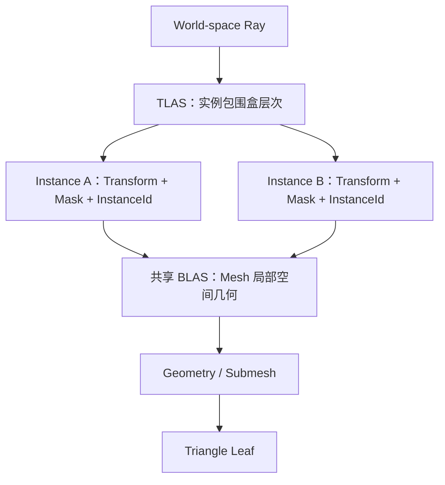
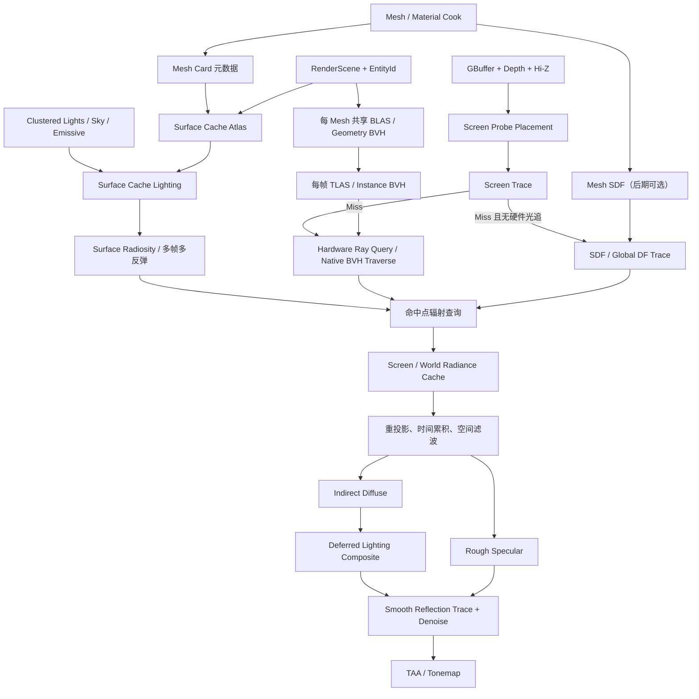

# PrismRender Lumen-like 动态全局光照技术分析与实施路线

> 文档性质：技术分析与实施规划，不表示下列功能已经完成。
>
> 目标不是复制 Unreal Engine 源码或复刻 Lumen 的全部产品能力，而是基于公开技术思想，为 PrismRender 设计一套模块化、可验证、显存可控的动态 GI 与反射系统。本文把它暂称为 `PrismGI`。

如果尚未熟悉光线、AABB、Grid/KD-Tree/BVH、BLAS/TLAS 或实时 GI 缓存，请先阅读博客式教程 [从一条射线到 PrismGI](RAY_TRACING_AND_PRISMGI_TUTORIAL_CN.md)，再使用本文进行工程规划。

## 1. 目标和边界

PrismGI 希望逐步获得以下能力：

- 动态漫反射全局光照，包括颜色串色、间接阴影和天空遮蔽；
- 动态发光材质对附近场景的间接照明；
- 屏幕外几何参与 GI 和反射；
- 平滑表面专用反射和粗糙表面低成本反射；
- D3D12 与 Vulkan 共用算法和 Slang Shader；
- 不支持光追的设备能够退回屏幕空间或软件追踪路径；
- 所有缓存都有固定预算、增量更新和可视化调试入口。

本阶段不应该把以下目标一次性加入首个版本：

- 电影级路径追踪；
- 无限制的透明、体积、毛发和骨骼动画 GI；
- 无限世界和 UE World Partition 级流送；
- 与 UE Lumen 完全一致的画质、性能和内容兼容性。

完整 Lumen 是多年工程积累的结果。PrismRender 更合理的策略是先完成可解释的单反弹动态 GI，再逐步加入缓存、多反弹、反射和软件回退。

## 2. 先理解问题：光线、BVH 与空间加速

### 2.1 动态 GI 究竟在计算什么

光栅化 GBuffer 已经告诉渲染器“相机看到的第一个表面在哪里、法线和材质是什么”。动态全局光照要继续估计从其他表面反弹后到达该点的光。可以把表面出射辐射简化为：

```text
最终出射光 = 自发光 + 直接光 + 间接漫反射 + 间接镜面反射
```

光线追踪首先解决的是**可见性和交点查询**：从起点沿方向发出一条射线，最近碰到哪个实例、哪个三角形、距离多远。它本身不会自动得到 GI；命中之后还要读取材质、计算命中点光照、对许多方向积分，并通过缓存和降噪把少量样本重建成稳定图像。

因此 PrismGI 至少有三类不同问题：

1. **几何查询：** 射线碰到了什么；
2. **辐射查询：** 命中点向当前点返回多少光；
3. **采样重建：** 射线数量很少时，怎样减少噪声、拖影和漏光。

BVH 主要加速第一类问题，Surface Cache/Radiance Cache 主要加速第二类问题，Screen Probe 和时空降噪主要解决第三类问题。它们不能互相替代。

### 2.2 为什么不能让每条射线测试所有三角形

若场景有 `N` 个三角形，最直接的方法是让每条射线逐一执行 `N` 次 Ray-Triangle Test。场景达到百万三角形、每帧又有数十万到数百万条 GI/反射射线时，这种 `Ray Count × Triangle Count` 的成本不可接受。

空间加速的核心思想是先用廉价的包围体排除大片不可能命中的空间：

- 每组相邻三角形由一个 AABB 包围；
- 多个小 AABB 再被更大的 AABB 包围；
- 这些包围盒形成一棵层次树；
- 射线若没有穿过父节点 AABB，整个子树都不用检查；
- 只有到达叶节点时才执行真实三角形求交。

这类结构称为 **Bounding Volume Hierarchy（BVH，包围体层次结构）**。良好 BVH 通常能跳过绝大多数三角形，但不能简单保证每条射线严格是 `O(log N)`：实际成本还取决于节点重叠、树质量、射线相干性、叶节点大小和场景分布。

### 2.3 BVH 中实际发生了什么

一条射线可写成 `P(t) = Origin + t × Direction`，并带有 `[TMin, TMax]` 范围。遍历大致如下：

```text
Ray
 -> 测试根节点 AABB
 -> 访问相交且更近的子节点
 -> 跳过未相交的整棵子树
 -> 到达叶节点
 -> 测试叶节点内的三角形
 -> 保留最近命中，缩小 TMax
 -> 继续或在 First-Hit 查询中提前终止
```

实时 GPU BVH 常见优化还包括宽节点、量化包围盒、SAH 类高质量构建和 Morton Code/LBVH 类快速构建。不过在 DXR 和 Vulkan 中，加速结构对引擎是**不透明对象**：驱动决定确切树形、节点宽度和内存布局。PrismRender 应控制输入几何、实例划分、Build Flags、更新策略和内存生命周期，而不应依赖某个厂商的内部 BVH 格式。

Khronos 的 Vulkan 教程也用“包围盒分组并沿树向下遍历”解释 GPU 加速结构，同时明确具体实现依赖 GPU 且对应用不透明；DXR 规范同样把构建结果定义为驱动生成的 opaque acceleration structure：

- [Vulkan Acceleration Structures（BLAS/TLAS）](https://docs.vulkan.org/tutorial/latest/courses/18_Ray_tracing/02_Acceleration_structures.html)
- [DirectX Raytracing Functional Spec](https://microsoft.github.io/DirectX-Specs/d3d/Raytracing.html)

### 2.4 为什么又分 BLAS 和 TLAS

现代硬件光追使用两级场景结构：



- **BLAS（Bottom-Level AS）：** 保存一个 Mesh 或一组局部空间几何。相同 Mesh 的多个实例共享 BLAS；
- **TLAS（Top-Level AS）：** 保存场景实例，每个实例引用一个 BLAS，并携带世界变换、Mask 和 Instance ID；
- **遍历：** 射线先遍历 TLAS 找候选实例，再变换到实例局部空间遍历 BLAS，最终测试三角形。

这正是 BVH 在 PrismRender 光追方案中的位置。BLAS/TLAS 不是 BVH 之外的另一种方法，而是 DXR/Vulkan 对两级硬件空间加速结构的抽象。官方 API 没有保证内部一定采用某种特定 BVH 布局，但对引擎设计可以按“两级包围体层次”理解。

### 2.5 Build、Update/Refit、Rebuild 和 Compaction 的区别

| 操作 | 含义 | 适用场景 | 风险/代价 |
| --- | --- | --- | --- |
| Build | 从几何或实例描述建立新 AS | 首次加载、拓扑改变 | 需要 Scratch，成本最高 |
| Update/Refit | 尽量保留原层次，只更新包围范围/实例描述 | 顶点位置改变但拓扑固定，或固定数量实例变化 | 快，但变化过大时树质量下降 |
| Rebuild | 重新选择层次和节点布局 | 实例数改变、物体大幅移动、Refit 质量恶化 | 比 Update 贵，但追踪通常更快 |
| Compaction | Build 后复制到驱动报告的更小结果缓冲 | 长寿命静态 BLAS | 多一步查询/复制，换取显存下降 |

对 PrismRender 的建议不是“所有东西每帧 Refit”：

- 静态 Mesh BLAS：`PreferFastTrace + AllowCompaction`，构建一次、压缩后长期复用；
- 刚体移动：BLAS 不变，只修改 TLAS 实例 Transform；TLAS 通常按帧重建，实测后再决定固定实例集是否使用 Update；
- 骨骼/顶点动画：拓扑不变时可以更新 BLAS，但需要定期 Rebuild 防止树退化；
- Mesh 重导入、LOD 拓扑变化、三角形数量变化：重建对应 BLAS；
- TLAS 增删实例：实例数量变化时走 Rebuild，而不是假设原地 Update 永远有效。

DXR 规范明确指出 Update 越偏离原始输入，遍历性能越可能下降，并建议常规场景评估每帧重建 TLAS；静态几何适合 `PreferFastTrace` 和 Compaction。Vulkan 同样要求应用负责 AS 的分配、Build/Update、同步和销毁。

### 2.6 BVH、Hi-Z、SDF 和自研 Compute BVH 如何选择

| 方法 | 空间表示 | 优点 | 局限 | PrismGI 定位 |
| --- | --- | --- | --- | --- |
| DXR/Vulkan 原生 AS | 驱动不透明的两级层次结构，概念上按 BVH 理解 | 精确三角形、屏幕外、RT Core/固定功能遍历 | 需要硬件支持；AS Build 和显存成本 | 主要屏幕外精确追踪 |
| Hi-Z Screen Trace | 当前帧深度的 mip 层次 | 已有数据、命中材质精确、成本最低 | 看不到屏幕外/背面，深度是 2.5D | 所有档位的第一层 |
| Mesh SDF / Global DF | 体素距离场与 Clipmap | 可用 Compute Sphere Tracing，适合低频长距离查询 | 薄片、开放网格、分辨率和非均匀缩放误差 | 后期无硬件光追回退 |
| 自研 Compute Triangle BVH | 自己构建并在 Compute 中遍历的 BVH | 不依赖 Ray Query，可精确到三角形 | 需自研构建器、宽节点布局、遍历栈、更新、压缩；通常慢于原生遍历 | 不进入首版，仅保留研究路径 |

因此修订后的选择是：**Hi-Z 优先，原生 BVH/AS 处理精确屏幕外命中，SDF 作为兼容回退。** 当前项目已具备 DXR/Vulkan 原生 AS 基线，再手写一套三角形 BVH 会重复底层工作；除非以后明确要求“在不支持 Ray Query 的 GPU 上仍进行精确三角形软件光追”，否则不值得作为主路线。

## 3. Lumen 的核心思想

Epic 官方资料将 Lumen 定义为动态全局光照和反射系统。它并不是“每像素发射大量路径追踪光线”，而是把多种表示、追踪和缓存组合起来：

1. 优先进行 Screen Trace，利用当前画面的高精度深度和材质信息；
2. 屏幕追踪失败后，使用硬件三角形光追或基于距离场的软件光追；
3. 用 Surface Cache 缓存射线命中位置的材质和光照，避免重复执行完整材质；
4. 用 Screen Probe Gather 在低分辨率探针空间计算漫反射间接光；
5. 用 World Space Radiance Cache 保存远处、低频的入射辐射；
6. 用重要性采样、空间滤波和时间累积降低少量射线带来的噪声；
7. 平滑反射发射专用光线，粗糙反射尽可能复用 GI 的辐射结果。

Epic 的公开资料说明，Lumen 首先执行屏幕追踪，再选择软件或硬件追踪；Surface Cache 从多个方向捕获网格表面，并把更新分摊到多帧；GI 通常以低于最终画面的分辨率计算，再与全分辨率材质结合。参考：

- [Lumen Global Illumination and Reflections](https://dev.epicgames.com/documentation/en-us/unreal-engine/lumen-global-illumination-and-reflections-in-unreal-engine)
- [Lumen Technical Details](https://dev.epicgames.com/documentation/unreal-engine/lumen-technical-details-in-unreal-engine?lang=en-US)
- [Lumen Performance Guide](https://dev.epicgames.com/documentation/unreal-engine/lumen-performance-guide-for-unreal-engine?lang=en-US)
- [Epic 技术博客：UE5 goes all-in on dynamic GI with Lumen](https://www.unrealengine.com/tech-blog/unreal-engine-5-goes-all-in-on-dynamic-global-illumination-with-lumen?lang=en-US)

## 4. PrismRender 当前基础

### 4.1 已经具备

| 当前能力 | 对 PrismGI 的价值 |
| --- | --- |
| 四目标 Deferred GBuffer | 已提供世界位置/粗糙度、法线/金属度、Albedo/AO、Emissive/Alpha |
| Motion Vector 与 TAA History | 可用于 GI/反射历史重投影，但需要专用拒绝规则 |
| 完整 mip-chain Hi-Z | 可直接作为屏幕空间射线求交加速结构 |
| GTAO 与 SSR | 可提取公共 Screen Trace 基础，并提供低质量回退 |
| HDR、IBL、天空和 Emissive | 提供环境 Miss 辐射与间接光输入 |
| Clustered Lighting 和阴影 | 可用于 Surface Cache 的直接光照更新 |
| SharedRenderGraphFrontend | 可统一声明 D3D12/Vulkan GI Pass、资源和队列依赖 |
| Compute、Transient Resource、多队列 | 适合探针追踪、缓存更新和时空滤波 |
| BLAS/TLAS 公共描述和原生构建 | 已验证真实 DXR/Vulkan AS 创建，不是空接口 |
| TLAS Descriptor 与 Ray Query 能力查询 | 可优先实现 Compute Ray Query，无须首版完成 SBT |
| 稳定 Asset ID、Cooked Asset、Streaming | 可保存 Mesh Card/SDF 离线产物并按预算流送 |
| World、RenderScene、稳定 EntityId | 可建立 RT Instance ID 到实体、材质和缓存项的映射 |

### 4.2 主要缺口

- 当前 Mesh GPU Buffer 没有声明 `AccelerationStructureBuildInput`；
- BLAS/TLAS 只用于验证三角形，没有完整 RenderScene 光追场景；
- RHI 没有通用 AS Update/Refit、Compaction、异步 Build 生命周期；
- 没有公共 Ray Query Pass 和命中数据查询协议；
- 没有 Bindless 几何/材质表，命中后不能任意读取顶点和纹理；
- 没有 Mesh Card、Surface Cache Atlas、缓存覆盖率与驻留管理；
- 没有 Mesh SDF 或 Global Distance Field；
- 没有 Screen Probe、World Radiance Cache 或 Surface Radiosity；
- 当前 TAA 只处理最终颜色，不足以稳定随机 GI 样本；
- RendererStatistics 与编辑器缺少 GI 专用耗时、显存和可视化数据。

因此，现状适合开始构建 PrismGI，但还不能直接在现有 RayTracingBaseline Shader 上增加一次 `TraceRay` 就得到稳定的动态 GI。

## 5. 目标数据流



建议追踪顺序固定为：

```text
Screen Trace
    -> Hardware Ray Query（设备支持且预算允许）
    -> Software SDF Trace（以后实现）
    -> World Radiance Cache / Sky IBL Miss
```

Screen Trace 提供当前画面最高精度的几何；硬件光追处理屏幕外三角形；SDF 提供较低硬件要求的回退；最终 Miss 返回天空和远场辐射。

一条实际 GI 射线的数据流是：

1. 从 GBuffer 表面位置沿余弦半球方向生成 Ray，并用法线 Bias 设置 Origin/TMin；
2. 先在 Hi-Z 中 Screen Trace；若命中，直接读取屏幕内 GBuffer/Lighting；
3. 屏幕 Miss 时，以同一条 Ray 遍历 TLAS，再进入候选实例的 BLAS；
4. Ray Query 返回 Instance/Geometry/Primitive/Barycentrics，通过 GPU Scene Table 重建命中位置、法线、UV 和 MaterialId；
5. 首版从 Surface Cache 查询命中辐射，后期可选择执行真实 Hit Lighting；
6. 硬件路径不可用时交给 SDF Sphere Trace；全部 Miss 才采样 World Radiance Cache 或 Sky IBL。

这里“BVH 遍历”和“命中着色”是两个 Pass/职责：前者找交点，后者解释交点。把两者分开后，阴影 Ray 可以只做 Any-Hit，GI/反射 Ray 才支付材质与辐射查询成本。

## 6. 需要完成的技术

### 6.0 先用一句话区分每项技术

| 技术 | 它是什么 | 输入 | 输出 | 它不负责什么 |
| --- | --- | --- | --- | --- |
| BLAS/TLAS | 两级场景空间加速结构，用包围层次跳过无关几何 | 三角形、实例 Transform/Mask | 最近或任意几何命中 | 不计算命中点光照 |
| Ray Query | 在普通 Shader 内驱动原生 AS 遍历的接口 | Ray + TLAS | Hit/Miss、距离、实例/图元信息 | 它不是另一种 BVH，也不自动着色 |
| Screen Trace | 在当前帧 Hi-Z 深度上追踪投影射线 | GBuffer、Depth/Hi-Z、Ray | 屏幕内命中及失败原因 | 看不到屏幕外和背面 |
| Mesh Card | 从若干方向描述 Mesh 表面的一组正交捕获视图 | Mesh 几何 | Card 方向、范围和覆盖关系 | 不是光照结果 |
| Surface Cache | 按 Card 把表面材质和辐射缓存到 Atlas | Card、材质、灯光 | 可在命中点快速查询的表面数据 | 不是几何求交结构 |
| Surface Radiosity | 让缓存表面之间分帧交换间接辐射 | Surface Cache 上一轮光照 | 近似多反弹间接光 | 不是单帧无限路径追踪 |
| Screen Probe Gather | 用稀疏屏幕探针代表许多像素的方向采样 | GBuffer、追踪器、辐射缓存 | 低分辨率方向辐射 | 不能独立处理屏幕外命中 |
| World Radiance Cache | 相机周围的低频世界空间辐射探针 | 世界位置、追踪结果、历史 | 远场/低频入射光查询 | 不保留高频镜面细节 |
| Mesh/Global SDF | 到最近表面的距离体，供 Sphere Tracing | 离线 Mesh 和运行时实例 | 近似命中/遮挡距离 | 不是精确三角形 BVH |
| Temporal/Spatial Denoiser | 复用历史和邻域，把少量随机样本重建为稳定图像 | 当前样本、Motion、深度/法线、历史 | 稳定间接光/反射 | 不能修复错误的几何或缓存数据 |
| Dynamic Reflections | 按粗糙度选择 SSR、BVH Ray Query 或缓存辐射 | GBuffer、追踪器、材质 | 间接镜面项 | 不等同于漫反射 GI |

后续各节均按“是什么 → 为什么需要 → PrismRender 怎样实现 → 限制”展开。

### 6.1 完整光追场景：BLAS Cache 与动态 TLAS

#### 技术含义

这是第 2 章 BVH 原理在引擎运行时的资源系统。BLAS 保存单个 Mesh 的局部空间三角形加速结构；TLAS 保存这些 BLAS 在场景中的实例、世界矩阵、Mask 和稳定 ID。多个实体引用同一个 Mesh 时，共享一份 BLAS，只在 TLAS 中创建多个实例。

它的输入和输出边界应明确：

```text
输入：Mesh Vertex/Index Buffer + Submesh Geometry + RenderScene Instances
构建：每唯一 Mesh 的 BLAS + 每帧/按需构建的 TLAS
输出：Shader 可绑定的 TLAS + Instance/Geometry/Material 查询表
```

TLAS/BLAS 只回答命中位置和几何身份。命中后读取法线、UV、材质或 Surface Cache 的工作属于 GPU Scene/Hit Lighting，不应塞进 AS 管理器。

#### PrismRender 需要完成

- Mesh Vertex/Index Buffer 增加 AS Build Input Usage；
- 建立 `MeshHandle -> BLAS` 缓存；
- 建立 `EntityId -> TLAS InstanceId` 稳定映射；
- 刚体 Transform 改变时 BLAS 不变，只更新 TLAS 实例描述；根据实例数量和树质量选择 TLAS Rebuild 或 Update；
- 顶点位置改变且拓扑固定时允许 BLAS Refit；拓扑、索引或三角形数量改变时 Rebuild；
- 增加距离、屏幕贡献和实例 Mask 裁剪；
- 静态 BLAS 使用 `PreferFastTrace + AllowCompaction`，动态 BLAS 才选择 `AllowUpdate`；
- 增加 AS Scratch 复用、Post-build Compacted Size 查询、Compaction Copy、UAV Barrier 和延迟释放；
- 记录 BLAS/TLAS 字节数、Build/Update 时间和有效实例数量。

当前 RHI 已能查询 Build Size，并在 D3D12/Vulkan 驱动中构建真实 AS；但 `CreateAccelerationStructure` 仍把结果分配、Scratch 分配和立即构建绑在一起，验证场景也只有单三角形 BLAS 和单实例 TLAS。生产路径需要把 `Allocate`、`Build/Update`、`Compact` 和 `Retire` 分开，交给命令上下文/RDG 调度，否则会产生同步等待和每帧分配抖动。

#### 首版限制

只支持静态三角形 Mesh 和 Transform 动态变化。Alpha Mask、骨骼网格和顶点动画暂时排除或按 Opaque 处理，并在调试视图中明确标记。

### 6.2 Compute Ray Query

#### 技术含义

Ray Query 是**使用 BVH/AS 的 Shader 编程接口**，不是另一种空间加速结构。它在 Compute/Pixel Shader 中以内联方式启动并推进 TLAS 遍历，不需要 RayGen、Miss、Hit Group 和完整 SBT。它适合阴影、可见性、单反弹 GI 和反射查询。

对于 Opaque First-Hit 查询，固定功能遍历可以直接提交最近命中；遇到 Alpha Mask 或程序化图元时，Shader 需要检查候选命中并决定 Commit/Ignore。它的主要输出是 `CommittedStatus`、`RayT`、`InstanceId`、`GeometryIndex`、`PrimitiveIndex` 和 Barycentrics。

#### 为什么先做 Ray Query

PrismRender 已有 Compute Pipeline、TLAS Descriptor 和 DXR Tier 1.1/Vulkan Ray Query 能力检测，但还没有公共 Ray Tracing Pipeline。先实现 Ray Query 能更快验证完整场景命中，同时避免首版引入 SBT 和 Hit Group 管理。

#### 需要的数据

Ray Query 返回的不应只有 hit/miss，还需要：

- Instance ID；
- Primitive ID；
- Barycentric；
- Hit Distance；
- Front/Back Face；
- 可用于查找几何和材质的索引。

为了在命中后重建世界位置、法线和 UV，需要一个 GPU Scene Geometry Table。首版可以只查询 Surface Cache 辐射；后续 Hit Lighting 才要求 Bindless 顶点、索引、材质和纹理访问。

### 6.3 屏幕空间追踪

#### 技术含义

屏幕空间追踪把当前帧深度缓冲当成一份 2.5D 场景表示。从 GBuffer 世界位置沿采样方向前进，把采样点投影回屏幕，并与 Hi-Z 深度比较。Hi-Z 的粗 mip 可以一次跳过较大的空区域，接近交点后再下降到细 mip；因此它也是空间加速，只是加速对象是“相机可见深度”，不是完整三角形场景。

#### 可复用基础

当前 `ScreenSpaceEffects.hlsl` 已有 SSR Hi-Z March。应抽出公共 Screen Trace 内核，而不是为 GI 再复制一份追踪逻辑。

#### 需要增加

- 统一 View Space Ray 与投影函数；
- Hi-Z 粗到细遍历；
- 厚度、步长和最大距离控制；
- 边缘淡出与背面拒绝；
- Hit、BehindSurface、OutOfScreen、MaxDistance 分类；
- Diffuse 的余弦半球采样和 Specular 的 GGX 方向采样。

屏幕追踪只能看到相机可见内容，因此必须把 Miss 交给硬件或软件追踪。它不能单独承担完整 GI。

### 6.4 Mesh Card 与 Surface Cache

#### 技术含义

在射线命中点重新执行完整材质、纹理和灯光非常昂贵。Surface Cache 预先从若干方向把 Mesh 表面投影到 Atlas，缓存命中着色需要的信息。

#### 建议缓存内容

- Base Color；
- Octahedral Normal；
- Emissive；
- Opacity/有效覆盖 Mask；
- Surface Depth 或局部位置；
- Direct Lighting；
- Indirect Lighting/上一轮 Radiosity。

#### Card 生成

首版对每个 Mesh 使用 AABB 六个轴向 Card，先保证流程闭环。后续离线分析三角形法线分布和覆盖率，增加自适应 Card：

1. 在局部空间选择捕获方向；
2. 计算 Card 正交投影视锥；
3. 统计三角形覆盖率和重叠；
4. 将 Card 元数据写入 Cooked Mesh；
5. 导入时输出覆盖率诊断。

Card Placement 可按 Mesh 共享，但 MaterialOverride 允许同一个 Mesh 实例有不同材质，因此 Atlas Residency 应至少以 `Mesh + Material/Override Signature` 区分。

#### Atlas 管理

- 固定页面或 Tile Allocator；
- Camera 周围、高屏幕贡献实例优先；
- Material revision、Mesh revision、Transform 或光照改变触发不同层级的 Dirty；
- 材质属性和 Lighting Atlas 分离，灯光改变时不重复捕获材质；
- 每帧只更新固定数量 Tile，避免导入场景时产生长帧。

Surface Cache 不只是纹理集合，还必须有覆盖率、驻留、更新队列和可视化，否则黑块和漏光无法诊断。

### 6.5 Surface Cache Lighting 与 Radiosity

#### 技术含义

Surface Cache 的材质捕获完成后，需要在表面空间计算直接光和间接光：

- 直接光来自 Directional、Point、Spot、Sky 和 Emissive；
- 间接光从上一帧的 Lighting Atlas 或 Radiance Cache 采样；
- 多帧迭代形成近似多次漫反射反弹。

#### PrismRender 可复用

Clustered Lighting 已经提供灯光列表和范围；现有 Shadow Map 可作为首版可见性来源。后续硬件 Ray Query 可以提高 Surface Cache 直接阴影精度。

#### 重要约束

- 每个 Tile 只选择最重要的少量灯光；
- Direct 与 Indirect 使用不同 Update Budget；
- Emissive 做亮度和面积限制，防止小而亮的表面产生 firefly；
- 多反弹反馈必须限制能量，避免历史缓存不断变亮；
- 灯光关闭或强度突变时必须加速更新相关区域。

所谓“无限反弹”不是每帧追踪无限路径，而是让表面缓存中的辐射跨帧迭代并收敛。

### 6.6 Screen Probe Gather

#### 技术含义

不为每个全分辨率像素追踪大量方向，而是在屏幕上稀疏放置探针。每个探针保存一个低分辨率方向辐射分布，再通过深度、法线和可见性权重插值回像素。

#### 建议实现

- 以 16×16 像素为初始探针间距；
- 在深度/法线不连续处自适应增加探针；
- 每个探针使用 8×8 Octahedral 方向图；
- 方向使用蓝噪声旋转，避免固定条纹；
- Diffuse 使用余弦加权积分；
- 插值时按深度、法线、距离和遮挡权重拒绝跨边缘泄漏。

Screen Probe 是 GI 的主要降采样层。它比直接在半分辨率像素上独立追踪更容易共享样本，也更适合重要性采样和局部滤波。

### 6.7 World Space Radiance Cache

#### 技术含义

Screen Probe 擅长近处屏幕可见细节，但室内小窗口、屏幕外光源和远距离入射光仍然困难。World Radiance Cache 在相机周围保存稀疏世界空间探针，提供低频、远距离辐射。

#### 建议结构

- Camera-relative Clipmap；
- 稀疏哈希或固定 3D Grid；
- 每个 Probe 存 Octahedral Radiance、距离统计和有效性；
- Probe 从墙体内部向可见空间重定位；
- 只有本帧被 Screen Probe 请求的 Probe 才进入更新队列；
- 相机移动时滚动 Clipmap，而不是清空全部数据。

它是质量和显存的主要调节器：Probe 数量、方向分辨率和每帧 Trace Budget 越高，响应越快、噪声越低，但成本也更大。

### 6.8 软件光追：Mesh SDF 与 Global Distance Field

#### 技术含义

Mesh SDF 在三维网格中保存到最近表面的有符号距离。沿光线按距离值推进可以进行 Sphere Tracing。Global Distance Field 把附近多个 Mesh SDF 合并到相机周围的低分辨率 Clipmap，降低实例重叠时的追踪成本。

#### 离线阶段

- 对 Mesh Bounds 建立体素网格；
- 计算到三角形的最近距离；
- 判断内外符号；
- 量化并压缩到 Cooked Asset；
- 记录分辨率、误差和开闭合诊断。

#### 运行时阶段

- 将 Mesh SDF 实例注入 Global DF Clipmap；
- Static 与 Movable 分层缓存；
- 只更新受移动物体影响的 Brick；
- Ray March 使用最大步数、Bias 和命中阈值；
- 薄片、开放网格和非均匀缩放需要特殊处理。

这部分工程量很大，并且当前 PrismRender 已有硬件 Ray Query 基础。因此建议先完成硬件路径，再把 SDF 作为兼容模式，而不是同时开发两套追踪器。

### 6.9 专用时间累积与降噪

#### 为什么不能直接复用最终 TAA

最终 TAA 只看到合成后的颜色，无法判断 GI 样本来自哪个命中点、是否发生遮挡变化、反射 Hit Distance 是否改变。GI 需要在合成前保存自己的历史。

#### GI History 至少包含

- Indirect Radiance；
- 一阶/二阶亮度矩；
- Sample Count 或 History Length；
- Hit Distance；
- Previous Depth、Normal、Roughness；
- 可选 Entity/Material Revision。

#### 处理步骤

1. 使用 Motion Vector 重投影；
2. 用深度、法线、粗糙度和实体变化进行 Disocclusion Reject；
3. 对历史做邻域 Clamp，抑制拖影和 firefly；
4. 根据样本方差自适应设置历史权重；
5. 执行深度/法线感知的双边或 A-Trous 空间滤波；
6. Camera Cut、Resize 和大规模场景切换时重置历史。

Diffuse GI 与镜面反射必须使用不同滤波参数。对低粗糙度反射进行过强空间滤波会直接抹掉汽车漆的窄高光。

### 6.10 动态反射

#### 技术含义

动态反射计算的是间接镜面项：根据视线、法线和材质粗糙度生成反射方向或 GGX 镜面波瓣，再查询该方向到达的辐射。粗糙度越低，方向越集中、图像细节越高，也越不能接受强空间模糊；粗糙度越高，结果越接近低频环境光，可以更多复用 Probe/Radiance Cache。

它与漫反射 GI 使用同一套场景追踪基础，但采样分布、历史拒绝和滤波强度不同，所以应共享 Trace Backend，不应共享最终 Denoiser 参数。

建议按粗糙度分层：

- 高粗糙度：复用 Screen Probe/Radiance Cache 的 Rough Specular；
- 中等粗糙度：低分辨率专用反射 Ray，允许较强时空滤波；
- 低粗糙度/镜面：SSR 优先，Ray Query 补屏幕外命中，并使用更保守的滤波；
- Miss：回退 Skybox/Prefiltered IBL。

命中光照有两种模式：

- Surface Cache Lighting：速度快，但缓存覆盖和更新延迟决定质量；
- Hit Lighting：命中后读取真实材质和灯光，质量高但要求 Bindless 资源和更高成本。

当前 Material 数据没有 Clear Coat 参数。若目标包括高质量汽车漆，还需要扩展 Material BRDF、GBuffer 和反射组合，分别表示 Base Layer 与 Coat Layer，不能只依赖更强降噪。

### 6.11 合成与能量一致性

当前 Deferred Lighting 已包含环境项、IBL、GTAO 和 SSR。加入 PrismGI 时必须重新定义每一项的职责：

```text
Final Diffuse = Direct Diffuse + Indirect Diffuse
Final Specular = Direct Specular + Rough Specular + Dedicated Reflection
```

- GI 开启时，旧 `ambientIntensity` 只能作为 Miss/Fallback，不能再叠加一份环境常量；
- GTAO 应作为低质量回退或近场 Contact Occlusion，不能重复压暗完整 GI；
- SSR 应成为 Reflection Trace 的第一层，而不是在完成反射后再次叠加；
- IBL 保留为天空 Miss 和最粗糙反射的稳定底色；
- Emissive 自发光颜色和其对场景的间接贡献要分开。

如果不先解决这些能量边界，画面可能更“亮眼”，但不具备可解释性，也很难与参考图比较。

### 6.12 调试、统计与可扩展质量档位

必须从第一阶段加入以下 View Mode：

- RT Instance/BLAS/TLAS Bounds；
- Screen Trace Hit/Miss 原因；
- Surface Card Placement；
- Surface Cache Coverage、Residency、Dirty Tile；
- Direct/Indirect Lighting Atlas；
- Screen Probe Placement 和方向 Radiance；
- World Radiance Probe Validity；
- History Length、Variance、Disocclusion；
- Diffuse GI、Rough Specular、Smooth Reflection 单独输出；
- SDF/Global DF Slice（软件路径完成后）。

统计至少包括：

- 每个 GI Pass 的 GPU/CPU 时间；
- Trace 数量和 Screen/Hardware/SDF/Miss 比例；
- BLAS/TLAS 内存与更新时间；
- Surface Cache 页数、命中率、更新 Tile 数；
- Probe 数量、更新预算和 History Reject 比例；
- GI 持久资源与瞬态资源显存。

## 7. 面向当前显存条件的设计

用户已经因为显存压力移除了神经材质，因此 PrismGI 必须以固定预算工作，而不是根据场景无限增长。

建议初始质量档位：

| 档位 | 路径 | 规划中的额外持久显存目标，不含场景 AS |
| --- | --- | --- |
| Off | 当前 GTAO + SSR + IBL | 0 |
| Low | Half-res Screen-space GI，屏幕外回退 IBL | 16–32 MB |
| Medium | Screen Probe + 1024² Surface Cache 页面 + 可选 Ray Query | 64–128 MB |
| High | 更多 Cache 页面、World Radiance Cache、专用反射 | 不高于 192 MB |

这些数字是设计门槛，不是当前实测结果。AS 内存与场景三角形和实例数量相关，必须单独统计和限制。

节省显存的具体策略：

- Radiance 优先使用 `R11G11B10_FLOAT`，只在需要负值/高动态范围时使用 RGBA16F；
- Normal 使用 Octahedral RG16；
- Surface 材质 Atlas 与 Lighting Atlas 分离；
- 从单个 1024² 页面开始，不预分配 4K Atlas；
- Probe Buffer 使用 Structured Buffer，按有效 Probe 数分配；
- Diffuse GI 从半分辨率或 Probe 空间开始；
- Reflection 只对低粗糙度像素分配专用 Ray；
- BLAS 按 Mesh 共享，启用 Compaction；
- TLAS 只包含追踪距离内、对 GI 有贡献的实例；
- 所有资源进入现有 Transient/Retirement/Streaming 统计体系。

## 8. 建议的 RDG 顺序

当前 Hi-Z 位于 Deferred Lighting 之后。PrismGI 需要使用当前帧 GBuffer/Hi-Z，因此建议重排为：

```text
Shadow / ClusteredLightBuild
-> GBuffer
-> HiZBuild
-> GTAO（低质量或 Contact AO）
-> SurfaceCacheCapture（仅 Dirty Cards）
-> SurfaceCacheDirectLighting
-> SurfaceCacheRadiosity
-> ScreenProbePlacement
-> ScreenTrace
-> HardwareRayQuery / SdfTrace Fallback
-> RadianceCacheUpdate
-> GiTemporalFilter
-> GiSpatialFilter
-> DeferredLighting（读取 IndirectDiffuse）
-> ReflectionTrace
-> ReflectionTemporalSpatialFilter
-> ReflectionComposite
-> TemporalResolve
-> Bloom / Tonemap
```

部分缓存更新可进入 Async Compute，但不能假定一定与 Graphics 重叠。现有 RDG 成本模型已经证明严格依赖图可能没有 overlap，必须以 GPU 时间线实测决定是否启用原生多队列。

## 9. 分阶段实施路线

### M0：契约、基准和显存门禁

功能：

- 新增 DynamicGI Settings、Quality Tier、Feature Capability；
- 增加 GI Persistent/Transient/AS Memory 统计；
- 建立 Cornell Box、室内窗口、发光材质、移动门和汽车材质测试场景；
- 加入 GI Pass Capture 与 Debug View 框架。

验收：关闭 PrismGI 时与当前 Golden Image 一致；所有资源预算可查询；不支持光追的 GPU 能正常运行。

### M1：原生 BVH/AS 资源系统

功能：

- 把 RHI 的 AS 结果分配与 Build 命令分离；
- 增加显式 Build、Update、Compaction 和 Barrier；
- 静态 BLAS Scratch Pool、Compacted Size 查询和延迟释放；
- 为 Build/Update/Rebuild 建立决策和统计；
- 用多个静态 Mesh、重复实例和移动实例扩展原生验证。

验收：D3D12/Vulkan 都不通过立即同步路径创建 AS；静态 BLAS 能压缩且结果不大于原始缓冲；Update/Rebuild 后命中保持正确；资源销毁受 GPU Fence 保护。

### M2：完整场景 BVH 与 Ray Query 可见性

功能：

- Mesh Buffer AS Build Usage；
- 每唯一 Mesh 的共享 BLAS Cache；
- 每帧从 GI Eligible Instance 构建/裁剪 TLAS；
- 稳定 `InstanceId -> Entity/Geometry/Material` GPU Scene Table；
- Compute Ray Query Shader；
- 输出 Hit Distance、Instance ID 和 Miss 分类图。

验收：刚体移动不重建 BLAS；实例增删会正确 Rebuild TLAS；D3D12/Vulkan 命中结果一致；重复 Mesh 只构建一次 BLAS；无可见 GI 变化。

### M3：公共 Screen Trace

功能：

- 从 SSR 提取 Hi-Z Screen Trace Library；
- Diffuse/Specular 方向和命中分类；
- SSR 改为使用公共追踪内核；
- Screen Miss 接 Ray Query。

验收：SSR 不回归；离开屏幕的物体能由 Ray Query 命中；可视化能够区分两条路径。

### M4：Surface Cache MVP

功能：

- Cooked Mesh 六向 Cards；
- 1024² 分页 Atlas；
- 材质属性 Capture；
- Dirty/Residency/Update Budget；
- Coverage Debug View。

验收：测试 Mesh 表面覆盖率可量化；材质重导入和 MaterialOverride 会使正确 Tile 失效；超预算时按优先级稳定淘汰。

### M5：单反弹动态漫反射 GI

功能：

- Screen Probe Placement；
- Screen -> RayQuery -> Sky 追踪；
- 命中 Surface Cache 的直接光；
- GI 专用时间/空间滤波；
- Deferred Composite。

验收：可观察颜色串色、间接阴影、天空遮蔽和开门后的动态变化；Camera Cut 不保留错误历史；GI 关闭时零回归。

这是第一个适合交付使用的 PrismGI MVP。

### M6：Radiance Cache 与多反弹

功能：

- Surface Cache Radiosity；
- World Space Radiance Cache；
- 重要性采样；
- 分帧更新和光照变化加速传播。

验收：白色室内多次反弹明显；小窗口天空光更稳定；光源关闭后在设定帧数内收敛；无持续能量增长。

### M7：Lumen-like Reflections

功能：

- Roughness 分层；
- SSR First、Ray Query Fallback；
- Rough Specular 复用 GI Cache；
- Smooth Reflection 专用时空滤波；
- 可选 Surface Cache Lighting/Hit Lighting。

验收：屏幕外物体进入反射；低粗糙度边缘稳定；汽车漆窄高光不过度平滑；反射不会重复叠加 IBL/SSR。

### M8：软件光追回退

功能：

- Mesh SDF Cook；
- Global DF Clipmap；
- Sphere Tracing；
- Dynamic Object Dirty Brick；
- Hardware/SDF Trace Policy。

验收：无 Ray Query GPU 能获得屏幕外 GI；SDF 与硬件追踪在封闭静态场景的遮挡结果接近；薄片问题有诊断而不是静默漏光。

### M9：生产化

功能：

- Streaming、远场、动态实例分类；
- Alpha Mask、双面和部分透明；
- Clear Coat 材质；
- Async Compute 自动决策；
- 跨 API Golden、稳定性和崩溃诊断。

验收：长时间运行无缓存增长；显存预算严格生效；D3D12/Vulkan 数值和画面差异在明确阈值内。

## 10. 推荐模块和文件边界

以下是实施时建议新增的文件，不在本分析阶段创建：

### Renderer

- `src/Renderer/DynamicGISettings.h`
- `src/Renderer/DynamicGlobalIllumination.h/.cpp`
- `src/Renderer/AccelerationStructureManager.h/.cpp`
- `src/Renderer/RayTracingScene.h/.cpp`
- `src/Renderer/GpuSceneGeometryTable.h/.cpp`
- `src/Renderer/SurfaceCache.h/.cpp`
- `src/Renderer/SurfaceCacheAllocator.h/.cpp`
- `src/Renderer/ScreenProbeGather.h/.cpp`
- `src/Renderer/RadianceCache.h/.cpp`
- `src/Renderer/IndirectLightingDenoiser.h/.cpp`
- `src/Renderer/DynamicReflections.h/.cpp`
- `src/Renderer/DynamicGIStatistics.h`

### Asset

- `src/Asset/MeshCardAsset.h/.cpp`
- `src/Asset/MeshCardBuilder.h/.cpp`
- `src/Asset/MeshDistanceFieldAsset.h/.cpp`（M8）
- `src/Asset/MeshDistanceFieldBuilder.h/.cpp`（M8）

### UI

- `src/UI/DynamicGIDebugPanel.h/.cpp`

### Shader

- `assets/shaders/ScreenTrace.hlsli`
- `assets/shaders/RayQueryVisibility.hlsl`
- `assets/shaders/SurfaceCacheCapture.hlsl`
- `assets/shaders/SurfaceCacheLighting.hlsl`
- `assets/shaders/SurfaceRadiosity.hlsl`
- `assets/shaders/ScreenProbeGather.hlsl`
- `assets/shaders/RadianceCache.hlsl`
- `assets/shaders/IndirectLightingDenoiser.hlsl`
- `assets/shaders/DynamicReflections.hlsl`
- `assets/shaders/DistanceFieldTrace.hlsl`（M8）

主要修改点：

- `src/RHI/RayTracing.*`、`IGraphicsDevice.h`、`ICommandContext.h`；
- D3D12/Vulkan AS 后端和 Shader/Descriptor 实现；
- `src/Asset/Mesh.*`、`CookedAssetIO.*`、`AssetDatabase.*`；
- `src/Scene/RenderObject.h` 与 World/RenderScene Bridge；
- `src/Renderer/SharedRenderGraphFrontend.*`；
- `SceneRendererStage4.cpp` 与 `VulkanSceneRenderer.*`；
- `Deferred.hlsl`、`Mesh.hlsl`、`RenderSettings.h`；
- `RendererStatistics.h`、DebugPanel 和 Editor Inspector；
- RHI、RDG、Shader、Golden 与动态场景测试。

`DynamicGlobalIllumination` 应只负责协调各子模块和向 RDG 暴露资源/回调，不应把 AS、Surface Cache、Probe、Denoiser 全部堆进 `SceneRendererStage4.cpp`。

## 11. 验证体系

### 11.1 单元测试

- AS Build/Update 描述与跨 API 转换；
- 用 CPU Brute-force Ray-Triangle 结果对照随机 Ray 的 GPU BVH 命中；
- 静态 BLAS Compaction 前后命中一致且显存不增加；
- TLAS Rebuild 与固定实例数 Update 的命中一致性；
- 大幅移动实例后的 Refit/Rebuild 性能与正确性决策；
- BLAS Cache 去重和资源失效；
- TLAS Instance ID 稳定性；
- Card Atlas 分配、淘汰和碎片；
- Probe Hash/Clipmap 滚动；
- History Reprojection 和 Disocclusion 条件；
- 能量 Clamp 和 Roughness 分层。

### 11.2 Shader 测试

- Slang DXIL/SPIR-V 编译；
- TLAS、Structured Buffer、UAV Reflection；
- Ray Query 能力门禁；
- Shader Constant Layout 静态断言；
- D3D12/Vulkan 相同采样序列。

### 11.3 图像测试

至少包含：

1. Cornell Box：颜色串色和能量守恒；
2. 室内小窗口：天空光、World Radiance Cache；
3. 移动门：历史拒绝和动态响应；
4. 小型发光体：噪声与 Firefly；
5. 镜面球和粗糙度阶梯：反射分层；
6. 汽车漆：Clear Coat 和窄高光保持；
7. 大量重复实例：BLAS 共享、TLAS 成本和 SDF 回退。

Golden Image 应同时记录 SSIM/误差图和分 Pass 输出。动态 GI 存在随机与时间维度，单帧 SSIM 不能独立作为正确性结论；还要固定采样序列、预热帧数、曝光、相机和更新预算。

### 11.4 性能与稳定性门禁

- 1080p 内部分辨率分别记录 GI、Reflection 和 Denoiser GPU 时间；
- 记录 P50/P95，而不是只看单帧；
- Camera 静止、快速移动、灯光突变分别测量；
- 检查无缓存无限增长、无每帧资源创建、无同步 WaitForGpu；
- 强制小显存预算，确认降级和淘汰可预测；
- D3D12/Vulkan 分别验证 Unsupported、Ray Query 和完整 RT 能力路径。

Epic 官方性能资料以 1080p 内部分辨率为基础，并给出 GI 与反射约 4 ms/8 ms 的不同质量目标。PrismRender 可以把它当作架构参考，但最终预算必须以实际目标显卡测量，不能直接照搬 UE 的数字。

## 12. 最终建议

对当前 PrismRender，推荐顺序是：

```text
原生 BVH/AS 资源系统
-> 完整场景 BLAS/TLAS
-> Compute Ray Query
-> 公共 Screen Trace
-> Surface Cache
-> 单反弹 Screen Probe GI
-> 专用时空降噪
-> Radiance Cache / 多反弹
-> Lumen-like Reflections
-> 软件 SDF 回退
```

最重要的取舍有三个：

1. **原生 BVH 路径先行。** 当前已有跨 API AS Build 基线，先补齐 BLAS Cache、每帧 TLAS、Build/Update/Rebuild/Compaction 生命周期，再接 Ray Query；不在首版重复开发自研 Compute Triangle BVH。
2. **缓存先限制预算。** 从 1024² 页面和半分辨率/探针空间开始，所有缓存必须可淘汰、可统计。
3. **先完成可验证的单反弹 GI。** Surface Cache、多反弹和反射逐步叠加，每个里程碑都保留关闭开关与 Golden 基线。

如果只追求短期画面效果，可先做低成本 SSGI；如果目标是展示现代渲染器架构，则 M1–M5 是最有价值的第一阶段，因为它会真正打通 Asset、World、RHI、RDG、Shader、时间域和编辑器诊断，而不是增加一个孤立的后处理效果。
