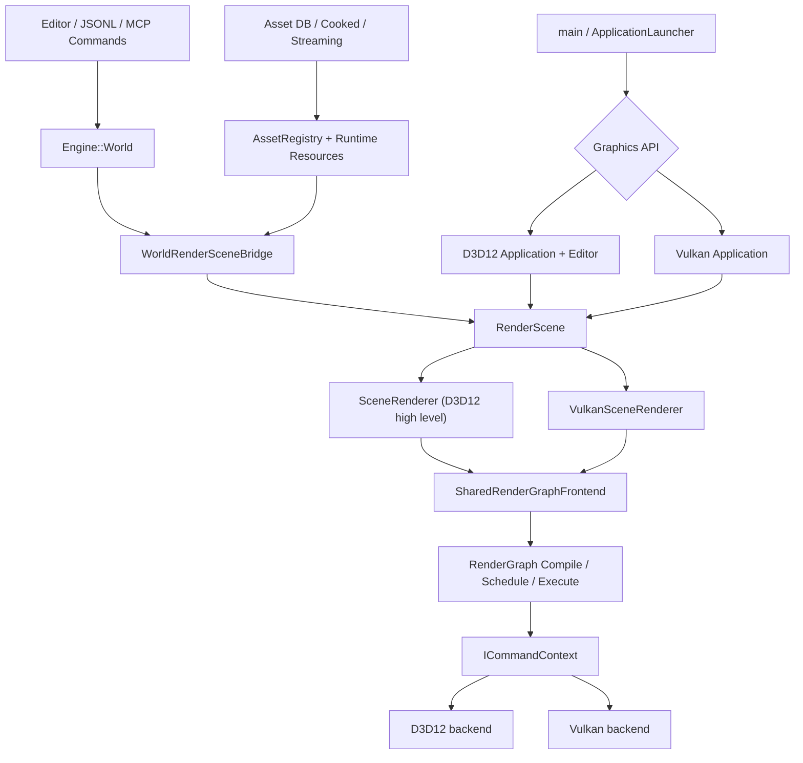

# PrismRender 当前架构审查与代码地图

审查日期：2026-08-06

> 状态说明：本文主体记录的是重构前审查快照，用来解释“为什么要改”。其中关于双 Application、双 SceneRenderer、Asset/Scene 原生 API 依赖、旧 Triangle/PSO 路径和 6/8 CTest 的描述已经过期。当前实现与验证结果请以 [ARCHITECTURE_REFACTOR_RESULT_CN.md](ARCHITECTURE_REFACTOR_RESULT_CN.md) 为准。

## 1. 结论先行

PrismRender 已经不是一个只包含 D3D12 三角形、Mesh 和基础光照的练习项目。当前代码覆盖：

- D3D12 与 Vulkan 双后端
- Slang 到 DXIL/SPIR-V 的统一 Shader 编译
- 版本化资源句柄、Pass Culling、瞬态资源别名、多队列调度和并行录制的 Render Graph
- Forward、Deferred、CSM、本地光阴影、Clustered Lighting、Bloom、Tonemap、Hi-Z、GTAO、SSR、TAA、GPU Driven
- CPU 资产、Cooked Asset、缓存、异步 IO、GPU Upload 和驻留预算
- World、命令、Undo/Redo、Journal、编辑器、JSONL Harness、MCP、Golden Image 和崩溃诊断

它的技术广度足以作为渲染/引擎岗位作品，但当前架构处于“功能已经铺开，边界尚未收敛”的状态。最大问题不是功能少，而是以下几条主线仍并存：

1. 旧 D3D12 原生路径与新公共 RHI 路径并存。
2. D3D12 与 Vulkan 仍各有一套高层 Application 和 SceneRenderer。
3. 目录看似分层，但 CMake 的 `PrismRenderer` 实际包含 Core、Platform、RHI、Asset、Renderer、Scene 六层代码。
4. 多个核心类已经成为数千行的聚合类，职责和编译粒度都过大。
5. 当前源码能完整编译，但 8 项 CTest 中仍有 2 项失败，不能作为稳定发布基线。

因此，不建议现在直接大规模移动所有文件。正确顺序应是：修复验证基线 -> 删除/收敛旧路径 -> 统一高层渲染前端 -> 拆分大类 -> 最后进行目录和 CMake 目标整理。

## 2. 本次审查基线

### 2.1 规模

`src/` 当前约 66,500 行 C/C++，模块规模如下：

| 目录 | 文件数 | 约计行数 | 当前真实职责 |
| --- | ---: | ---: | --- |
| `Asset/` | 42 | 9,149 | CPU 资产、GPU 资源、导入、Cook、缓存、Shader、流送 |
| `Automation/` | 10 | 4,572 | JSONL Harness、MCP、性能基线 |
| `Core/` | 20 | 5,260 | 基础工具、诊断、两个 Application、启动编排 |
| `Engine/` | 11 | 2,136 | Entity/World、反射元数据、序列化、命令和 Journal |
| `Platform/` | 4 | 265 | GLFW Window、文件对话框 |
| `Renderer/` | 57 | 20,548 | RDG、渲染前端、全部 Feature/Pass、Profiler、两套 Renderer |
| `RHI/` | 61 | 16,961 | 公共接口、D3D12/Vulkan 后端、资源和命令录制 |
| `Scene/` | 37 | 4,985 | RenderScene、加载/序列化、Demo 工厂、World/Streaming 桥 |
| `Tools/` | 4 | 541 | Golden Image 与 Minidump 命令行工具 |
| `UI/` | 10 | 2,098 | EditorLayer、属性、内容浏览、统计面板 |

最大的实现文件包括：

| 文件 | 行数 | 判断 |
| --- | ---: | --- |
| `Renderer/RenderGraph.cpp` | 4,040 | 编译、调度、资源生命周期、执行混在一类 |
| `RHI/Vulkan/VulkanContext.cpp` | 3,941 | Instance 到 Capture 的后端总管 |
| `Automation/HarnessTools.cpp` | 3,520 | 自动化命令聚合过度 |
| `Renderer/D3D12SceneRenderer.cpp` | 3,387 | D3D12 高层渲染总管，且文件名已经失真 |
| `Renderer/VulkanSceneRenderer.cpp` | 2,105 | 与 D3D12 高层流程重复 |
| `RHI/D3D12/D3D12Context.cpp` | 1,855 | Device/Swapchain/Queue/Descriptor/Upload 聚合 |
| `Core/Application.cpp` | 1,464 | D3D12、Editor、World、Asset、Capture 编排聚合 |

### 2.2 构建与测试

在当前源码上执行了 Debug 完整构建：

```text
PrismRender 及全部库、工具、测试目标：编译成功
CTest：6/8 通过
```

失败项：

- `ShaderCompiler`：进程崩溃，需要定位 Slang 编译/反射用例中的生命周期或 SDK 问题。
- `RenderGraph`：独立 DAG queue-batch 调度结果未满足测试预期。

通过项：

- RHI Type Translation
- Vulkan Runtime
- Golden Image Metrics
- Engine Harness
- World/RenderScene Bridge
- Minidump Symbolizer

这两项失败应作为求职展示前的 P0。项目文档中“全部测试通过”的历史结论不能代表当前工作区。

## 3. 当前构建目标，而不是目录表面结构

当前 CMake 目标关系大致是：

```text
PrismEngine
    ^
    |
PrismRenderer ---- GLFW / Slang / D3D12 / Vulkan
    ^
    |
PrismEditor
    ^
    |
PrismRender ---- PrismDiagnostics

PrismHarness / PrismMcpServer ---- PrismRenderer + PrismDiagnostics
```

关键事实：

- `PrismEngine` 的边界相对干净，只包含 `Engine/`。
- `PrismRenderer` 并不只包含 Renderer；它同时编译 Core 工具、Window、RHI、Asset、Renderer 和 Scene。
- 所有目标把整个 `src/` 作为 include 根目录暴露，CMake 无法阻止跨层 include。
- `PrismRenderer` 公开链接 `PrismEngine`，主要原因是 Scene 桥接代码也被放进 Renderer 目标。
- `Core/` 既包含最低层 Assert/Environment，又包含最高层 Application，因而目录依赖图出现双向关系。

目标图没有链接环，但目录和命名没有真实表达目标边界。这是当前“看起来模块化、实际隔离较弱”的根因。

## 4. 当前代码按功能整理

### 4.1 启动、运行循环与诊断

**入口与 API 选择**

- `src/main.cpp`
- `src/Core/ApplicationLauncher.*`
- `src/RHI/GraphicsApi.*`

职责：初始化 Trace/Crash 诊断，解析 `--api`，选择 D3D12 或 Vulkan Application。

**D3D12 应用编排**

- `src/Core/Application.*`

职责：Window、D3D12 Context、Renderer、Asset、World、Editor、Scene 同步、截图和报告的总装配与主循环。

**Vulkan 应用编排**

- `src/Core/VulkanApplication.*`

职责：Vulkan Context、Renderer、Asset/Streaming、RenderScene、截图和报告。它没有与 D3D12 等价的 Editor/World 常驻路径。

**时间、环境和可观测性**

- `src/Core/FrameTimer.*`
- `src/Core/Environment.*`
- `src/Core/CpuTrace.*`
- `src/Core/ProcessDiagnostics.*`
- `src/Core/ProcessDiagnosticsPosix.cpp`
- `src/Core/BuildSymbolIdentity.*`
- `src/Core/MinidumpSymbolizer.*`
- `src/Core/Assert.h`

建议后续把 Application 移入 `Core/App/`，把 Trace/Crash/Symbol 移入 `Core/Diagnostics/`，让 `Core/Base/` 只保留真正低层、无业务依赖的工具。

### 4.2 Platform

**窗口和输入**

- `src/Platform/Window.*`

职责：GLFW Window、Resize、键鼠状态、光标捕获、原生窗口句柄。

**编辑器平台能力**

- `src/Platform/FileDialog.*`

职责：Windows 文件选择，应继续只属于 Editor 目标，不属于通用 Renderer。

### 4.3 Engine World

**实体与数据模型**

- `src/Engine/EntityId.*`
- `src/Engine/Components.h`
- `src/Engine/World.*`

当前 `World` 是 `std::map<EntityId, EntityRecord>` 加多个 `optional<Component>` 的实体注册表。它适合小型编辑器和确定性序列化，但不是数据导向的 ECS；面试中应称为 Entity/Component 数据模型，不要过度声称 Archetype/Sparse-Set ECS。

**反射、序列化和命令**

- `src/Engine/Reflection.*`
- `src/Engine/WorldSerializer.*`
- `src/Engine/CommandSystem.*`

职责：属性描述、World JSON、命令执行、Undo/Redo、请求去重和 Journal Replay。

### 4.4 Asset

**稳定标识和 CPU 资产模型**

- `src/Asset/AssetHandle.h`
- `src/Asset/MeshAsset.*`
- `src/Asset/TextureAsset.*`
- `src/Asset/MaterialAsset.*`

职责：可序列化、可 Cook 的 CPU 数据。

**GPU Runtime 资产**

- `src/Asset/Mesh.*`
- `src/Asset/Texture.*`
- `src/Asset/Material.*`
- `src/Asset/AssetRegistry.*`
- `src/Asset/AssetRuntimeLoader.*`

职责：创建和持有 GPU 资源，将稳定 Asset Handle/Path 映射到 Runtime 对象。

当前问题：`Mesh/Texture/Material` 同时保留 D3D12 原生实现和公共 RHI 实现，形成双表示与条件编译。这是旧路径尚未退役的直接证据。

**导入、数据库、Cook 与缓存**

- `src/Asset/AssetDatabase.*`
- `src/Asset/AssetImportService.*`
- `src/Asset/CookedAssetIO.*`
- `src/Asset/AssetCache.*`
- `src/Asset/GltfLoader.*`
- `src/Asset/ImageLoader.*`

**环境与 IBL**

- `src/Asset/EnvironmentMapLoader.*`
- `src/Asset/IblEnvironmentBuilder.*`

**Shader 工具链**

- `src/Asset/IShaderCompiler.h`
- `src/Asset/SlangShaderCompiler.*`
- `src/Asset/ShaderLoader.*`
- `src/Asset/ShaderManager.*`

Shader 是渲染基础设施，不是普通内容资产。建议在保持 `Asset/` 顶层规则的前提下整理到 `Asset/Shader/`，并让 Pipeline Cache 消费明确的 Shader Module/Reflection 结果。

**异步流送**

- `src/Asset/AssetStreamingManager.*`

数据流：后台线程读取 Cooked Payload -> 主线程 `TickUploads` 创建 RHI 资源 -> Upload Ticket 完成 -> Registry 发布 Runtime 对象 -> 预算不足时按引用/Pin/LRU 尝试驱逐。

当前使用 `shared_ptr::use_count()` 辅助判断是否可驱逐，能避免正在使用的对象被释放，但驻留语义依赖偶然引用数量。更清晰的长期方案是显式 Residency Handle、资源版本和 Fence 延迟回收。

### 4.5 Scene 与 World 到 Renderer 的桥

**渲染场景数据**

- `src/Scene/Transform.*`
- `src/Scene/Camera.*`
- `src/Scene/Light.h`
- `src/Scene/RenderObject.h`
- `src/Scene/RenderScene.*`
- `src/Scene/CameraController.*`
- `src/Scene/SceneFraming.*`

`RenderScene` 是面向 Renderer 的扁平场景：Camera、Directional Light、固定上限灯光数组和 RenderObject 数组。`RenderObject` 同时保存 EntityId、Asset Handle 和 Runtime `shared_ptr`。

**World/Asset 到 RenderScene 的投影**

- `src/Scene/WorldRenderSceneBridge.*`
- `src/Scene/WorldRenderSnapshot.*`
- `src/Scene/AssetStreamingSceneBridge.*`

这是当前架构中正确且值得保留的思想：Engine World 不直接调用图形 API，而是被提取为 RenderScene。问题在于同步仍主要依靠手工全量复制和 `worldDirty` 标志，层级 Transform、增量更新和并行 Extract 尚未形成系统。

**场景加载、保存和 Demo 内容**

- `src/Scene/SceneLoader.*`
- `src/Scene/SceneSerializer.*`
- `src/Scene/DefaultSceneFactory.*`
- `src/Scene/DemoSceneBuilder.*`
- `src/Scene/DemoSceneCatalog.*`
- `src/Scene/FeatureLabSceneFactory.*`
- `src/Scene/LightingShowcaseSceneFactory.*`
- `src/Scene/ShadowShowcaseSceneFactory.*`
- `src/Scene/ShowcaseSceneFactory.*`

Demo 工厂数量已经明显大于 Scene 核心，建议归入 `Scene/Demo/`，避免示例内容掩盖运行时数据结构。

### 4.6 公共 RHI

**API 中立类型与接口**

- `src/RHI/GraphicsApi.*`
- `src/RHI/GraphicsTypes.*`
- `src/RHI/GraphicsResources.*`
- `src/RHI/PipelineState.*`
- `src/RHI/Rendering.*`
- `src/RHI/ShaderTypes.*`
- `src/RHI/ShaderLayoutBuilder.*`
- `src/RHI/TransientResources.*`
- `src/RHI/DeviceCapabilities.h`
- `src/RHI/GraphicsAdapterInfo.h`
- `src/RHI/IGraphicsDevice.h`
- `src/RHI/ICommandContext.h`
- `src/RHI/DeferredCommandContext.*`
- `src/RHI/RayTracing.*`
- `src/RHI/RayTracingValidation.*`

优点：资源、Pipeline、Descriptor、Barrier、Rendering Scope、Indirect Draw、Queue 能力已有公共描述，并有跨 API Translation Tests。

不足：公共接口主要覆盖资源创建与命令录制，还没有统一 Swapchain、Frame Lifecycle 和 Presentation。高层代码因此仍接收具体 `D3D12Context`/`VulkanContext`。

**遗留 D3D12 资源包装**

- `src/RHI/VertexBuffer.*`
- `src/RHI/IndexBuffer.*`

它们位于 RHI 根目录但只服务 D3D12 旧路径，应随旧 Asset/Renderer 路径一起删除或移入 `RHI/D3D12/Legacy/`。

### 4.7 D3D12 后端

- `src/RHI/D3D12/D3D12Context.*`
- `src/RHI/D3D12/D3D12Debug.h`
- `src/RHI/D3D12/D3D12TypeConversions.*`
- `src/RHI/D3D12/D3D12GraphicsDevice.*`
- `src/RHI/D3D12/D3D12CommandContextAdapter.*`
- `src/RHI/D3D12/D3D12PipelineView.*`
- `src/RHI/D3D12/D3D12Resources.*`
- `src/RHI/D3D12/D3D12TransientResources.*`

当前结构是不对称的：`D3D12Context` 不是 `IGraphicsDevice/ICommandContext`，而是再由 `D3D12GraphicsDevice` 和 `D3D12CommandContextAdapter` 包装；同时它自身仍公开大量原生 Device、Queue、Descriptor 和 CommandList 接口。

建议最终拆为：

```text
RHI/D3D12/
  D3D12InstanceDevice
  D3D12Swapchain
  D3D12Queue
  D3D12CommandContext
  D3D12DescriptorAllocator
  D3D12UploadManager
  D3D12Resources
  D3D12Pipeline
  D3D12TransientAllocator
```

不要求一次完成；优先先把 `D3D12Context.*` 移入 D3D12 目录，并禁止 Renderer 新增原生 D3D12 依赖。

### 4.8 Vulkan 后端

- `src/RHI/Vulkan/VulkanLoader.*`
- `src/RHI/Vulkan/VulkanTypeConversions.*`
- `src/RHI/Vulkan/VulkanContext.*`
- `src/RHI/Vulkan/VulkanResources.*`
- `src/RHI/Vulkan/VulkanPipeline.*`
- `src/RHI/Vulkan/VulkanTransientResources.*`
- `src/RHI/Vulkan/VulkanParallelCommandRecording.*`

`VulkanContext` 直接同时实现 `IGraphicsDevice` 和 `ICommandContext`，还拥有 Instance、Surface、Physical/Logical Device、Swapchain、所有 Queue、Frame、Upload、Capture。功能闭环完整，但单类职责过多，也与 D3D12 的 Adapter 形式不一致。

建议 D3D12 与 Vulkan 最终使用相同的对象模型，而不是要求方法名完全一致、内部结构仍完全不同。

### 4.9 Render Graph

- `src/Renderer/RenderGraph.*`
- `src/Renderer/RenderGraphResources.*`
- `src/Renderer/RenderGraphDiagnostics.*`
- `src/Renderer/QueueSchedulingCostModel.*`
- `src/Renderer/DeferredTransientLayout.*`

当前 RDG 已包含：

- 版本化 Texture/Buffer/View Handle
- Pass Parameter 读写声明
- RAW/WAR/WAW 依赖
- Pass Culling
- 资源 First/Last Use
- 瞬态 Texture/Buffer 别名
- 子资源 Barrier
- Queue Schedule/Batch/Sync
- 并行命令录制入口
- Blackboard、报告与签名

这是项目最有岗位价值的部分之一。当前问题不是能力不足，而是 `RenderGraph.cpp` 同时承担 Builder、Compiler、Scheduler、Resource Registry、Barrier Planner 和 Executor，已经很难局部验证。

建议拆为：

```text
Renderer/Graph/
  RenderGraphBuilder
  RenderGraphRegistry
  RenderGraphCompiler
  RenderGraphScheduler
  RenderGraphBarrierPlanner
  RenderGraphExecutor
  RenderGraphDiagnostics
```

### 4.10 高层 Renderer 与 Pass

**共享前端与通用 Pass 命令**

- `src/Renderer/SharedRenderData.h`
- `src/Renderer/SharedRenderGraphFrontend.*`
- `src/Renderer/RhiPasses.*`

`SharedRenderGraphFrontend` 统一了 Pass 拓扑和资源状态，这是正确方向。但它通过一个包含大量裸指针的 `SharedRenderGraphResources` 和约 20 个 Callback 的 `SharedRenderGraphCallbacks` 工作。结果是图结构共享了，Pipeline/Descriptor/常量更新/Draw 组装仍在两个 Renderer 中重复。

**D3D12 高层 Renderer**

- `src/Renderer/D3D12SceneRenderer.h`
- `src/Renderer/D3D12SceneRenderer.cpp`

它同时拥有：旧原生 Root Signature/PSO/ComPtr、公共 RHI Pipeline/DescriptorSet、RenderGraph、全部渲染 Feature、场景可见性、常量更新、截图和统计。D3D12 原生对象与 RHI Wrapper 指向同一资源的双表示非常明显。

另外：

- `src/Renderer/D3D12SceneRenderer.cpp` 没有加入任何 CMake 目标，是遗留死代码。
- 当前实现仍叫 `SceneRendererStage4.cpp`，但项目文档已经描述到 Stage 21，命名会误导审阅者。
- D3D12 路径固定 `MaxRenderObjects = 128`，超过容量会触发检查或被当作裁剪对象；这不是可扩展的 GPU Driven 场景容量策略。

**Vulkan 高层 Renderer**

- `src/Renderer/VulkanSceneRenderer.*`

它使用公共 RHI 对象，但仍重复维护 Scene Resource、Pipeline、DescriptorSet、常量更新和每个 Pass 的录制逻辑。

最终目标应只有一个 API 中立的 `SceneRenderer`；Backend 差异应停留在 RHI 对象创建、命令编码、Swapchain 和 UI Backend Adapter。

**渲染 Feature/Pass**

- Lighting：`ClusteredLighting.*`、`LocalLightShadows.*`、`ShadowCascades.*`、`VarianceShadowMaps.*`
- Visibility：`Frustum.*`、`GpuDrivenVisibility.*`
- Reflection/AO/SSR：`PlanarReflections.*`、`ScreenSpaceEffects.*`
- Temporal：`TemporalAntiAliasing.*`
- 基础/遗留：`TriangleRenderer.*`、`VulkanTriangleRenderer.*`
- 材质：`MaterialParameterResolver.*`
- Pipeline：`PSOCache.*`
- 配置/统计：`RenderSettings.h`、`RendererStatistics.h`、`DemoSceneSettings.*`
- Profiling/报告：`GpuProfiler.*`、`GpuTimingReport.*`、`PerformanceIdentity.*`

建议按 `Renderer/Passes/Lighting`、`Passes/Shadows`、`Passes/PostProcess`、`Visibility`、`Profiling` 建子目录，而不是继续扩张 Renderer 根目录。

### 4.11 Editor UI

- `src/UI/EditorLayer.*`
- `src/UI/DebugPanel.*`
- `src/UI/ContentBrowserPanel.*`
- `src/UI/PropertyGrid.*`
- `src/UI/ViewportStatisticsOverlay.*`

优点：Editor 作为独立 `PrismEditor` 目标存在。

问题：运行时只在 D3D12 `Application` 中完整接入；Scene Viewport 直接消费 D3D12 GPU Descriptor Handle。若要真正支持 Vulkan Editor，应增加 UI Renderer Bridge，把 `ITextureView` 转换为 ImGui Texture ID，而不是让 Editor/Application 理解 D3D12 Descriptor。

### 4.12 Automation、Tests 与 Tools

**Automation**

- `src/Automation/HarnessMain.cpp`
- `src/Automation/HarnessRunner.*`
- `src/Automation/HarnessTools.*`
- `src/Automation/McpMain.cpp`
- `src/Automation/McpServer.*`
- `src/Automation/PerformanceBaseline.*`

`HarnessTools.cpp` 已超过 3,500 行，建议按 Asset、World、Render、RDG、Diagnostics 命令拆分注册器。

**Tools**

- `src/Tools/GoldenImageComparator.*`
- `src/Tools/GoldenImageMain.cpp`
- `src/Tools/MinidumpSymbolizeMain.cpp`

**Tests**

- `tests/RhiTypeTranslationTests.cpp`
- `tests/ShaderCompilerTests.cpp`
- `tests/VulkanRuntimeTests.cpp`
- `tests/RenderGraphTests.cpp`
- `tests/GoldenImageTests.cpp`
- `tests/EngineHarnessTests.cpp`
- `tests/WorldRenderSceneBridgeTests.cpp`
- `tests/MinidumpSymbolizerTests.cpp`
- `tests/CrashFixtureMain.cpp`

`RenderGraphTests.cpp` 和 `EngineHarnessTests.cpp` 也已成为大文件。修复当前失败后，应按 Compiler/Scheduler/Executor/Resources 和命令域拆分，以便失败能直接指向子系统。

## 5. 实际运行数据流



### 5.1 D3D12 一帧

```text
Poll GLFW
-> Begin ImGui
-> Editor/Camera/World Command
-> WorldRenderSceneBridge（dirty 时）
-> D3D12Context::BeginFrame
-> AssetStreamingManager::TickUploads
-> SceneRenderer::Render
   -> Update constants / visibility / batches
   -> SharedRenderGraphFrontend::Build
   -> RenderGraph::Compile + Execute
-> ImGui DX12 RenderDrawData
-> D3D12Context::EndFrame / Present / Fence
```

### 5.2 Vulkan 一帧

```text
Poll GLFW
-> Camera
-> VulkanContext::BeginFrame
-> AssetStreamingManager::TickUploads
-> VulkanSceneRenderer::Render
   -> Update constants / scene resources
   -> SharedRenderGraphFrontend::Build
   -> RenderGraph::Compile + Execute
-> VulkanContext::EndFrame / Present
```

差异说明：Vulkan 不是简单的 RHI Backend 替换；它目前还有独立 Application 和独立高层 Renderer，因此跨 API 新功能仍需要同步修改多个位置。

## 6. 不合理设计与优先级

### P0：求职展示前必须解决

1. **测试基线不绿**：ShaderCompiler 崩溃、RenderGraph DAG Queue Batch 测试失败。
2. **缺少项目入口文档**：根目录没有 README，新审阅者无法快速知道定位、截图、构建命令、架构亮点和已知限制。
3. **当前工作区工程卫生差**：根目录没有 `.gitignore`；`.git` 在当前工作区为空，无法审查变更历史；多个 build 目录合计约 6.3 GB。不能据此断言远端仓库也如此，但当前交付快照不可直接作为干净作品集。

### P1：架构收敛的主线

1. **双 Application**：D3D12 与 Vulkan 复制窗口、场景、资产、流送、截图和报告流程，Editor 能力还不对等。
2. **双高层 Renderer**：共享 RDG 拓扑但不共享资源/Pipeline/Descriptor/常量/Draw 组装，新增 Backend 或 Pass 的维护成本仍高。
3. **D3D12 双路径迁移未结束**：同一个类同时保存原生 ComPtr/Descriptor 和 RHI Resource/Pipeline。
4. **RHI 对象模型不对称**：VulkanContext 直接实现接口，D3D12Context 依赖 Device/Command Adapter；Frame/Swapchain 仍没有公共接口。
5. **God Object/God File**：RenderGraph、两个 Context、两个 Renderer、Application、HarnessTools 职责过多。
6. **CMake 目标边界太粗**：`PrismRenderer` 包含六个逻辑层，无法利用链接依赖约束架构。
7. **World 与 RenderScene 同步较脆弱**：双数据模型方向正确，但更新依赖手工 dirty flag 和全量复制，缺少层级世界矩阵、版本和增量 Extract。

### P2：在主线收敛后改进

1. `shared_ptr` 广泛传播，资源所有权和 Residency 语义不够显式。
2. RenderGraph Shared Frontend 使用巨大 Resource/Callback 参数包，Feature 注册仍集中。
3. 固定 128 D3D12 RenderObject 容量与“超限等于被裁剪”的统计语义不合理。
4. `SceneRenderer.cpp` 是未编译死代码，`SceneRendererStage4.cpp` 名称过期。
5. 学习文档含失效路径：`assets/shaders/RhiScene.hlsl`、`assets/scenes/EditorScene.prism.json` 当前不存在。
6. 一个 37 KB 的根 `CMakeLists.txt` 承担依赖获取、平台配置、全部目标和测试，维护成本高。
7. `third_party/slang` 在工作区约 165 MB，包含 Bin/Lib/Docs。作品仓库应明确是固定 SDK、Git LFS、Release 依赖还是 CI 下载，不宜含糊。

## 7. 建议目标目录

保持项目既有顶层模块，不做“推倒重写”，只增加清晰子目录：

```text
src/
  Core/
    Base/              Assert, Environment, FrameTimer
    Diagnostics/       CpuTrace, Crash, Symbol
    App/               Launcher, common ApplicationHost
  Platform/
    Window/
    Dialog/
  Engine/
    World/             EntityId, Components, World
    Commands/          CommandSystem, Journal
    Serialization/
    Reflection/
  Asset/
    Model/             Handles, MeshAsset, TextureAsset, MaterialAsset
    Import/            glTF, Image, ImportService
    Database/          Database, Cache, Cooked IO
    Runtime/           Registry, RuntimeLoader, StreamingManager
    Shader/            Slang compiler, ShaderManager
    Environment/       EnvironmentMap, IBL
  Scene/
    Runtime/           Camera, Light, Transform, RenderObject, RenderScene
    Bridge/            World/Streaming -> RenderScene
    Serialization/     SceneLoader, SceneSerializer
    Demo/              all showcase/factory files
  RHI/
    Common/            interfaces, types, resource/pipeline descriptions
    D3D12/             device/swapchain/queue/descriptors/upload/resources
    Vulkan/            same conceptual split as D3D12
    D3D11/             translation-only code, clearly labeled
  Renderer/
    Graph/             builder/compiler/scheduler/executor/diagnostics
    Passes/
      Lighting/
      Shadows/
      PostProcess/
    Visibility/
    Profiling/
    SceneRenderer.*    one API-neutral high-level renderer
  UI/
    Editor/
    Panels/
    Backend/           ImGui D3D12/Vulkan adapters
  Automation/
    Commands/          Asset, World, Render, RDG, Diagnostics
  Tools/
```

目标 CMake 边界：

```text
PrismCore
PrismPlatform -> PrismCore
PrismEngine -> PrismCore
PrismRHICommon -> PrismCore
PrismRHID3D12 / PrismRHIVulkan -> RHICommon + Platform
PrismAsset -> Core + RHICommon
PrismScene -> Engine + Asset
PrismRenderGraph -> RHICommon
PrismRenderer -> Scene + Asset + RenderGraph + RHICommon
PrismEditor -> Engine + Renderer + Platform
PrismApp -> selected RHI backend + Renderer + optional Editor
```

不必立即创建十几个静态库。第一步可以先拆 `cmake/*.cmake` 和 include 检查；当边界稳定后再形成库目标。

## 8. 分阶段重构方案

### 阶段 A：建立可信基线

**文件新增**

- `README.md`
- `.gitignore`
- 可选：`docs/KNOWN_ISSUES_CN.md`

**文件修改**

- `tests/ShaderCompilerTests.cpp` 或 `Asset/SlangShaderCompiler.*`
- `Renderer/RenderGraph.*` / Queue Schedule 相关测试
- 与失效路径有关的学习文档

**数据流**

不改变运行数据流，只让构建、测试和项目入口可信。

**验证**

- Debug 与 RelWithDebInfo 全量编译
- 8/8 CPU/Runtime CTest
- D3D12/Vulkan Golden Image
- 干净目录从零配置构建

### 阶段 B：删除遗留与改正命名

**文件删除/重命名**

- 删除未编译的 `Renderer/SceneRenderer.cpp`
- `Renderer/D3D12SceneRenderer.cpp` 重命名为当前真实实现名
- 将 `RHI/D3D12/D3D12Context.*` 移入 `RHI/D3D12/`
- 明确 Triangle Renderer 是 Sample/Baseline 还是删除

**文件修改**

- `CMakeLists.txt`
- include 路径与文档

**数据流**

完全不变；这是机械整理阶段。

**验证**

- 全量编译、8/8 CTest
- 对比 D3D12/Vulkan Capture Hash

### 阶段 C：完成公共 RHI 迁移

**主要修改**

- `Asset/Mesh.*`、`Texture.*`、`Material.*` 只保留 `IGraphicsDevice/ICommandContext` 路径
- D3D12 `SceneRenderer` 删除原生 RootSignature/PSO/Resource 双表示
- 删除根目录 `VertexBuffer/IndexBuffer` 旧包装
- 为 Frame/Swapchain/Present 增加最小公共接口或 Backend Frame Adapter

**数据流**

```text
Asset CPU Data -> IGraphicsDevice -> Runtime RHI Resource
Render Pass -> ICommandContext -> D3D12/Vulkan Command Encoder
```

**验证**

- 禁止 `Asset/`、通用 `Renderer/` include `d3d12.h` 或 Vulkan Header
- RHI Translation、Shader、RenderGraph、双 API Golden 全通过

### 阶段 D：统一高层 SceneRenderer 和 ApplicationHost

**文件新增**

- `Core/App/ApplicationHost.*`
- `Renderer/SceneRenderer.*`（公共实现）
- `UI/Backend/ImGuiRendererBridge.*`

**文件逐步退役**

- `Core/Application.*`
- `Core/VulkanApplication.*`
- `Renderer/VulkanSceneRenderer.*`

**数据流**

```text
ApplicationHost
  -> selected Backend Frame Adapter
  -> common Asset/World/Scene services
  -> common SceneRenderer
  -> optional Editor UI Bridge
```

**验证**

- 同一 SceneRenderer 代码分别运行 D3D12/Vulkan
- Editor Scene Viewport 在两个 API 都能显示
- 单个新 Pass 不需要修改两个 Renderer

### 阶段 E：拆分大类与明确所有权

**拆分目标**

- RenderGraph：Builder/Compiler/Scheduler/Executor/Diagnostics
- D3D12/Vulkan Context：Device/Swapchain/Queue/Descriptor/Upload/Capture
- Renderer：Scene Extraction、Frame Resources、Pipeline Library、Feature Pass
- HarnessTools：按命令域拆分

**所有权原则**

- ApplicationHost 拥有系统生命周期。
- RHI Device 拥有设备级分配器和 Queue。
- Frame Context 拥有每帧 Allocator/Command/Fence 临时状态。
- Asset Runtime Manager 拥有长期 GPU Asset；RenderScene 使用稳定 Handle/Residency Reference。
- RenderGraph 只拥有一帧的逻辑资源声明和瞬态物理分配，不拥有长期资产。

**验证**

- 每个子系统有独立单元测试目标
- Header 不泄漏后端原生类型
- Include 依赖符合单向层级

## 9. 面试时应该怎样描述这个项目

推荐表述：

> PrismRender 是一个 renderer-first 的现代实时渲染项目。我从 D3D12 基础显式资源管理开始，逐步建立了 API 中立 RHI、Slang 双目标 Shader、编译型 Render Graph、D3D12/Vulkan 双后端、GPU Driven 和异步资产流送。当前我正在收敛早期 D3D12 原生路径与公共 RHI 路径，并用跨 API Golden Image 和调度测试保证迁移不改变结果。

不要表述为：

- “已经是完整游戏引擎”——缺少动画、物理、脚本、Prefab、完整打包和内容生产链。
- “完整 ECS”——当前是稳定 ID + EntityRecord + Optional Components 的小型 World 模型。
- “完全统一的跨 API Renderer”——当前统一了部分 RHI 和 RDG 拓扑，但高层 Renderer/Application 仍分叉。
- “全部测试通过”——当前工作区实际是 6/8。

最值得深入准备的面试主题：

1. D3D12 Frame Resource、Fence、Descriptor 和 Upload 生命周期。
2. RHI 如何表达资源、Pipeline、Descriptor、Barrier，又如何避免最低公分母设计。
3. RenderGraph 如何从读写声明生成依赖、Culling、Lifetime、Aliasing、Barrier 和 Queue Batch。
4. 为什么 World 与 RenderScene 分离，以及如何进一步做增量/并行 Scene Extraction。
5. Slang Reflection 如何校验 C++/Shader Binding 契约。
6. 如何用 Golden Image、GPU Capture、Timeline 和自动化报告验证跨 API 一致性。

## 10. 推荐阅读顺序

不要从最长的文件逐行读。按一次渲染数据流阅读：

1. `src/main.cpp`、`Core/ApplicationLauncher.cpp`
2. `Core/Application.cpp` 和 `Core/VulkanApplication.cpp` 的 Initialize/Run
3. `Platform/Window.*`
4. `Engine/World.*`、`Components.h`、`CommandSystem.h`
5. `Scene/WorldRenderSceneBridge.*`、`RenderScene.*`、`RenderObject.h`
6. `Asset/AssetRegistry.*`、`AssetRuntimeLoader.*`、`AssetStreamingManager.h`
7. `RHI/IGraphicsDevice.h`、`ICommandContext.h`、`GraphicsResources.h`
8. `RHI/D3D12/D3D12Context.h` 与 `RHI/Vulkan/VulkanContext.h`，对比对象模型
9. `Renderer/SharedRenderGraphFrontend.*`
10. `Renderer/RenderGraphResources.h`、`RenderGraph.h`
11. `Renderer/RenderGraph.cpp` 中 Compile/Execute 各阶段
12. `Renderer/D3D12SceneRenderer.cpp` 和 `VulkanSceneRenderer.cpp`，只比较同名职责
13. `assets/shaders/ShaderBindings.hlsli`、`Mesh.hlsl`、`Deferred.hlsl`、`PostProcess.hlsl`
14. 选择一个 Feature（如 Clustered Lighting 或 TAA）完整跟踪 CPU -> RDG -> RHI -> Shader
15. 最后阅读 Editor、Harness 和 Diagnostics

每读一个子系统，回答四个问题：

1. 谁创建它？
2. 谁拥有它？
3. 谁每帧修改它？
4. GPU 完成之前，谁保证它不会被复用或销毁？

这四个问题比记住类名更接近游戏引擎岗位真正考察的架构能力。
