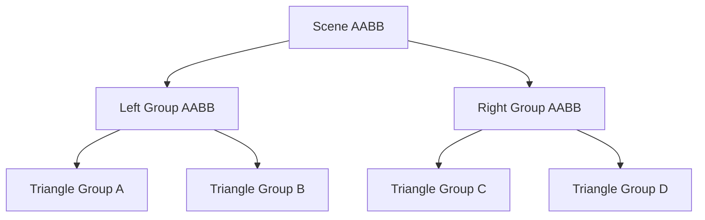
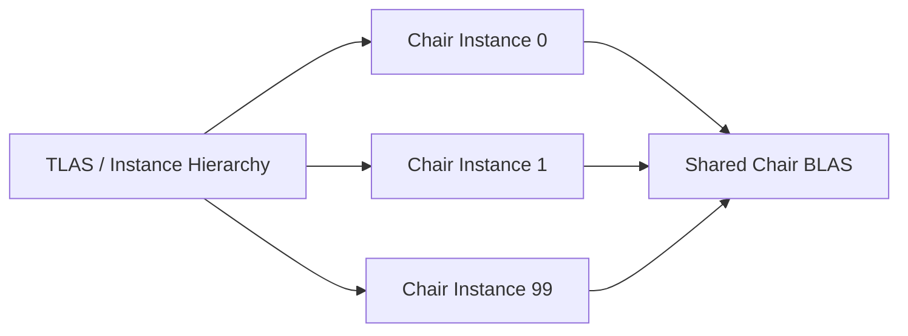
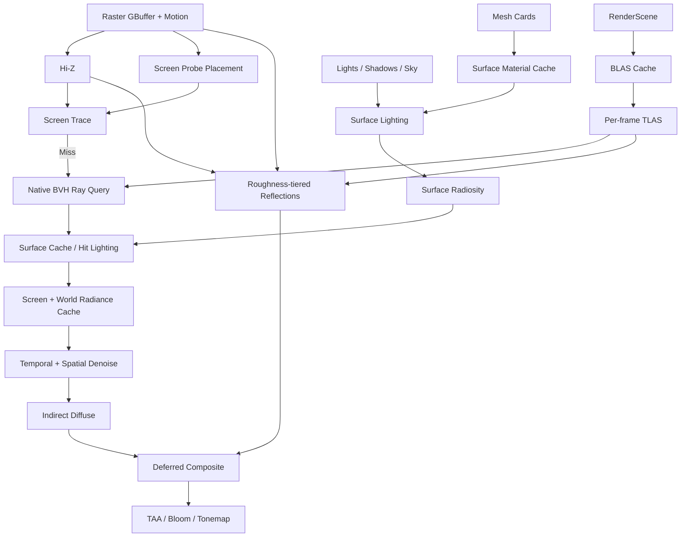

# 从一条射线到 PrismGI：光线追踪、BVH 与实时全局光照

> 本文是一篇面向 PrismRender 的入门教程。它先解释“为什么需要这项技术”，再给出直观过程、简化伪代码和工程实现，不假设读者已经理解 DXR、Vulkan Ray Query 或 Lumen。
>
> 本文的讲解方式参考了用户提供的《实时渲染基础（6）光线追踪》：从光栅化与光追的差异讲起，再逐步进入求交、空间加速和全局光照。本文没有照搬原文，而是针对 PrismRender 当前架构补充现代实时光追内容。

## 1. 光栅化还是光线追踪？

想象桌面上放着一个红色杯子和一张白纸。

即使灯光没有直接照向白纸，杯子附近的纸面仍可能带一点红色。这是因为光先照到杯子，再从杯子反射到白纸，最后进入眼睛。镜子、水面、金属和汽车漆上的倒影也是类似的“其他表面影响当前表面”。

传统光栅化擅长回答：

```text
一个三角形投影到屏幕以后，覆盖了哪些像素？
```

它从物体出发，把三角形投影到屏幕，因此特别适合生成主画面、GBuffer 和直接光照。但仅凭当前像素，渲染器通常不知道“这个方向后面还有什么物体”，所以阴影、反射和间接光往往需要 Shadow Map、SSR、IBL、AO 等专门方法补充。

光线追踪换了一个问题：

```text
从某个位置沿某个方向出发，最先碰到什么？
```

一旦能回答这个问题，就可以继续查询：

- 从相机穿过像素的射线命中了哪个表面；
- 从表面指向光源的射线是否被遮挡；
- 镜面反射方向能看到哪个物体；
- 从表面随机发出的间接光射线接收到了多少辐射。

现代实时渲染器通常不是二选一。PrismRender 更适合采用混合渲染：

```text
光栅化：主可见性、GBuffer、直接光
屏幕追踪：复用当前帧已有信息
硬件光追：补充屏幕外精确命中
缓存与降噪：把少量射线变成稳定 GI/反射
```

## 2. 一条射线到底是什么

射线可以写成：

```text
P(t) = Origin + t * Direction,  TMin < t < TMax
```

- `Origin`：射线起点；
- `Direction`：射线方向；
- `t`：沿方向前进的距离参数；
- `TMin`：忽略离起点太近的交点，减少自相交；
- `TMax`：最远追踪距离，阴影射线通常只追到光源。

例如从表面向灯光发出阴影射线：

```text
Origin    = SurfacePosition + Normal * Bias
Direction = normalize(LightPosition - SurfacePosition)
TMax      = distance(LightPosition, SurfacePosition)
```

如果在 `TMax` 之前命中物体，这个点被遮挡；否则灯光可见。

这里有一个容易混淆的地方：**光线追踪首先只负责求交，不自动负责着色。** 求交结果通常包括：

- 是否命中；
- 命中距离；
- Instance ID；
- Geometry/Primitive ID；
- 三角形重心坐标；
- 正面或背面。

渲染器还要用这些信息找到顶点、法线、UV、材质和纹理，才能计算颜色。

## 3. 从经典光追到实时混合光追

### 3.1 Whitted-style 光线追踪

经典递归光追从相机射线开始，在镜面或透明表面继续生成反射/折射射线：

```text
TraceWhitted(ray, depth):
    if depth >= MaxDepth:
        return 0

    hit = FindClosestHit(ray)
    if hit is miss:
        return SampleSky(ray.direction)

    color = EvaluateDirectLighting(hit)

    if hit.material is reflective:
        reflected = MakeReflectionRay(hit)
        color += hit.material.reflectance
               * TraceWhitted(reflected, depth + 1)

    if hit.material is transmissive:
        refracted = MakeRefractionRay(hit)
        color += hit.material.transmittance
               * TraceWhitted(refracted, depth + 1)

    return color
```

它很适合解释硬阴影、镜面反射和折射，但不会自然覆盖粗糙表面向整个半球散射能量的情况。

### 3.2 Path Tracing

路径追踪把表面反射看成半球上的积分。实际计算时不能遍历无穷多个方向，于是随机选择方向，并用概率密度修正样本贡献：

```text
IndirectSample = IncomingRadiance
               * BRDF
               * Cosine
               / DirectionPdf
```

多帧或每像素多样本平均后，结果逐渐收敛。样本少时会产生明显噪声，因此离线路径追踪通常等待大量样本；实时路径追踪则需要重要性采样、时空复用和强降噪。

### 3.3 PrismGI 不是实时 Path Tracer

PrismGI 的目标是实时动态 GI，不是每像素追踪完整多反弹路径。它把成本拆开：

```text
少量 Ray 查询几何
+ Surface Cache 查询命中辐射
+ Screen/World Probe 共享样本
+ 多帧 Radiosity 近似多反弹
+ Temporal/Spatial Denoiser 稳定结果
```

因此“支持光线追踪”不等于“已经实现路径追踪”，也不等于“自动拥有 Lumen”。

## 4. 为什么求交会成为瓶颈

假设场景有一百万个三角形。若一条射线依次测试全部三角形，即使最后什么也没命中，也要做一百万次测试。

```text
BruteForceClosestHit(ray):
    closest = Miss
    for triangle in SceneTriangles:
        hit = Intersect(ray, triangle)
        if hit is closer than closest:
            closest = hit
    return closest
```

若一帧发出五十万条射线，最坏情况下就变成约五千亿次候选测试。真正的问题不是 Ray-Triangle 公式本身，而是绝大多数三角形根本不在射线附近，却仍被检查。

空间加速结构的目标就是：**先用便宜测试排除不可能命中的大量几何，只对少量候选三角形做精确求交。**

## 5. 从 Grid、KD-Tree 到 BVH

### 5.1 Uniform Grid

最容易想到的办法是把世界切成相同大小的格子，并记录每个格子包含哪些物体。射线沿方向逐格前进，只检查经过的格子。

它适合草地、粒子等分布较均匀的场景，但格子尺寸很难统一：

- 格子太大：每格仍然有很多三角形；
- 格子太小：射线要经过太多空格；
- 一个巨大物体可能登记到许多格子；
- 室内小物体与室外大地形混合时很难选择尺度。

### 5.2 KD-Tree

KD-Tree 递归切分空间：这一层按 X 切，下一层按 Y 或 Z 切。空旷区域可以使用大节点，复杂区域继续细分，因此比固定 Grid 更适应不均匀场景。

但空间切分可能让同一个三角形跨越多个区域，并且动态物体移动后容易破坏原有划分。它曾广泛用于离线光追，现在通用实时三角形光追更常采用 BVH。

### 5.3 BVH

BVH 的全称是 Bounding Volume Hierarchy。它不先切空间，而是先把物体分组，再为每组物体计算包围盒。

例如十万个三角形可以被分成两组，每组再分成两组，直到叶节点只剩少量三角形：



若射线没有穿过 `Left Group AABB`，左侧全部三角形都可以跳过。这正是 BVH 加速的来源。

## 6. 射线怎样与 AABB 相交

AABB 是与 X/Y/Z 轴对齐的包围盒。可以把它看成三个轴向区间：

```text
X: [min.x, max.x]
Y: [min.y, max.y]
Z: [min.z, max.z]
```

射线分别计算自己进入和离开三个轴向平板的 `t` 范围。如果三个范围存在公共区间，射线就穿过盒子；否则不相交。

```text
IntersectAabb(ray, bounds):
    tEnter = ray.TMin
    tExit  = ray.TMax

    for axis in X, Y, Z:
        t0 = (bounds.min[axis] - ray.origin[axis])
             / ray.direction[axis]
        t1 = (bounds.max[axis] - ray.origin[axis])
             / ray.direction[axis]
        sort(t0, t1)
        tEnter = max(tEnter, t0)
        tExit  = min(tExit, t1)

    return tEnter <= tExit
```

AABB 测试比遍历许多三角形便宜，而且 GPU 光追硬件通常专门加速 BVH 节点和三角形求交。

## 7. BVH 怎样构建

一个容易理解的 CPU 构建器可以这样工作：

1. 计算当前三角形集合的总 AABB；
2. 若三角形数量足够少，生成叶节点；
3. 找到三角形中心分布最宽的轴；
4. 按中心排序并从中间切成两组；
5. 递归构建左右子树。

```text
BuildBvh(primitives):
    node.bounds = UnionBounds(primitives)

    if primitives.count <= LeafThreshold:
        node.leafPrimitives = primitives
        return node

    axis = LongestAxis(CentroidBounds(primitives))
    split = PartitionAtMedian(primitives, axis)
    node.left  = BuildBvh(split.left)
    node.right = BuildBvh(split.right)
    return node
```

中位数切分能生成深度较均衡的树，却不一定有最快遍历。更成熟的方法使用 SAH（Surface Area Heuristic）：估计射线进入左右子树的概率和子树测试成本，从多个候选切分中选择预计成本最低者。

可以把 SAH 直观理解为：

```text
好的切分 = 子盒更小 + 重叠更少 + 两侧图元成本合理
```

构建速度与遍历速度存在取舍：静态场景可以花更多时间构建高质量树；每帧重建的动态场景更重视快速构建。

## 8. BVH 怎样遍历

基础遍历过程是：

```text
Traverse(ray, node, closestT):
    if ray misses node.bounds before closestT:
        return Miss

    if node is leaf:
        return ClosestTriangleHit(ray, node.triangles, closestT)

    nearChild, farChild = OrderByEntryDistance(ray,
                                               node.left,
                                               node.right)
    nearHit = Traverse(ray, nearChild, closestT)
    if nearHit exists:
        closestT = nearHit.t

    farHit = Traverse(ray, farChild, closestT)
    return Closer(nearHit, farHit)
```

先访问近节点很重要。发现近命中后可以缩小 `TMax`，许多更远节点会自动被排除。阴影射线只关心“是否存在遮挡”，找到第一个有效命中就能提前结束；反射和 GI 通常需要最近命中。

实际 DXR/Vulkan 加速结构由驱动构建，应用看不到节点数组和遍历栈。上面的伪代码是理解模型，不是要求 PrismRender 自己在 Shader 中实现同样的二叉树。

## 9. 动态场景：Refit 还是 Rebuild

场景发生变化后，原 BVH 可能失效或质量下降：

- 刚体移动：Mesh 内部三角形没变，只是实例 Transform 改变；
- 骨骼动画：三角形拓扑不变，但顶点位置改变；
- Mesh 重导入/LOD 改变：三角形数量和拓扑可能改变。

常见操作如下：

| 操作 | 做什么 | 适合情况 |
| --- | --- | --- |
| Build | 从输入重新生成 AS | 第一次创建 |
| Update/Refit | 保留大部分原有层次，只更新包围范围 | 变化有限且拓扑固定 |
| Rebuild | 重新组织整个层次 | 实例增删或变化过大 |
| Compaction | 把 Build 结果复制到更小缓冲 | 长寿命静态结构 |

Refit 不等于永远更好。若物体从房间左边移动到右边，原来的节点分组可能出现严重重叠；结构仍然正确，但射线要访问更多节点。此时 Rebuild 成本更高，却可能换回更快的后续遍历。

## 10. 为什么现代 API 使用 BLAS + TLAS

假设场景里有一百把相同椅子。如果为每把椅子都复制三角形和 BVH，会浪费大量显存。

现代硬件光追采用两级结构：

- BLAS：保存唯一 Mesh 的局部空间几何；
- TLAS：保存实例 Transform、Mask、Instance ID 和 BLAS 引用。



世界空间射线先遍历 TLAS，找到可能相交的实例；随后被转换到实例局部空间，再遍历对应 BLAS。刚体移动只改变 TLAS 实例数据，不需要重建 Mesh BLAS。

DXR/Vulkan 将 AS 暴露为不透明资源。驱动通常使用 BVH 类结构，但应用只控制几何输入、实例组织、Build Flags、结果/Scratch 内存和同步，不能依赖厂商内部节点格式。

## 11. Ray Query 与 TraceRay 有什么不同

二者使用同一套 BLAS/TLAS，区别主要在 Shader 调度方式。

### Ray Query

Ray Query 在 Compute、Pixel 等普通 Shader 内进行内联遍历：

```text
query.TraceRayInline(sceneTlas, flags, mask, ray)
while query.Proceed():
    if candidate passes alpha/material rule:
        query.CommitCandidate()

if query has committed hit:
    consume hit information
```

它适合阴影、AO、单反弹 GI 和反射，因为调用端可以直接控制流程，不需要完整 Ray Tracing Pipeline。

### TraceRay / Ray Tracing Pipeline

完整 Pipeline 通常包含 Ray Generation、Miss、Closest Hit、Any Hit、Intersection、Callable Shader，并通过 SBT（Shader Binding Table）把几何与 Shader Record 对应起来。

它适合复杂材质和多种命中行为，但 Pipeline、SBT、Shader Record 和跨 API 管理明显更复杂。

因此 PrismRender 首版选择 Compute Ray Query：先打通完整场景命中，再决定是否需要完整 Pipeline。

## 12. PrismRender 当前到底实现到哪里

当前项目已经完成：

- D3D12 `BuildRaytracingAccelerationStructure` 原生构建；
- Vulkan `vkCmdBuildAccelerationStructuresKHR` 原生构建；
- BLAS/TLAS Build Size 查询；
- `PreferFastTrace`、`AllowUpdate`、`AllowCompaction` 等公共 Flags；
- TLAS Descriptor 写入；
- DXR/Vulkan Ray Query 能力检测；
- 一个三角形 BLAS + 一个实例 TLAS 的驱动验证。

当前还没有完成：

- 所有场景 Mesh 的 BLAS Cache；
- 每帧 RenderScene TLAS；
- 独立 Build/Update/Compact 命令和异步生命周期；
- GPU Geometry/Material 查询表；
- 运行时 Compute Ray Query Pass；
- RT Pipeline、SBT 和 `DispatchRays` 场景渲染；
- 光追 GI 或光追反射。

所以目前准确说法是“已经验证硬件 AS 构建基础”，而不是“主画面正在使用光线追踪”。

## 13. 找到交点之后，为什么还没有 GI

假设一条间接光射线命中了墙壁。BVH/Ray Query 只能告诉我们：

```text
命中了 Instance 42 的第 310 个三角形，距离为 3.7 米。
```

它没有告诉我们墙壁向当前点返回多少光。要得到这个结果，至少还需要：

1. 用重心坐标插值得到命中点法线和 UV；
2. 根据 Instance/Geometry 找到 Material；
3. 采样 Base Color、Normal、Emissive 等纹理；
4. 计算命中点受到的直接光和间接光；
5. 用 BRDF 与采样概率计算这次路径的贡献。

若每条 GI 射线都执行完整材质和全部灯光计算，成本仍然很高。Lumen-like 系统的关键不是“更多光线”，而是用缓存减少命中着色，用 Probe 减少射线数量，再用时间维度复用结果。

## 14. Screen Trace：先查已经画出来的世界

光栅化完成后，屏幕上已经有深度、法线、材质和颜色。若反射射线指向的物体也出现在当前画面中，没有必要立即进入硬件 BVH。

Screen Trace 的思路是：

1. 从当前 GBuffer 表面生成射线；
2. 沿射线取样，并投影回屏幕；
3. 比较射线深度与 Depth Buffer；
4. 接近交点时细化搜索；
5. 命中后直接读取屏幕数据。

Hi-Z 把深度生成多级 mip：高 mip 表示较大屏幕区域的深度范围。射线在空旷区域可以跨大步前进，接近表面后再下降到精细 mip。

```text
TracePolicy(ray):
    screenHit = TraceHiZ(ray)
    if screenHit is valid:
        return ReadScreenRadiance(screenHit)

    if HardwareRayQueryAvailable:
        return TraceNativeScene(ray)

    if DistanceFieldAvailable:
        return TraceDistanceField(ray)

    return SampleSkyOrRadianceCache(ray)
```

Screen Trace 很便宜，但它只能看到当前画面：

- 屏幕外物体不存在于 Depth Buffer；
- 被前景遮住的背后物体不可见；
- 屏幕边缘容易丢失长射线；
- 深度只有一个可见层，无法完整表示厚度。

因此它是第一层加速，不是完整场景光追的替代品。Epic 的 Lumen 也先执行 Screen Trace，再回退到硬件或软件追踪。

## 15. Mesh Card 与 Surface Cache：给场景表面拍快照

### 15.1 为什么需要 Surface Cache

假设一万条射线在同一帧命中同一面墙。如果每次都重新执行复杂材质和光照，许多工作是重复的。

Surface Cache 相当于提前为墙壁表面准备一张“可查询的表面档案”：

- Base Color；
- Normal；
- Roughness/Metallic；
- Emissive；
- 有效覆盖 Mask；
- Direct Lighting；
- 上一轮 Indirect Lighting。

射线命中后，不必完整重跑墙壁材质，而是把命中位置映射到缓存 Atlas，快速读取辐射。

### 15.2 Mesh Card 是什么

一个复杂 Mesh 不能总被单张平面纹理完整覆盖。Mesh Card 是从某个方向观察 Mesh 的正交捕获视图，类似围绕物体放置几台相机。

首版可为 Mesh 的 `+X/-X/+Y/-Y/+Z/-Z` 六个方向生成 Cards：

```text
Mesh
 -> 选择 Card 方向和正交范围
 -> 离线保存 Card 元数据
 -> 运行时捕获材质到 Atlas Tile
 -> 建立 Local Surface 到 Atlas UV 的映射
```

六方向流程容易实现，但凹形物体、房间内部和复杂遮挡可能覆盖不足。后续需要根据三角形法线、可见面积和覆盖率增加自适应 Cards。

### 15.3 为什么材质缓存和光照缓存要分开

材质纹理通常不会每帧变化，灯光却可能移动或开关。如果把二者绑定在同一更新中，灯光变化会迫使渲染器重新捕获所有材质。

因此建议拆分：

```text
Material Atlas：BaseColor / Normal / Emissive / Mask
Lighting Atlas：Direct / Indirect Radiance
```

材质修改只使 Material Tile 失效；灯光变化只更新相关 Lighting Tile。所有更新都进入固定预算队列，避免一帧内刷新整个场景。

## 16. Screen Probe：让一组像素共享射线

若 1920×1080 每个像素追踪 8 个方向，一帧需要超过一千六百万条 GI 射线。实时渲染通常无法承担这种成本。

Screen Probe 在屏幕上稀疏放置探针，例如每 16×16 像素一个。每个探针向多个方向采样辐射，再把结果插值给附近像素。

```text
16×16 Pixel Tile
 -> 1 Screen Probe
 -> 8×8 Direction Samples
 -> 方向辐射图
 -> 依据深度/法线插值回 256 个像素
```

它的优势是：

- 邻近像素共享追踪结果；
- 可以对明亮方向分配更多样本；
- 更适合蓝噪声旋转和局部滤波；
- 可在深度/法线边缘增加自适应探针。

插值时必须检查深度和法线。若把墙前探针直接插值到墙后像素，就会出现漏光。

## 17. World Radiance Cache：记住远处来的光

Screen Probe 依赖当前画面，面对小窗口、屏幕外亮区和远距离天空光时仍可能不稳定。

World Radiance Cache 在相机周围放置世界空间探针，记录从不同方向到达该位置的低频辐射：

```text
World Probe = Position
            + Directional Radiance
            + Hit Distance Statistics
            + Validity / Age
```

常见组织方式是 Camera-relative Clipmap：近处网格密，远处网格疏。相机移动时滚动 Clipmap，只更新新进入的区域，而不是清空全部历史。

它适合保存远场和低频光，但不适合直接表现镜面中的细小文字或汽车漆窄高光。Probe 越密、方向分辨率越高，显存和更新成本越大。

## 18. Surface Radiosity：多反弹不等于一帧递归很多次

想象白色房间里打开一盏灯：

- 第一次更新：灯直接照亮一面墙；
- 第二次更新：这面墙把光反射到地面；
- 第三次更新：地面继续把少量光反射到天花板。

Surface Radiosity 可以让 Surface Cache 的辐射跨帧迭代：

```text
NewIndirect(tile) = Integrate(
    PreviousFrameSurfaceRadiance,
    Visibility,
    BRDF)
```

这会逐步形成近似多反弹效果，而不是一帧内从每个像素递归出大量路径。代价是光照变化存在传播延迟，因此要给新开灯、关灯和大范围 Emissive 变化更高更新优先级。

同时必须限制反馈能量，否则缓存误差可能在多帧后越来越亮。

## 19. SDF 软件光追：按“到表面的距离”前进

Mesh SDF 在三维网格中记录当前位置到最近表面的距离。若某点距离最近表面还有 0.5 米，沿任意方向前进 0.5 米通常不会越过表面，因此射线可以按距离值大步前进。

```text
SphereTrace(ray):
    t = ray.TMin
    repeat MaxSteps times:
        p = ray.origin + t * ray.direction
        d = SampleDistanceField(p)
        if d < HitThreshold:
            return Hit(t)
        t += max(d * SafetyScale, MinStep)
        if t > ray.TMax:
            return Miss
```

Global Distance Field 把附近许多 Mesh SDF 注入相机周围的 Clipmap，使远距离追踪不必逐实例访问所有体素纹理。

SDF 的代价是近似误差：

- 薄片可能比一个体素还薄；
- 开放网格难以确定内部/外部；
- 低分辨率会让边缘变圆；
- 非均匀缩放会影响距离含义。

因此 PrismGI 把它作为无 Ray Query 设备的后期回退，而不是当前主路径。

## 20. 时空降噪：借用过去和邻居的样本

实时 GI 每像素样本很少，单帧通常充满噪声。Temporal Denoiser 使用 Motion Vector 把上一帧的间接光重新投影到当前帧，相当于让静止像素随时间积累更多样本。

但历史不能无条件使用：

- 相机移动后出现了以前看不到的区域；
- 物体移动导致命中表面变化；
- 灯光突然关闭；
- 反射方向因粗糙度或法线变化而改变。

因此 GI History 至少应保存 Radiance、Moments、Sample Count、Hit Distance，以及前一帧 Depth/Normal/Roughness。

```text
Denoise(current, history):
    previousUv = ReprojectWithMotionVector()

    if DepthNormalOrEntityMismatch(previousUv):
        historyWeight = 0
    else:
        historyWeight = WeightFromVarianceAndAge()

    stable = ClampHistoryToCurrentNeighborhood(
        history[previousUv])
    temporal = lerp(current, stable, historyWeight)
    return EdgeAwareSpatialFilter(temporal)
```

漫反射和镜面反射不能使用完全相同的滤波。低粗糙度反射包含高频细节，过强空间滤波会抹掉汽车 Clear Coat 上的窄高光。

## 21. 动态反射：按粗糙度选择算法

镜面反射方向可由视线和法线计算；粗糙材质则不是单方向，而是围绕镜面方向的 GGX 波瓣。

PrismGI 建议分层：

| 粗糙度 | 主要方法 | 原因 |
| --- | --- | --- |
| 很低 | SSR → Ray Query Fallback | 需要清晰、稳定的屏幕外细节 |
| 中等 | 低分辨率专用反射 Ray | 可以适度时空滤波 |
| 很高 | Probe/Radiance Cache | 反射本身已是低频模糊结果 |
| Miss | Prefiltered IBL/Skybox | 稳定且成本低 |

Surface Cache Lighting 查询快，但缓存分辨率和更新时间限制质量；Hit Lighting 在命中处读取真实材质和灯光，质量更高，却需要 Bindless Geometry/Material Table，并增加 Shader 发散。

## 22. PrismGI 一帧的完整故事



这张图中有三种不同的“加速”：

1. BVH/Hi-Z/SDF 加速几何求交；
2. Surface/Radiance Cache 加速辐射查询；
3. Probe/Denoiser 减少并复用射线样本。

## 23. 对 PrismRender 的实现顺序

```text
M0  Settings、Debug View、显存和性能基线
M1  原生 AS Build/Update/Rebuild/Compaction 生命周期
M2  完整场景 BLAS Cache、TLAS、GPU Scene Table、Ray Query
M3  从 SSR 抽取公共 Hi-Z Screen Trace
M4  Mesh Card 与固定预算 Surface Cache
M5  单反弹 Screen Probe GI 与专用 Denoiser
M6  World Radiance Cache 与 Surface Radiosity
M7  Roughness 分层动态反射
M8  Mesh SDF 与 Global Distance Field 回退
M9  Alpha Mask、Clear Coat、Streaming、跨 API 生产化
```

第一个可见画面成果在 M5，但 M1–M2 不能跳过。否则只能得到仅在验证三角形上运行的 Shader，无法追踪真实导入场景。

## 24. 常见误解

### “使用 BVH 就等于完成光线追踪”

不对。BVH 只加速求交，还需要射线生成、命中数据、材质查询和着色。

### “完成光线追踪就等于完成 GI”

不对。GI 需要采样多个入射方向、计算辐射和 BRDF，并解决少样本噪声。

### “完成 GI 就等于完成 Lumen”

不对。Lumen-like 系统还需要多种场景表示、Surface Cache、Probe、时间缓存、动态更新和反射。

### “Refit 一定比 Rebuild 好”

不对。Refit 较快，但节点重叠可能不断增加，导致以后每条射线更慢。

### “硬件光追会自动读取材质”

不对。硬件遍历返回几何身份；Material、Texture、Surface Cache 或 Hit Lighting 由引擎组织。

### “更多降噪一定更好”

不对。过强滤波会产生拖影、漏光，并抹掉镜面和 Clear Coat 高频细节。

## 25. 同类博客与进一步阅读

### 25.1 与附件内容高度匹配的来源

- [实时渲染基础（6）光线追踪（Ray Tracing）](https://www.cnblogs.com/KillerAery/p/15106773.html)：附件文本与此文的标题、章节、伪代码及 Grid/KD-Tree/BVH 描述基本一致，适合建立 Whitted、Path Tracing 和空间加速的整体直觉。

### 25.2 中文 BVH/基础光追

- [渲染拾遗：BVH](https://blog.zcy.moe/blog/bvh/)：集中讲 BVH 构建、划分与优化，适合在入门博客后继续阅读。
- [GAMES101 Lecture 14 光线追踪 2 笔记](https://www.cnblogs.com/somedayLi/p/12595785.html)：按 Grid、空间划分、BVH、辐射度量学组织，学习顺序与附件相近。
- [光线追踪及其加速结构](https://www.cnblogs.com/hanselhuang/p/15759886.html)：比较 Octree、KD-Tree、BSP 与 BVH，并解释物体划分。
- [计算机图形学基础（8）——光线追踪](https://baochuquan.github.io/2024/04/27/foundation-of-computer-graphic-08/)：中文图形学教程式说明，覆盖 AABB、KD-Tree 与 BVH。

### 25.3 BVH 实现与优化

- [Jacco Bikker BVH Series](https://jacco.ompf2.com/articles/)：从简单 BVH、SAH、有序遍历一直讲到动画模型、Refit 和 TLAS/BLAS，最适合动手写 CPU/Compute BVH。
- [PBRT: Bounding Volume Hierarchies](https://www.pbr-book.org/3ed-2018/Primitives_and_Intersection_Acceleration/Bounding_Volume_Hierarchies)：系统介绍 BVH 和 SAH 成本模型，理论与代码都更严谨。
- [Ray Tracing: The Next Week](https://raytracing.github.io/books/RayTracingTheNextWeek.html)：在暴力路径追踪器上加入实例、纹理、体积、光源和 BVH，适合完整练习。

### 25.4 现代 DXR/Vulkan BLAS/TLAS

- [Intro to DirectX Raytracing: The Concepts](https://pappaniels.github.io/posts/intro-dxr/part-1)：用现代 DXR 术语连接 BVH、BLAS、TLAS 与 Ray Tracing Pipeline。
- [Vulkan Acceleration Structures Tutorial](https://docs.vulkan.org/tutorial/latest/courses/18_Ray_tracing/02_Acceleration_structures.html)：Khronos 官方教程，演示 BLAS/TLAS 构建并绑定给 Ray Query。
- [Introduction to Real-Time Ray Tracing with Vulkan](https://developer.nvidia.com/blog/vulkan-raytracing/)：解释两级 AS、Pipeline 和 Shader Binding Table。
- [NVIDIA RTX Ray Tracing Best Practices](https://developer.nvidia.com/blog/best-practices-using-nvidia-rtx-ray-tracing/)：讨论 AS 分组、Build Flags、动态 BLAS、显存和异步构建，更偏工程实践。

### 25.5 Lumen-like 动态 GI

- [Lumen Technical Details](https://dev.epicgames.com/documentation/unreal-engine/lumen-technical-details-in-unreal-engine?lang=en-US)：Epic 官方说明 Screen Trace、Surface Cache、Cards、硬件/软件追踪和更新机制。
- [Lumen Performance Guide](https://dev.epicgames.com/documentation/unreal-engine/lumen-performance-guide-for-unreal-engine?lang=en-US)：理解 Scene Lighting、Screen Probe Gather、Radiance Cache 和质量预算。

建议阅读顺序：

```text
附件原文/匹配来源
-> GAMES101 光追笔记
-> 渲染拾遗：BVH
-> Jacco BVH Series 或 PBRT
-> DXR/Vulkan BLAS/TLAS 教程
-> Lumen Technical Details
-> PrismGI 路线图
```

