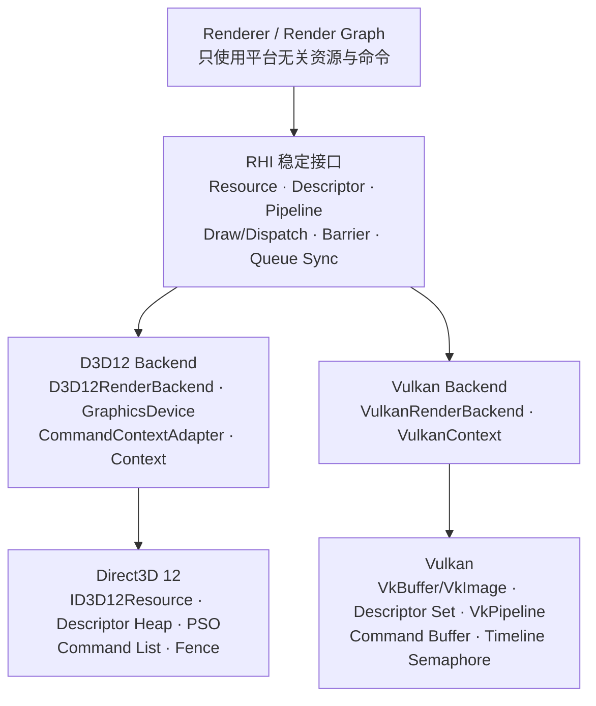
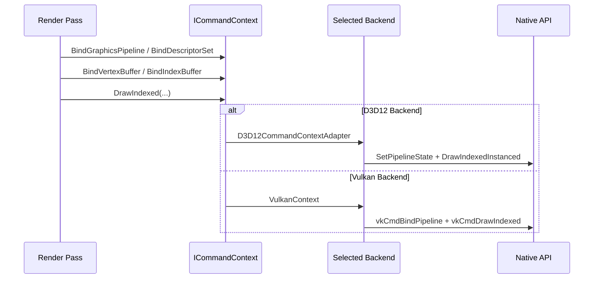

# PrismRender RHI 与 D3D12/Vulkan 双后端

本文说明 PrismRender 如何通过稳定的 RHI 接口屏蔽 Direct3D 12 与 Vulkan 的差异，以及资源、描述符、Pipeline、命令和同步操作如何映射到两个原生后端。


## 架构关系



这里的核心边界是：上层表达“创建什么、绑定什么、执行什么、等待什么”，后端决定“使用哪一种原生对象和 API 调用完成”。

## 公共接口职责

| RHI 抽象 | 主要职责 | 不负责的内容 |
|---|---|---|
| `IRenderBackend` | 后端初始化与组合入口，提供 Device、Frame、Command Context，管理帧准入、截图和帧节奏 | 具体 Pass 调度 |
| `IFrameContext` | Begin/End Frame、Resize、Swapchain、Back Buffer、Depth、Frames-in-Flight、Present | 普通资源创建与 Draw 录制 |
| `IGraphicsDevice` | 查询 Capability，创建 Buffer、Texture、View、Sampler、Descriptor、Pipeline、Transient Pool 与 AS | Pass 执行顺序 |
| `ICommandContext` | Render Scope、资源绑定、Draw、Dispatch、Copy、Indirect、Barrier、Queue Batch | 自动推导资源依赖 |
| `DeferredCommandContext` | 将平台无关命令记录为软件命令流，之后向目标 `ICommandContext` 回放 | GPU 提交与 Present |

Render Graph 负责计算 Pass 顺序、Barrier 和队列依赖；RHI 负责执行这些已经确定的操作。

## 后端选择与组合

`RenderBackendFactory` 根据 `GraphicsApi` 创建具体后端：

```text
GraphicsApi::Direct3D12 → D3D12RenderBackend
GraphicsApi::Vulkan    → VulkanRenderBackend
```

D3D12 后端采用组合结构：

```text
D3D12RenderBackend
├─ D3D12Context               Device、Queue、Swapchain、Fence、Frame
├─ D3D12GraphicsDevice        资源、Descriptor、Pipeline 创建
└─ D3D12CommandContextAdapter Draw、Dispatch、Barrier 与绑定
```

Vulkan 后端由 `VulkanRenderBackend` 包装 `VulkanContext`；`VulkanContext` 同时提供 Device、Frame 和 Command Context 能力。两个后端内部结构可以不同，但向上层暴露相同接口。

## 原生对象映射

| RHI 概念 | Direct3D 12 | Vulkan |
|---|---|---|
| `IBuffer` | `D3D12Buffer` / `ID3D12Resource` | `VulkanBuffer` / `VkBuffer` |
| `ITexture` | `D3D12Texture` / `ID3D12Resource` | `VulkanTexture` / `VkImage` |
| `ITextureView` | SRV/UAV/RTV/DSV Descriptor | `VkImageView` |
| `IDescriptorSetLayout` | Binding 描述，创建 Pipeline 时转换为 Root Signature/Descriptor Range | `VkDescriptorSetLayout` |
| `IDescriptorSet` | Shader-visible Descriptor Heap/Table 与动态 Root CBV | `VkDescriptorSet` |
| `IGraphicsPipeline` | Root Signature + `ID3D12PipelineState` | `VkPipelineLayout` + `VkPipeline` |
| `IComputePipeline` | Compute Root Signature + Compute PSO | Compute Pipeline Layout + `VkPipeline` |
| Command Context | `ID3D12GraphicsCommandList` / Allocator | `VkCommandBuffer` / Command Pool |
| Resource State | `D3D12_RESOURCE_STATES` | Pipeline Stage + Access Mask + Image Layout |
| Queue Sync | `ID3D12Fence` Value | Timeline Semaphore Value / Fence |
| Present | DXGI Swapchain | Vulkan Swapchain |

## 主要函数如何映射

### 资源、Descriptor 与 Pipeline

| 上层 RHI 调用 | D3D12 后端 | Vulkan 后端 |
|---|---|---|
| `CreateBuffer` | 创建 `D3D12Buffer`，内部持有 `ID3D12Resource` | 创建 `VulkanBuffer`，内部持有 `VkBuffer` 与分配信息 |
| `CreateTexture` | 创建 `D3D12Texture` / `ID3D12Resource` | 创建 `VulkanTexture` / `VkImage` |
| `CreateTextureView` | 创建 SRV、UAV、RTV 或 DSV Descriptor | 创建 `VkImageView` |
| `CreateDescriptorSetLayout` | 保存统一 Binding；创建 Pipeline 时生成 Descriptor Range 与 Root Signature | 创建 `VkDescriptorSetLayout` |
| `CreateDescriptorSet` | 从 Descriptor Heap 分配资源表/采样器表 | 从 Descriptor Pool 分配 `VkDescriptorSet` |
| `IDescriptorSet::Write*` | 写入或复制 CBV/SRV/UAV/Sampler Descriptor | 组织 `VkWriteDescriptorSet` 并更新 Descriptor Set |
| `CreateGraphicsPipeline` | 生成 Root Signature、`D3D12_GRAPHICS_PIPELINE_STATE_DESC` 和 Graphics PSO | 生成 `VkPipelineLayout` 与 Graphics `VkPipeline` |
| `CreateComputePipeline` | 生成 Compute Root Signature 与 Compute PSO | 生成 Compute Pipeline Layout 与 `VkPipeline` |

### 命令录制

| `ICommandContext` 调用 | Direct3D 12 | Vulkan |
|---|---|---|
| `BeginRendering` | Attachment 状态转换、Clear、`OMSetRenderTargets`、Viewport/Scissor | 构造 `VkRenderingInfo`，调用 `vkCmdBeginRendering` |
| `EndRendering` | 完成 Attachment 后置状态转换 | `vkCmdEndRendering` |
| `BindGraphicsPipeline` | `SetGraphicsRootSignature` + `SetPipelineState` + Primitive Topology | `vkCmdBindPipeline(Graphics)` |
| `BindComputePipeline` | `SetComputeRootSignature` + `SetPipelineState` | `vkCmdBindPipeline(Compute)` |
| `BindDescriptorSet` | `SetDescriptorHeaps` + Root Descriptor Table/动态 Root CBV | `vkCmdBindDescriptorSets` + Dynamic Offset |
| `BindVertexBuffer` | `IASetVertexBuffers` | `vkCmdBindVertexBuffers` |
| `BindIndexBuffer` | `IASetIndexBuffer` | `vkCmdBindIndexBuffer` |
| `Draw` | `DrawInstanced` | `vkCmdDraw` |
| `DrawIndexed` | `DrawIndexedInstanced` | `vkCmdDrawIndexed` |
| `DrawIndexedIndirect` | `ExecuteIndirect` + Command Signature | `vkCmdDrawIndexedIndirect` / `vkCmdDrawIndexedIndirectCount` |
| `Dispatch` | `ID3D12GraphicsCommandList::Dispatch` | `vkCmdDispatch` |
| `CopyBuffer` | `CopyBufferRegion` | `vkCmdCopyBuffer` |

### Barrier 与队列同步

| RHI 调用 | Direct3D 12 | Vulkan |
|---|---|---|
| `TextureBarrier` | Transition/UAV `D3D12_RESOURCE_BARRIER`，支持 Mip/Layer 子资源 | `VkImageMemoryBarrier` + `vkCmdPipelineBarrier`，包含 Stage/Access/Layout |
| `BufferBarrier` | Transition/UAV Resource Barrier | `VkBufferMemoryBarrier` + `vkCmdPipelineBarrier` |
| `GlobalBarrier` | 全局 UAV Ordering Barrier | 全局 Memory Barrier |
| `TextureAliasingBarrier` | Aliasing Resource Barrier | 对共享 Allocation 建立必要的内存可见性与布局处理 |
| `BufferAliasingBarrier` | Aliasing Resource Barrier | 对共享 Buffer Allocation 建立内存依赖 |
| `BeginQueueBatch(queue, waits)` | 在目标 Queue 上等待生产者 Fence Value | 提交时等待生产者 Timeline Semaphore Value |
| `EndQueueBatch()` | 结束 Batch 并生成 `QueueSyncPoint`/Fence Value | 结束 Batch 并生成 Timeline Value |
| `FlushQueueBatches()` | 向 Graphics/Compute Queue 提交命令列表 | 通过 Queue Submit 提交 Command Buffer Batch |

`QueueSyncPoint` 只包含统一的 Queue 类型与递增值，原生 Fence/Semaphore 由当前后端内部持有。

## 一次 Draw 的完整调用链



同一个 Pass 回调不包含 D3D12/Vulkan 分支，区别只发生在 `ICommandContext` 的具体实现中。

## Capability 与安全退化

RHI 不假设所有设备都支持相同高级功能，而是公开：

- `GraphicsDeviceCapabilities`：Ray Tracing、Indirect、Descriptor 等设备能力。
- `CommandQueueCapabilities`：Compute Queue、Dedicated Compute、Timeline Sync、Independent/Deferred Batch Submit、Native Parallel Recording。
- `GetPreferredShaderBinaryFormat()`：D3D12 选择 DXIL，Vulkan 选择 SPIR-V。

Render Graph 在启用原生多队列或并行录制前检查 Capability；能力不足时退化到 Graphics 串行执行或平台无关的 `DeferredCommandContext`，避免把高级路径硬编码为所有后端的前提。

## 与 UE RHI 的关系和边界

项目借鉴 UE 的是分层思想：公共 RHI 定义平台无关语义，具体 API 模块负责原生实现，上层 Renderer/RDG 不直接依赖原生句柄。

PrismRender 的当前边界是：

- 使用 Backend Factory，而不是完整复刻 UE 的 Dynamic RHI Module 系统。
- 当前只有 D3D12 与 Vulkan 可运行后端；D3D11 只有转换代码，没有可运行后端。
- 没有独立的 UE 风格 RHI Thread；渲染线程直接调用 RHI。
- 工作线程池负责安全 Pass 的独立命令录制，不负责整个后端命令翻译与提交。
- Render Graph 当前调度 Graphics/Compute；Copy/Transfer Queue 由异步上传系统单独管理。

## 关键代码入口

### 公共层

- `src/RHI/IRenderBackend.h`
- `src/RHI/IFrameContext.h`
- `src/RHI/IGraphicsDevice.h`
- `src/RHI/ICommandContext.h`
- `src/RHI/GraphicsResources.h`
- `src/RHI/PipelineState.h`
- `src/RHI/DeferredCommandContext.cpp`
- `src/RHI/RenderBackendFactory.cpp`

### D3D12 后端

- `src/RHI/D3D12/D3D12RenderBackend.cpp`
- `src/RHI/D3D12/D3D12Context.cpp`
- `src/RHI/D3D12/D3D12GraphicsDevice.cpp`
- `src/RHI/D3D12/D3D12CommandContextAdapter.cpp`
- `src/RHI/D3D12/D3D12Resources.cpp`
- `src/RHI/D3D12/D3D12TypeConversions.cpp`

### Vulkan 后端

- `src/RHI/Vulkan/VulkanRenderBackend.cpp`
- `src/RHI/Vulkan/VulkanContext.cpp`
- `src/RHI/Vulkan/VulkanResources.cpp`
- `src/RHI/Vulkan/VulkanPipeline.cpp`
- `src/RHI/Vulkan/VulkanTypeConversions.cpp`
- `src/RHI/Vulkan/VulkanParallelCommandRecording.cpp`
